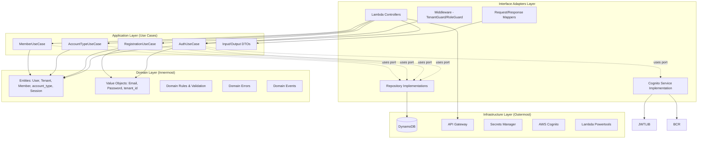
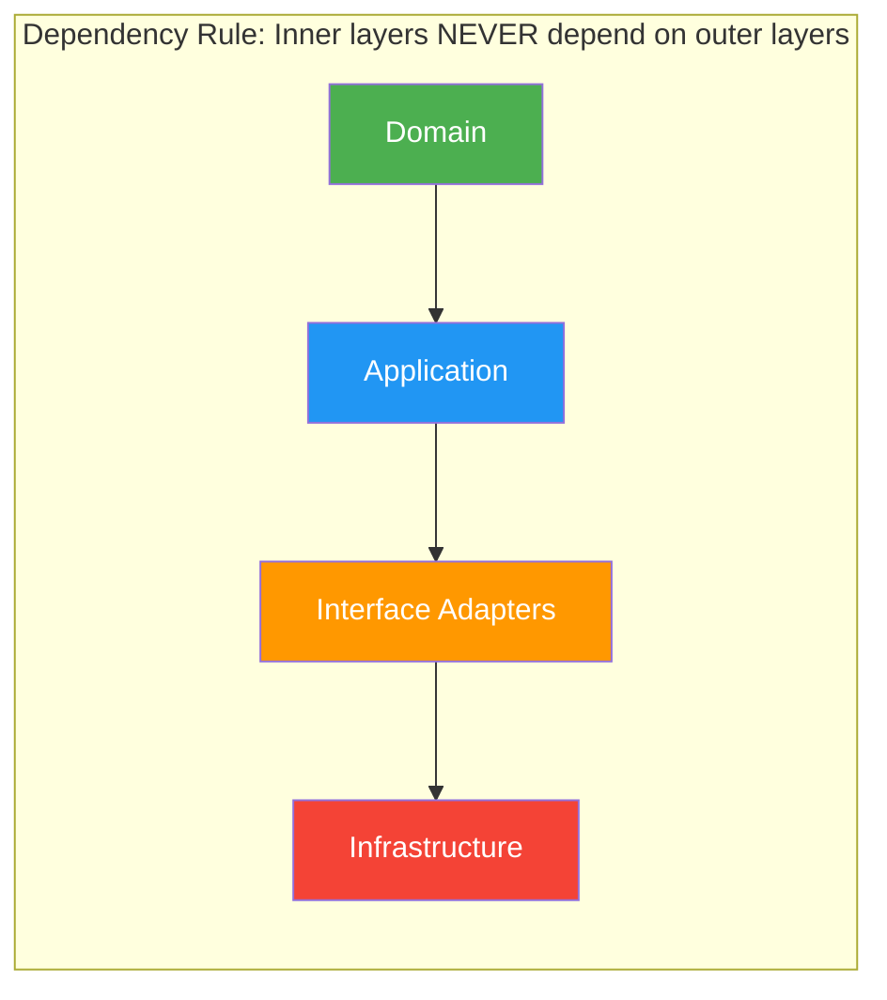
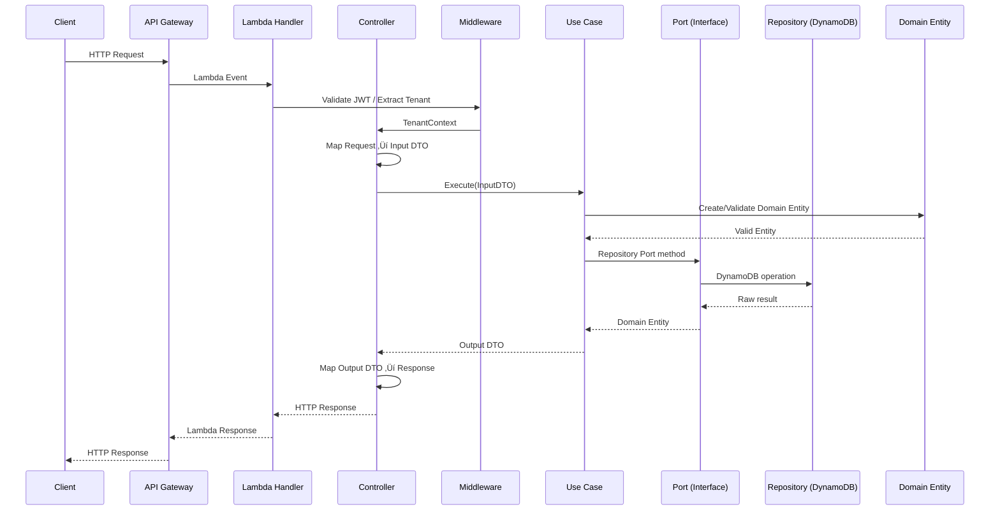
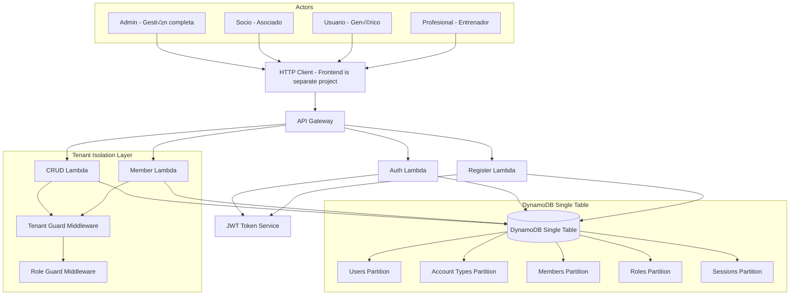
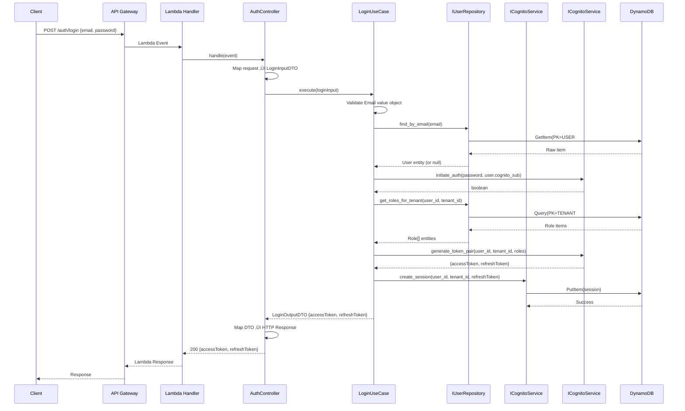
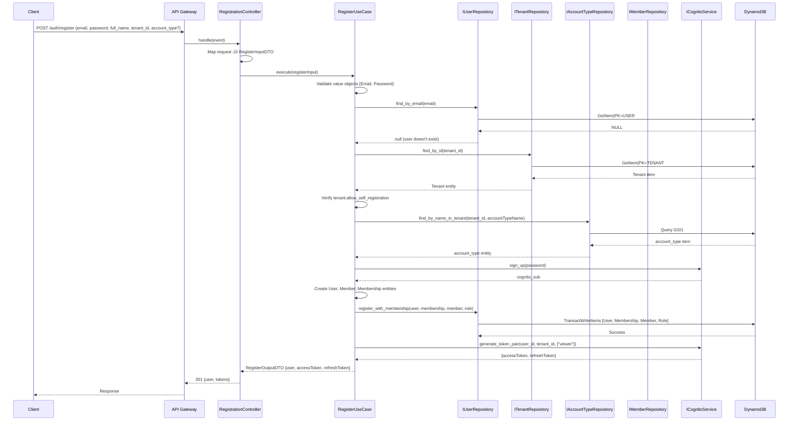
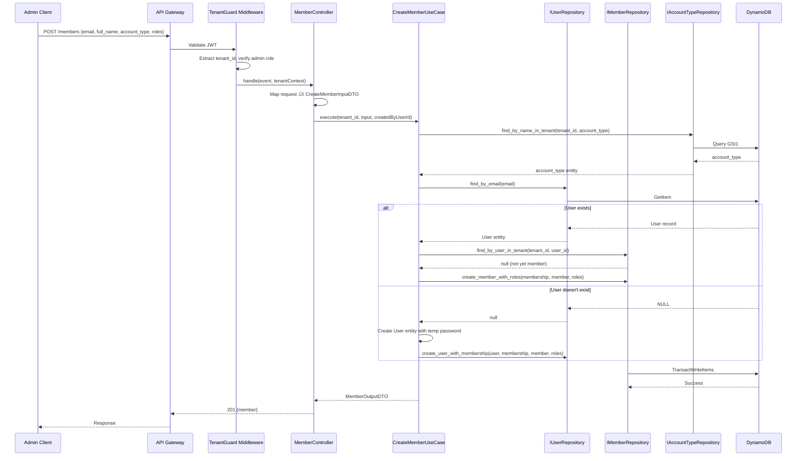
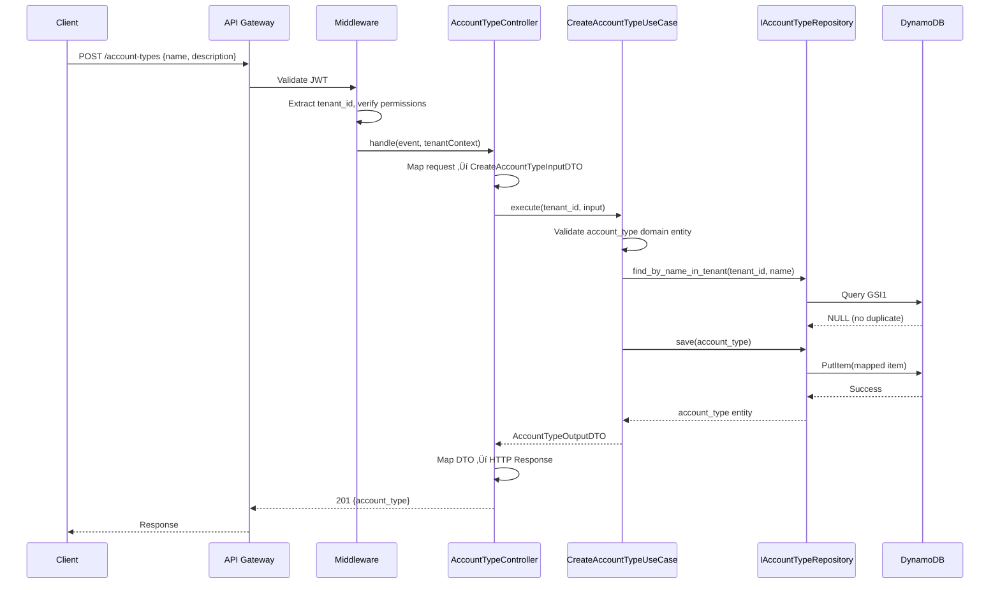
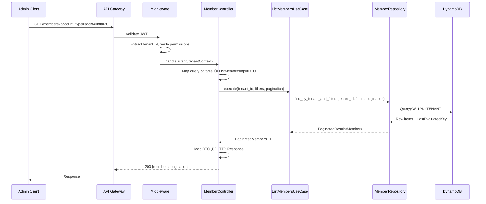

# Design Document: Account Management (Control de Tipos de Cuentas y Gestión de Miembros)

## Overview

Este sistema provee un backend API (REST) en Python para la gestión de tipos de cuentas con operaciones CRUD, autenticación (login), registro de usuarios, gestión de miembros, soporte multi-tenant y multi-rol, utilizando AWS DynamoDB con un diseño de tabla única (single table design). **Este es un servicio backend puro — el frontend se desarrolla como un proyecto separado.**

El modelo multi-tenant garantiza aislamiento de datos entre organizaciones (instituciones). Cada tenant opera de forma independiente con sus propios tipos de cuenta, miembros y usuarios. El sistema de roles permite control granular de permisos dentro de cada tenant, soportando roles como admin, manager y viewer.

Los miembros de una institución se clasifican por tipo de cuenta: **Socio** (asociado), **Usuario** (usuario genérico) y **Profesional** (entrenador/profesional). Cada miembro tiene un account_type asignado y roles dentro del tenant. El registro puede ser por auto-registro (el usuario se registra solo) o por invitación del admin.

La arquitectura serverless con DynamoDB single table design optimiza costos y latencia al consolidar todas las entidades en una sola tabla con patrones de acceso bien definidos.

**El backend está estructurado siguiendo Clean Architecture con Python**, garantizando separación de responsabilidades, testabilidad y flexibilidad para cambiar componentes de infraestructura sin afectar la lógica de negocio.

## Architecture

### Clean Architecture Layers

La arquitectura sigue el principio de Clean Architecture (Robert C. Martin), organizando el código en capas concéntricas donde las dependencias apuntan únicamente hacia adentro.



### Dependency Flow



**Capas:**

1. **Domain Layer (Entities)** — Capa más interna. Entidades de negocio puras y reglas de dominio. Sin dependencias de frameworks. Contiene: User, Tenant, Member, account_type, Session con su lógica de validación y reglas de negocio.

2. **Application Layer (Use Cases)** — Lógica de negocio específica de la aplicación. Contiene: LoginUseCase, RegisterUseCase, AccountTypeUseCases, MemberUseCases. Cada use case define DTOs de entrada/salida y orquesta las entidades de dominio. Depende únicamente del Domain Layer y de interfaces de puertos (ports).

3. **Interface Adapters Layer (Controllers/Presenters/Gateways)** — Convierte datos entre use cases y agentes externos. Contiene: Lambda handlers (controllers), mappers de request/response, interfaces de repositorio (ports).

4. **Infrastructure Layer (Frameworks & Drivers)** — Capa más externa. Concerns externos. Contiene: Implementaciones de repositorio DynamoDB, implementación del servicio JWT, implementación Cognito, configuración de API Gateway.

### Request Flow (Clean Architecture)



### Infrastructure Diagram (Deployment View)



## Project Structure

```
src/
├── domain/
│   ├── __init__.py
│   ├── entities/              # Pure business entities
│   │   ├── __init__.py
│   │   ├── user.py
│   │   ├── tenant.py
│   │   ├── member.py
│   │   ├── account_type.py
│   │   └── session.py
│   ├── value_objects/         # Immutable value types with validation
│   │   ├── __init__.py
│   │   ├── email.py
│   │   ├── password.py
│   │   ├── tenant_id.py
│   │   ├── member_id.py
│   │   ├── account_type_id.py
│   │   └── role_name.py
│   ├── errors/                # Domain-specific errors
│   │   ├── __init__.py
│   │   ├── domain_error.py
│   │   ├── validation_error.py
│   │   ├── invalid_credentials_error.py
│   │   └── tenant_not_found_error.py
│   └── events/                # Domain events (optional, for future use)
│       ├── __init__.py
│       ├── member_created.py
│       ├── member_deactivated.py
│       └── account_type_deleted.py
├── application/
│   ├── __init__.py
│   ├── use_cases/             # Application-specific business logic
│   │   ├── __init__.py
│   │   ├── auth/
│   │   │   ├── __init__.py
│   │   │   ├── login_use_case.py
│   │   │   ├── refresh_token_use_case.py
│   │   │   └── logout_use_case.py
│   │   ├── registration/
│   │   │   ├── __init__.py
│   │   │   ├── register_use_case.py
│   │   │   └── invite_user_use_case.py
│   │   ├── account_type/
│   │   │   ├── __init__.py
│   │   │   ├── create_account_type_use_case.py
│   │   │   ├── list_account_types_use_case.py
│   │   │   ├── update_account_type_use_case.py
│   │   │   └── delete_account_type_use_case.py
│   │   └── member/
│   │       ├── __init__.py
│   │       ├── create_member_use_case.py
│   │       ├── list_members_use_case.py
│   │       ├── update_member_use_case.py
│   │       ├── deactivate_member_use_case.py
│   │       └── reactivate_member_use_case.py
│   ├── dtos/                  # Input/Output DTOs (Pydantic models)
│   │   ├── __init__.py
│   │   ├── auth/
│   │   │   ├── __init__.py
│   │   │   ├── login_input_dto.py
│   │   │   ├── login_output_dto.py
│   │   │   ├── register_input_dto.py
│   │   │   └── register_output_dto.py
│   │   ├── account_type/
│   │   │   ├── __init__.py
│   │   │   ├── create_account_type_input_dto.py
│   │   │   ├── account_type_output_dto.py
│   │   │   └── paginated_account_types_dto.py
│   │   └── member/
│   │       ├── __init__.py
│   │       ├── create_member_input_dto.py
│   │       ├── member_output_dto.py
│   │       └── paginated_members_dto.py
│   ├── ports/                 # Repository & service interfaces (abstract base classes)
│   │   ├── __init__.py
│   │   ├── i_user_repository.py
│   │   ├── i_member_repository.py
│   │   ├── i_account_type_repository.py
│   │   ├── i_cognito_service.py
│   │   ├── i_tenant_repository.py
│   │   └── i_cognito_service.py
│   └── services/              # Application services that orchestrate use cases
│       ├── __init__.py
│       └── tenant_context_service.py
├── infrastructure/
│   ├── __init__.py
│   ├── persistence/           # DynamoDB repository implementations
│   │   ├── __init__.py
│   │   ├── dynamodb_user_repository.py
│   │   ├── dynamodb_member_repository.py
│   │   ├── dynamodb_account_type_repository.py
│   │   ├── cognito_auth_service.py
│   │   ├── dynamodb_tenant_repository.py
│   │   └── dynamodb_client.py
│   ├── auth/                  # External auth implementations
│   │   ├── __init__.py
│   │   ├── cognito_auth_service.py
│   │   └── cognito_auth_service.py
│   ├── config/                # Environment & client configuration
│   │   ├── __init__.py
│   │   ├── environment.py
│   │   └── dynamodb_client.py
│   └── mappers/               # Entity ↔ DynamoDB item mappers
│       ├── __init__.py
│       ├── user_mapper.py
│       ├── member_mapper.py
│       ├── account_type_mapper.py
│       └── 
└── interfaces/
    ├── __init__.py
    ├── http/
    │   ├── __init__.py
    │   ├── controllers/       # Lambda handlers (entry points)
    │   │   ├── __init__.py
    │   │   ├── auth_controller.py
    │   │   ├── registration_controller.py
    │   │   ├── account_type_controller.py
    │   │   └── member_controller.py
    │   ├── middleware/        # Cross-cutting concerns
    │   │   ├── __init__.py
    │   │   ├── tenant_guard_middleware.py
    │   │   ├── role_guard_middleware.py
    │   │   └── validation_middleware.py
    │   ├── routes/            # API route definitions
    │   │   ├── __init__.py
    │   │   └── routes.py
    │   └── dtos/              # Request/Response schemas (HTTP-specific, Pydantic)
    │       ├── __init__.py
    │       ├── login_request.py
    │       ├── register_request.py
    │       ├── create_account_type_request.py
    │       ├── create_member_request.py
    │       └── api_response.py
    └── shared/                # Shared interface utilities
        ├── __init__.py
        ├── error_handler.py
        └── response_builder.py
```

## Clean Architecture Rules

Las siguientes reglas son inmutables en este proyecto:

1. **Inner layers NEVER import from outer layers** — El dominio no conoce DynamoDB, JWT, ni Lambda. Los use cases no conocen HTTP ni la estructura de DynamoDB items.

2. **Domain entities have no framework annotations/decorators** — Las entidades son clases Python puras (dataclasses o Pydantic models) con lógica de validación propia. No tienen decoradores de ORM, serialización de frameworks externos, ni dependencias de infraestructura.

3. **Use Cases define their own input/output DTOs** — No se filtran estructuras HTTP (request body) ni estructuras DynamoDB (items) a los use cases. Los DTOs son contratos puros de la capa de aplicación (Pydantic models).

4. **Dependency Inversion Principle** — Los módulos de alto nivel (use cases) no dependen de módulos de bajo nivel (DynamoDB). Ambos dependen de abstracciones (port interfaces como `IUserRepository` definidas como Abstract Base Classes).

5. **El DynamoDB single table design es un concern de infraestructura** — Está completamente oculto detrás de las interfaces de repositorio. Los use cases solo conocen métodos como `find_by_email()`, `save()`, `find_by_tenant_and_account_type()`.

6. **Cada capa tiene su propio modelo de error** — Domain tiene `DomainError`, Application tiene errores de use case, Interface Adapters mapea a HTTP status codes.

7. **Testing sin infraestructura** — Los use cases se testean con mocks de los ports (usando unittest.mock o pytest fixtures). El dominio se testea sin mocks (lógica pura). Solo los tests de integración necesitan DynamoDB (moto).


## Naming Conventions

| Element | Convention | Example |
|---------|-----------|---------|
| Variables | snake_case | user_id, tenant_id, account_type, password_hash |
| Functions/Methods | snake_case | find_by_email, sign_up, create_session |
| Classes/Interfaces | PascalCase | IUserRepository, LoginUseCase, Member |
| Folders/Files | snake_case | use_cases/, value_objects/, login_use_case.py |
| Constants | UPPER_SNAKE_CASE | SALT_ROUNDS, TOKEN_EXPIRY, ROLES |
## Dependency Injection

### Estrategia de Inyección

Se utiliza un patrón de composición simple (Composition Root) en cada Lambda handler para conectar las capas. En Python se implementa con constructor injection y funciones factory (o la librería `dependency-injector` si se requiere más estructura):

```pascal
// Composition Root - Se ejecuta una vez por Lambda cold start
PROCEDURE create_dependencies()
  OUTPUT: container of type DependencyContainer

BEGIN
  // Infrastructure Layer - concrete implementations
  dynamo_client ‚Üê create_dynamodb_client(ENV.TABLE_NAME, ENV.REGION)
  
  // Repository implementations (implement port interfaces)
  user_repository ‚Üê NEW DynamoDBUserRepository(dynamo_client)
  member_repository ‚Üê NEW DynamoDBMemberRepository(dynamo_client)
  account_type_repository ‚Üê NEW DynamoDBAccountTypeRepository(dynamo_client)
  session_repository ‚Üê NEW DynamoDBSessionRepository(dynamo_client)
  tenant_repository ‚Üê NEW DynamoDBTenantRepository(dynamo_client)
  
  // Service implementations (implement port interfaces)
  auth_service ‚Üê NEW CognitoAuthService(ENV.JWT_SECRET, ENV.TOKEN_EXPIRY)
  password_hasher ‚Üê NEW CognitoAuthService(ENV.SALT_ROUNDS)
  
  // Application Layer - Use Cases (receive ports via constructor injection)
  login_use_case ‚Üê NEW LoginUseCase(user_repository, session_repository, auth_service, password_hasher)
  register_use_case ‚Üê NEW RegisterUseCase(user_repository, member_repository, tenant_repository, account_type_repository, session_repository, auth_service, password_hasher)
  create_account_type_use_case ‚Üê NEW CreateAccountTypeUseCase(account_type_repository, tenant_repository)
  list_account_types_use_case ‚Üê NEW ListAccountTypesUseCase(account_type_repository)
  update_account_type_use_case ‚Üê NEW UpdateAccountTypeUseCase(account_type_repository)
  delete_account_type_use_case ‚Üê NEW DeleteAccountTypeUseCase(account_type_repository, member_repository)
  create_member_use_case ‚Üê NEW CreateMemberUseCase(user_repository, member_repository, account_type_repository, password_hasher)
  list_members_use_case ‚Üê NEW ListMembersUseCase(member_repository)
  update_member_use_case ‚Üê NEW UpdateMemberUseCase(member_repository, account_type_repository)
  deactivate_member_use_case ‚Üê NEW DeactivateMemberUseCase(member_repository, session_repository)
  
  // Interface Adapters Layer - Controllers (receive use cases)
  auth_controller ‚Üê NEW AuthController(login_use_case, refresh_token_use_case, logout_use_case)
  registration_controller ‚Üê NEW RegistrationController(register_use_case)
  account_type_controller ‚Üê NEW AccountTypeController(create_account_type_use_case, list_account_types_use_case, update_account_type_use_case, delete_account_type_use_case)
  member_controller ‚Üê NEW MemberController(create_member_use_case, list_members_use_case, update_member_use_case, deactivate_member_use_case)
  
  RETURN container
END
```

### Principios de DI

- **Constructor Injection** — Todas las dependencias se inyectan via constructor (`__init__`). No se usa service locator.
- **Interface Segregation** — Cada port (ABC) define solo los métodos que su consumidor necesita.
- **Single Responsibility** — Cada use case tiene una única razón para cambiar.
- **Composition Root** — La composición ocurre en un único punto (Lambda handler entry), no dispersa por el código.
- **Lazy Initialization** — El container se crea una vez por cold start de Lambda y se reutiliza en invocaciones warm.
- **Abstract Base Classes (ABC)** — Los ports se definen como ABCs de Python, las implementaciones concretas heredan de ellos.

## Sequence Diagrams

### Authentication Flow (Clean Architecture)



### Self-Registration Flow (Clean Architecture)



### Admin-Invited Registration (Create Member)



### CRUD Account Type Flow (Clean Architecture)



### Member Management Flow (Clean Architecture)



## Components and Interfaces

### Ports (Interfaces — Application Layer)

Los ports definen los contratos que los use cases necesitan. Son interfaces declaradas en la capa de Application que las implementaciones de Infrastructure satisfacen.

#### IUserRepository

```pascal
INTERFACE IUserRepository
  PROCEDURE find_by_email(email: Email): User OR NULL
  PROCEDURE find_by_id(user_id: UUID): User OR NULL
  PROCEDURE save(user: User): User
  PROCEDURE get_roles_for_tenant(user_id: UUID, tenant_id: tenant_id): List[Role]
  PROCEDURE register_with_membership(user: User, membership: TenantMembership, member: Member, role: UserRole): Void
  PROCEDURE create_user_with_membership(user: User, membership: TenantMembership, member: Member, roles: List[UserRole]): Void
END INTERFACE
```

#### IMemberRepository

```pascal
INTERFACE IMemberRepository
  PROCEDURE find_by_id(tenant_id: tenant_id, member_id: member_id): Member OR NULL
  PROCEDURE find_by_user_in_tenant(tenant_id: tenant_id, user_id: UUID): Member OR NULL
  PROCEDURE find_by_tenant_and_filters(tenant_id: tenant_id, filters: MemberFilters, pagination: PaginationParams): PaginatedResult[Member]
  PROCEDURE save(member: Member): Member
  PROCEDURE update(member: Member): Member
  PROCEDURE create_member_with_roles(membership: TenantMembership, member: Member, roles: List[UserRole]): Void
  PROCEDURE count_active_by_account_type(tenant_id: tenant_id, accountTypeName: String): Number
END INTERFACE
```

#### IAccountTypeRepository

```pascal
INTERFACE IAccountTypeRepository
  PROCEDURE find_by_id(tenant_id: tenant_id, account_type_id: account_type_id): account_type OR NULL
  PROCEDURE find_by_name_in_tenant(tenant_id: tenant_id, name: String): account_type OR NULL
  PROCEDURE find_all_by_tenant(tenant_id: tenant_id, pagination: PaginationParams): PaginatedResult[account_type]
  PROCEDURE save(account_type: account_type): account_type
  PROCEDURE update(account_type: account_type): account_type
END INTERFACE
```

#### ICognitoService

```pascal
INTERFACE ICognitoService
  PROCEDURE create_session(user_id: UUID, tenant_id: tenant_id, refresh_token_hash: String, ttl: Number): Session
  PROCEDURE find_by_token_hash(tokenHash: String): Session OR NULL
  PROCEDURE delete_session(sessionPK: String, sessionSK: String): Void
  PROCEDURE delete_all_for_user_in_tenant(user_id: UUID, tenant_id: tenant_id): Void
  PROCEDURE rotate_token(oldSession: Session, newSession: Session): Void
END INTERFACE
```

#### ITenantRepository

```pascal
INTERFACE ITenantRepository
  PROCEDURE find_by_id(tenant_id: tenant_id): Tenant OR NULL
END INTERFACE
```

#### ICognitoService

```pascal
INTERFACE ICognitoService
  PROCEDURE sign_up(password: Password): String
  PROCEDURE initiate_auth(plainPassword: String, hashedPassword: String): Boolean
  PROCEDURE generate_token_pair(user_id: UUID, tenant_id: tenant_id, email: String, roles: List[String]): token_pair
  PROCEDURE verify_access_token(token: String): TokenPayload OR NULL
  PROCEDURE generate_secure_random(length: Number): String
  PROCEDURE hash_token(token: String): String
END INTERFACE
```

### Use Cases (Application Layer)

Cada use case encapsula una operación de negocio. Recibe DTOs de entrada, orquesta entidades de dominio, y usa ports para persistencia/servicios.

#### LoginUseCase

```pascal
STRUCTURE LoginUseCase
  DEPENDENCIES: IUserRepository, ICognitoService, ICognitoService

  PROCEDURE execute(input: LoginInputDTO): LoginOutputDTO OR Error
    // Orchestrates: validate credentials, check user status, get roles, generate tokens, store session
END STRUCTURE
```

#### RegisterUseCase

```pascal
STRUCTURE RegisterUseCase
  DEPENDENCIES: IUserRepository, IMemberRepository, ITenantRepository, IAccountTypeRepository, ICognitoService, ICognitoService

  PROCEDURE execute(input: RegisterInputDTO): RegisterOutputDTO OR Error
    // Orchestrates: validate uniqueness, verify tenant, determine account_type, create all entities atomically, generate tokens
END STRUCTURE
```

#### CreateAccountTypeUseCase

```pascal
STRUCTURE CreateAccountTypeUseCase
  DEPENDENCIES: IAccountTypeRepository, ITenantRepository

  PROCEDURE execute(tenant_id: tenant_id, input: CreateAccountTypeInputDTO): AccountTypeOutputDTO OR Error
    // Orchestrates: verify tenant, check name uniqueness, create and persist account_type entity
END STRUCTURE
```

#### ListAccountTypesUseCase

```pascal
STRUCTURE ListAccountTypesUseCase
  DEPENDENCIES: IAccountTypeRepository

  PROCEDURE execute(tenant_id: tenant_id, pagination: PaginationParams): PaginatedAccountTypesDTO
    // Orchestrates: query repository with tenant isolation, return paginated results
END STRUCTURE
```

#### UpdateAccountTypeUseCase

```pascal
STRUCTURE UpdateAccountTypeUseCase
  DEPENDENCIES: IAccountTypeRepository

  PROCEDURE execute(tenant_id: tenant_id, account_type_id: account_type_id, input: UpdateAccountTypeInputDTO): AccountTypeOutputDTO OR Error
    // Orchestrates: find existing, validate name uniqueness if changed, update entity
END STRUCTURE
```

#### DeleteAccountTypeUseCase

```pascal
STRUCTURE DeleteAccountTypeUseCase
  DEPENDENCIES: IAccountTypeRepository, IMemberRepository

  PROCEDURE execute(tenant_id: tenant_id, account_type_id: account_type_id): Void OR Error
    // Orchestrates: check for active members using this type, soft-delete if safe
END STRUCTURE
```

#### CreateMemberUseCase

```pascal
STRUCTURE CreateMemberUseCase
  DEPENDENCIES: IUserRepository, IMemberRepository, IAccountTypeRepository, ICognitoService

  PROCEDURE execute(tenant_id: tenant_id, input: CreateMemberInputDTO, createdByUserId: UUID): MemberOutputDTO OR Error
    // Orchestrates: validate account_type, check user existence, create member atomically
END STRUCTURE
```

#### ListMembersUseCase

```pascal
STRUCTURE ListMembersUseCase
  DEPENDENCIES: IMemberRepository

  PROCEDURE execute(tenant_id: tenant_id, filters: MemberFilters, pagination: PaginationParams): PaginatedMembersDTO
    // Orchestrates: query repository with filters and pagination
END STRUCTURE
```

#### UpdateMemberUseCase

```pascal
STRUCTURE UpdateMemberUseCase
  DEPENDENCIES: IMemberRepository, IAccountTypeRepository

  PROCEDURE execute(tenant_id: tenant_id, member_id: member_id, input: UpdateMemberInputDTO): MemberOutputDTO OR Error
    // Orchestrates: find member, validate new account_type if changed, update
END STRUCTURE
```

#### DeactivateMemberUseCase

```pascal
STRUCTURE DeactivateMemberUseCase
  DEPENDENCIES: IMemberRepository, ICognitoService

  PROCEDURE execute(tenant_id: tenant_id, member_id: member_id): Void OR Error
    // Orchestrates: verify member exists, soft-delete, invalidate sessions
END STRUCTURE
```

### Adapters (Infrastructure Layer — Implementations)

Las implementaciones concretas satisfacen los ports definidos en Application.

#### DynamoDBUserRepository implements IUserRepository

```pascal
STRUCTURE DynamoDBUserRepository IMPLEMENTS IUserRepository
  DEPENDENCIES: DynamoDBClient, UserMapper

  PROCEDURE find_by_email(email: Email): User OR NULL
    // Maps: Email ‚Üí PK=USER#{email}, SK=PROFILE
    // Uses: GetItem
    // Returns: UserMapper.toDomain(item) OR NULL
  END PROCEDURE

  PROCEDURE get_roles_for_tenant(user_id: UUID, tenant_id: tenant_id): List[Role]
    // Maps: ‚Üí PK=TENANT#{tenant_id}#USER#{user_id}, SK begins_with ROLE#
    // Uses: Query
    // Returns: items mapped to Role entities
  END PROCEDURE

  PROCEDURE register_with_membership(user, membership, member, role): Void
    // Maps: all entities to DynamoDB items via Mappers
    // Uses: TransactWriteItems
    // Encapsulates: single table key patterns
  END PROCEDURE
END STRUCTURE
```

#### DynamoDBMemberRepository implements IMemberRepository

```pascal
STRUCTURE DynamoDBMemberRepository IMPLEMENTS IMemberRepository
  DEPENDENCIES: DynamoDBClient, MemberMapper

  PROCEDURE find_by_tenant_and_filters(tenant_id, filters, pagination): PaginatedResult[Member]
    // Strategy: uses GSI1 if account_type filter present, otherwise base table query
    // Maps: filter ‚Üí GSI1PK=TENANT#{tid}#MEMBER#ACCTYPE#{type} OR PK=TENANT#{tid}#MEMBER
    // Encapsulates: pagination cursor encoding/decoding
  END PROCEDURE

  PROCEDURE count_active_by_account_type(tenant_id, accountTypeName): Number
    // Maps: ‚Üí GSI1 query with status filter
    // Used by: DeleteAccountTypeUseCase to check references
  END PROCEDURE
END STRUCTURE
```

#### DynamoDBAccountTypeRepository implements IAccountTypeRepository

```pascal
STRUCTURE DynamoDBAccountTypeRepository IMPLEMENTS IAccountTypeRepository
  DEPENDENCIES: DynamoDBClient, AccountTypeMapper

  PROCEDURE find_by_name_in_tenant(tenant_id, name): account_type OR NULL
    // Maps: ‚Üí GSI1PK=TENANT#{tid}#ACCTYPE, GSI1SK=NAME#{lowercase(name)}
    // Encapsulates: case-insensitive name lookup via GSI
  END PROCEDURE

  PROCEDURE save(account_type): account_type
    // Maps: account_type entity ‚Üí DynamoDB item with PK/SK/GSI keys
    // Uses: PutItem with ConditionExpression
  END PROCEDURE
END STRUCTURE
```

#### CognitoAuthService implements ICognitoService

```pascal
STRUCTURE CognitoAuthService IMPLEMENTS ICognitoService
  DEPENDENCIES: jwtSecret: String, tokenExpiry: Number, saltRounds: Number

  PROCEDURE generate_token_pair(user_id, tenant_id, email, roles): token_pair
    // Uses: jsonwebtoken library to sign JWT
    // Returns: {accessToken, refreshToken}
  END PROCEDURE

  PROCEDURE verify_access_token(token): TokenPayload OR NULL
    // Uses: jsonwebtoken library to verify and decode
    // Returns: decoded payload or null if invalid/expired
  END PROCEDURE

  PROCEDURE sign_up(password): String
    // Uses: Cognito with configured salt rounds
  END PROCEDURE

  PROCEDURE initiate_auth(plain, hashed): Boolean
    // Uses: Cognito.compare
  END PROCEDURE
END STRUCTURE
```

### Controllers (Interface Adapters Layer)

Los controllers mapean requests HTTP a DTOs de use case y responses de use case a HTTP responses.

#### AuthController

```pascal
STRUCTURE AuthController
  DEPENDENCIES: LoginUseCase, RefreshTokenUseCase, LogoutUseCase

  PROCEDURE handle_login(event: APIGatewayEvent): APIResponse
    // 1. Extract email, password from event.body
    // 2. Validate request schema
    // 3. Map to LoginInputDTO
    // 4. Call loginUseCase.execute(dto)
    // 5. Map LoginOutputDTO ‚Üí 200 response
    // 6. On error: map to appropriate HTTP status
  END PROCEDURE

  PROCEDURE handle_refresh(event: APIGatewayEvent): APIResponse
    // Similar pattern: extract ‚Üí validate ‚Üí map ‚Üí execute ‚Üí respond
  END PROCEDURE
END STRUCTURE
```

#### MemberController

```pascal
STRUCTURE MemberController
  DEPENDENCIES: CreateMemberUseCase, ListMembersUseCase, UpdateMemberUseCase, DeactivateMemberUseCase

  PROCEDURE handle_create(event: APIGatewayEvent, context: TenantContext): APIResponse
    // 1. Extract body from event
    // 2. Validate request schema
    // 3. Map to CreateMemberInputDTO
    // 4. Call createMemberUseCase.execute(context.tenant_id, dto, context.user_id)
    // 5. Map MemberOutputDTO ‚Üí 201 response
  END PROCEDURE

  PROCEDURE handle_list(event: APIGatewayEvent, context: TenantContext): APIResponse
    // 1. Extract query params (account_type, status, limit, cursor)
    // 2. Map to filters + pagination
    // 3. Call listMembersUseCase.execute(context.tenant_id, filters, pagination)
    // 4. Map PaginatedMembersDTO ‚Üí 200 response
  END PROCEDURE
END STRUCTURE
```

### Middleware (Interface Adapters Layer)

#### TenantGuard Middleware

```pascal
INTERFACE TenantGuard
  PROCEDURE validateTenantAccess(token: TokenPayload, resourceTenantId: String): Boolean
  PROCEDURE extractTenantContext(token: TokenPayload): TenantContext
END INTERFACE

INTERFACE RoleGuard
  PROCEDURE has_permission(user_roles: List[Role], requiredPermission: String): Boolean
  PROCEDURE validateRole(tenant_id: String, user_id: String, action: String): Boolean
END INTERFACE
```

**Responsibilities**:
- Extraer tenant_id del token JWT
- Verificar que el usuario pertenece al tenant solicitado
- Validar permisos de rol para la acción solicitada
- Rechazar acceso cross-tenant

## Data Models

### Table Structure

**Table Name**: `SportBE_Main`

| Attribute | Type | Description |
|-----------|------|-------------|
| PK | String | Partition Key |
| SK | String | Sort Key |
| GSI1PK | String | Global Secondary Index 1 PK |
| GSI1SK | String | Global Secondary Index 1 SK |
| GSI2PK | String | Global Secondary Index 2 PK |
| GSI2SK | String | Global Secondary Index 2 SK |
| data | Map | Entity-specific attributes |
| created_at | String | ISO 8601 timestamp |
| updated_at | String | ISO 8601 timestamp |
| ttl | Number | TTL for sessions (epoch) |

### Entity Key Patterns

```pascal
STRUCTURE KeyPatterns
  // Users
  User_PK: "USER#{email}"
  User_SK: "PROFILE"
  
  // User-Tenant membership
  UserTenant_PK: "TENANT#{tenant_id}#USER#{user_id}"
  UserTenant_SK: "MEMBERSHIP"
  
  // User Roles within Tenant
  UserRole_PK: "TENANT#{tenant_id}#USER#{user_id}"
  UserRole_SK: "ROLE#{role_name}"
  
  // Members (personas dentro de un tenant con account_type)
  Member_PK: "TENANT#{tenant_id}#MEMBER"
  Member_SK: "MEMBER#{member_id}"
  
  // Account Types
  AccountType_PK: "TENANT#{tenant_id}#ACCTYPE"
  AccountType_SK: "ACCTYPE#{account_type_id}"
  
  // Tenants
  Tenant_PK: "TENANT#{tenant_id}"
  Tenant_SK: "METADATA"
  
  // Sessions (for refresh tokens)
  Session_PK: "SESSION#{user_id}"
  Session_SK: "TOKEN#{tokenId}"
  
  // GSI1 - Query users by tenant
  GSI1_UsersByTenant_PK: "TENANT#{tenant_id}"
  GSI1_UsersByTenant_SK: "USER#{user_id}"
  
  // GSI1 - Query account types by name
  GSI1_AccTypeByName_PK: "TENANT#{tenant_id}#ACCTYPE"
  GSI1_AccTypeByName_SK: "NAME#{name}"
  
  // GSI1 - Query members by account_type within tenant
  GSI1_MembersByAccType_PK: "TENANT#{tenant_id}#MEMBER#ACCTYPE#{account_type}"
  GSI1_MembersByAccType_SK: "MEMBER#{member_id}"
  
  // GSI2 - Query member by user_id within tenant
  GSI2_MemberByUser_PK: "TENANT#{tenant_id}#MEMBER#USER"
  GSI2_MemberByUser_SK: "USER#{user_id}"
END STRUCTURE
```

### Data Entities

```pascal
STRUCTURE User
  pk: String          // USER#{email}
  sk: String          // PROFILE
  user_id: UUID
  email: String
  cognito_sub: String
  full_name: String
  status: ENUM(active, inactive, suspended, pending_confirmation)
  created_at: String
  updated_at: String
END STRUCTURE

STRUCTURE Tenant
  pk: String          // TENANT#{tenant_id}
  sk: String          // METADATA
  tenant_id: UUID
  name: String
  plan: ENUM(free, basic, premium)
  status: ENUM(active, suspended)
  allow_self_registration: Boolean
  default_account_type: String   // account_type assigned on self-registration
  created_at: String
END STRUCTURE

STRUCTURE UserTenantMembership
  pk: String          // TENANT#{tenant_id}#USER#{user_id}
  sk: String          // MEMBERSHIP
  gsi1pk: String      // TENANT#{tenant_id}
  gsi1sk: String      // USER#{user_id}
  user_id: UUID
  tenant_id: UUID
  joined_at: String
END STRUCTURE

STRUCTURE UserRole
  pk: String          // TENANT#{tenant_id}#USER#{user_id}
  sk: String          // ROLE#{role_name}
  role_name: String
  permissions: List[String]
  assigned_at: String
END STRUCTURE

STRUCTURE Member
  pk: String          // TENANT#{tenant_id}#MEMBER
  sk: String          // MEMBER#{member_id}
  gsi1pk: String      // TENANT#{tenant_id}#MEMBER#ACCTYPE#{account_type}
  gsi1sk: String      // MEMBER#{member_id}
  gsi2pk: String      // TENANT#{tenant_id}#MEMBER#USER
  gsi2sk: String      // USER#{user_id}
  member_id: UUID
  tenant_id: UUID
  user_id: UUID
  account_type: String          // "socio", "usuario", "profesional" (references account_type)
  account_type_id: UUID          // FK to account_type entity
  full_name: String
  email: String
  status: ENUM(active, inactive, pending)
  registration_type: ENUM(self, invited)
  invited_by: UUID OR NULL      // user_id of admin who invited, NULL if self-registered
  metadata: Map                // Additional member-specific data
  created_at: String
  updated_at: String
END STRUCTURE

STRUCTURE account_type
  pk: String          // TENANT#{tenant_id}#ACCTYPE
  sk: String          // ACCTYPE#{account_type_id}
  gsi1pk: String      // TENANT#{tenant_id}#ACCTYPE
  gsi1sk: String      // NAME#{name}
  account_type_id: UUID
  tenant_id: UUID
  name: String             // "socio", "usuario", "profesional", custom types
  description: String
  config: Map
  status: ENUM(active, inactive)
  created_at: String
  updated_at: String
END STRUCTURE

STRUCTURE Session
  pk: String          // SESSION#{user_id}
  sk: String          // TOKEN#{tokenId}
  refreshToken: String
  tenant_id: String
  expires_at: Number   // TTL epoch
  created_at: String
  ttl: Number         // DynamoDB TTL
END STRUCTURE
```

### Access Patterns

| Access Pattern | Operation | Key Condition |
|---------------|-----------|---------------|
| Get user by email | GetItem | PK=USER#{email}, SK=PROFILE |
| Get user roles in tenant | Query | PK=TENANT#{tid}#USER#{uid}, SK begins_with ROLE# |
| List users in tenant | Query GSI1 | GSI1PK=TENANT#{tid}, GSI1SK begins_with USER# |
| Get account type by ID | GetItem | PK=TENANT#{tid}#ACCTYPE, SK=ACCTYPE#{id} |
| List account types by tenant | Query | PK=TENANT#{tid}#ACCTYPE, SK begins_with ACCTYPE# |
| Find account type by name | Query GSI1 | GSI1PK=TENANT#{tid}#ACCTYPE, GSI1SK=NAME#{name} |
| Get member by ID | GetItem | PK=TENANT#{tid}#MEMBER, SK=MEMBER#{mid} |
| List members by tenant | Query | PK=TENANT#{tid}#MEMBER, SK begins_with MEMBER# |
| List members by account_type | Query GSI1 | GSI1PK=TENANT#{tid}#MEMBER#ACCTYPE#{type}, GSI1SK begins_with MEMBER# |
| Get member by user_id in tenant | Query GSI2 | GSI2PK=TENANT#{tid}#MEMBER#USER, GSI2SK=USER#{uid} |
| Get user sessions | Query | PK=SESSION#{uid}, SK begins_with TOKEN# |
| Get tenant metadata | GetItem | PK=TENANT#{tid}, SK=METADATA |
| Get user membership | GetItem | PK=TENANT#{tid}#USER#{uid}, SK=MEMBERSHIP |

### Validation Rules

- `email`: formato v√°lido, √∫nico globalmente
- `name` (account_type): no vacío, máx 100 caracteres, único dentro del tenant
- `tenant_id`: debe existir en la tabla
- `role_name`: debe ser uno de los roles v√°lidos del sistema
- `cognito_sub`: identificador ˙nico del usuario en Cognito (UUID generado por Cognito)
- `account_type` (Member): debe referenciar un account_type activo dentro del mismo tenant
- `member_id`: √∫nico dentro del tenant
- `full_name` (Member): no vacío, máx 200 caracteres

## Multi-Role Model

### Role Definitions

```pascal
STRUCTURE RoleDefinition
  CONSTANT ROLES
    admin: List["create", "read", "update", "delete", "manage_users", "manage_roles", "manage_members", "invite_members"]
    manager: List["create", "read", "update", "delete", "manage_members"]
    viewer: List["read"]
  END CONSTANT
END STRUCTURE
```

### Permission Matrix

| Action | admin | manager | viewer |
|--------|-------|---------|--------|
| Create Account Type | Yes | Yes | No |
| Read Account Type | Yes | Yes | Yes |
| Update Account Type | Yes | Yes | No |
| Delete Account Type | Yes | No | No |
| Create Member (invite) | Yes | Yes | No |
| Read Members | Yes | Yes | Yes |
| Update Member | Yes | Yes | No |
| Deactivate Member | Yes | No | No |
| Manage Users | Yes | No | No |
| Manage Roles | Yes | No | No |

## Algorithmic Pseudocode

### Authentication Algorithm (LoginUseCase.execute)

```pascal
ALGORITHM LoginUseCase.execute(input: LoginInputDTO)
INPUT: input of type LoginInputDTO {email: String, password: String}
OUTPUT: result of type LoginOutputDTO OR Error

BEGIN
  // --- Domain Validation ---
  email_vo ‚Üê Email.create(input.email)
  IF email_vo IS Error THEN
    RETURN Error("Invalid email format")
  END IF
  
  ASSERT input.password IS NOT empty
  
  // --- Use Case Orchestration (via Ports) ---
  
  // Step 1: Retrieve user via repository port
  user ‚Üê this.user_repository.find_by_email(email_vo)
  
  IF user IS NULL THEN
    RETURN Error("Invalid credentials")
  END IF
  
  IF user.status != "active" THEN
    RETURN Error("Account is not active")
  END IF
  
  // Step 2: Verify password via auth service port
  is_valid ‚Üê this.auth_service.initiate_auth(input.password, user.password_hash)
  
  IF NOT is_valid THEN
    RETURN Error("Invalid credentials")
  END IF
  
  // Step 3: Get roles via repository port
  roles ‚Üê this.user_repository.get_roles_for_tenant(user.user_id, user.primary_tenant_id)
  
  IF roles IS EMPTY THEN
    RETURN Error("No tenant assigned")
  END IF
  
  role_names ‚Üê EXTRACT role_name FROM EACH role IN roles
  
  // Step 4: Generate tokens via auth service port
  token_pair ‚Üê this.auth_service.generate_token_pair(user.user_id, user.primary_tenant_id, user.email, role_names)
  
  // Step 5: Store session via repository port
  refresh_token_hash ‚Üê this.auth_service.hash_token(token_pair.refresh_token)
  this.session_repository.create_session(user.user_id, user.primary_tenant_id, refresh_token_hash, NOW() + 86400 * 7)
  
  // --- Return Output DTO ---
  RETURN LoginOutputDTO {
    access_token: token_pair.access_token,
    refresh_token: token_pair.refresh_token,
    user_id: user.user_id,
    tenant_id: user.primary_tenant_id,
    roles: role_names
  }
END
```

**Preconditions:**
- `input.email` is a non-empty string with valid email format
- `input.password` is a non-empty string
- All injected ports (IUserRepository, ICognitoService, ICognitoService) are available

**Postconditions:**
- On success: returns valid JWT access token and refresh token
- On success: session stored via ICognitoService
- On failure: returns error without leaking user existence info
- No mutations to user record on authentication failure

### Registration Algorithm (RegisterUseCase.execute)

```pascal
ALGORITHM RegisterUseCase.execute(input: RegisterInputDTO)
INPUT: input of type RegisterInputDTO {email, password, full_name, tenant_id, account_type?}
OUTPUT: result of type RegisterOutputDTO OR Error

BEGIN
  // --- Domain Validation (Value Objects) ---
  email_vo ‚Üê Email.create(input.email)
  IF email_vo IS Error THEN RETURN Error("Invalid email format") END IF
  
  password_vo ‚Üê Password.create(input.password)
  IF password_vo IS Error THEN RETURN Error("Password must be >= 8 characters") END IF
  
  tenant_id_vo ‚Üê tenant_id.create(input.tenant_id)
  IF tenant_id_vo IS Error THEN RETURN Error("Invalid tenant ID") END IF
  
  ASSERT input.full_name IS NOT empty
  
  // --- Use Case Orchestration (via Ports) ---
  
  // Step 1: Check if user already exists
  existing_user ‚Üê this.user_repository.find_by_email(email_vo)
  
  IF existing_user IS NOT NULL THEN
    RETURN Error("Email already registered")
  END IF
  
  // Step 2: Verify tenant exists and allows self-registration
  tenant ‚Üê this.tenant_repository.find_by_id(tenant_id_vo)
  
  IF tenant IS NULL THEN
    RETURN Error("Tenant not found")
  END IF
  
  IF tenant.status != "active" THEN
    RETURN Error("Tenant is not active")
  END IF
  
  IF NOT tenant.allow_self_registration THEN
    RETURN Error("Self-registration is not allowed for this institution")
  END IF
  
  // Step 3: Determine and validate account_type
  account_type_name ‚Üê input.account_type OR tenant.default_account_type OR "usuario"
  
  account_type_record ‚Üê this.account_type_repository.find_by_name_in_tenant(tenant_id_vo, LOWERCASE(account_type_name))
  
  IF account_type_record IS NULL THEN
    RETURN Error("Invalid account type")
  END IF
  
  // Step 4: Hash password via auth service port
  password_hash ‚Üê this.auth_service.sign_up(password_vo)
  
  // Step 5: Create domain entities
  user_id ‚Üê generate_uuid()
  member_id ‚Üê generate_uuid()
  now ‚Üê ISO8601(NOW())
  
  user ‚Üê User.create(user_id, email_vo, password_hash, input.full_name, "active", now)
  membership ‚Üê TenantMembership.create(tenant_id_vo, user_id, now)
  member ‚Üê Member.create(member_id, tenant_id_vo, user_id, account_type_name, account_type_record.account_type_id, input.full_name, email_vo, "active", "self", NULL, now)
  role ‚Üê UserRole.create(tenant_id_vo, user_id, "viewer", ["read"], now)
  
  // Step 6: Atomic persistence via repository port
  this.user_repository.register_with_membership(user, membership, member, role)
  
  // Step 7: Generate tokens via auth service port
  token_pair ‚Üê this.auth_service.generate_token_pair(user_id, tenant_id_vo, email_vo, ["viewer"])
  
  // Store session
  refresh_token_hash ‚Üê this.auth_service.hash_token(token_pair.refresh_token)
  this.session_repository.create_session(user_id, tenant_id_vo, refresh_token_hash, NOW() + 86400 * 7)
  
  // --- Return Output DTO ---
  RETURN RegisterOutputDTO {
    user_id: user_id,
    member_id: member_id,
    access_token: token_pair.access_token,
    refresh_token: token_pair.refresh_token
  }
END
```

**Preconditions:**
- `email` is unique globally (not already registered)
- `tenant_id` references an active tenant that allows self-registration
- `account_type` (if provided) must reference an active account_type in the tenant
- `password` meets minimum security requirements (>= 8 chars)

**Postconditions:**
- User, TenantMembership, Member, and Role all created atomically (all or nothing)
- User immediately receives tokens for authentication
- Member is assigned the specified or default account_type
- Default role "viewer" is assigned
- If any part of the transaction fails, no records are created

### Create Member Algorithm (CreateMemberUseCase.execute)

```pascal
ALGORITHM CreateMemberUseCase.execute(tenant_id: tenant_id, input: CreateMemberInputDTO, created_by_user_id: UUID)
INPUT: tenant_id of type tenant_id, input of type CreateMemberInputDTO {email, full_name, account_type, roles}, created_by_user_id of type UUID
OUTPUT: result of type MemberOutputDTO OR Error

BEGIN
  // --- Domain Validation ---
  email_vo ‚Üê Email.create(input.email)
  IF email_vo IS Error THEN RETURN Error("Invalid email format") END IF
  
  ASSERT input.full_name IS NOT empty
  ASSERT input.account_type IS NOT empty
  ASSERT input.roles IS NOT empty
  
  // --- Use Case Orchestration (via Ports) ---
  
  // Step 1: Verify account_type exists in tenant
  account_type_record ‚Üê this.account_type_repository.find_by_name_in_tenant(tenant_id, LOWERCASE(input.account_type))
  
  IF account_type_record IS NULL THEN
    RETURN Error("Account type '" + input.account_type + "' does not exist in this tenant")
  END IF
  
  IF account_type_record.status != "active" THEN
    RETURN Error("Account type is not active")
  END IF
  
  // Step 2: Check if user already exists
  existing_user ‚Üê this.user_repository.find_by_email(email_vo)
  
  member_id ‚Üê generate_uuid()
  now ‚Üê ISO8601(NOW())
  
  IF existing_user IS NULL THEN
    // New user - create User entity with temp password
    user_id ‚Üê generate_uuid()
    temp_password ‚Üê this.auth_service.generate_secure_random(16)
    password_hash ‚Üê this.auth_service.sign_up(Password.create_unsafe(temp_password))
    
    user ‚Üê User.create(user_id, email_vo, password_hash, input.full_name, "pending_confirmation", now)
    membership ‚Üê TenantMembership.create(tenant_id, user_id, now)
    member ‚Üê Member.create(member_id, tenant_id, user_id, input.account_type, account_type_record.account_type_id, input.full_name, email_vo, "active", "invited", created_by_user_id, now)
    roles ‚Üê MAP input.roles TO UserRole.create(tenant_id, user_id, role_name, ROLES[role_name], now)
    
    // Validate all roles are valid
    FOR EACH role_name IN input.roles DO
      IF role_name NOT IN VALID_ROLES THEN
        RETURN Error("Invalid role: " + role_name)
      END IF
    END FOR
    
    this.user_repository.create_user_with_membership(user, membership, member, roles)
  ELSE
    user_id ‚Üê existing_user.user_id
    
    // Check if already a member of this tenant
    existing_member ‚Üê this.member_repository.find_by_user_in_tenant(tenant_id, user_id)
    
    IF existing_member IS NOT NULL THEN
      RETURN Error("User is already a member of this tenant")
    END IF
    
    membership ‚Üê TenantMembership.create(tenant_id, user_id, now)
    member ‚Üê Member.create(member_id, tenant_id, user_id, input.account_type, account_type_record.account_type_id, input.full_name, email_vo, "active", "invited", created_by_user_id, now)
    roles ‚Üê MAP input.roles TO UserRole.create(tenant_id, user_id, role_name, ROLES[role_name], now)
    
    FOR EACH role_name IN input.roles DO
      IF role_name NOT IN VALID_ROLES THEN
        RETURN Error("Invalid role: " + role_name)
      END IF
    END FOR
    
    this.member_repository.create_member_with_roles(membership, member, roles)
  END IF
  
  // --- Return Output DTO ---
  RETURN MemberOutputDTO {
    member_id: member_id,
    tenant_id: tenant_id,
    user_id: user_id,
    account_type: input.account_type,
    full_name: input.full_name,
    email: input.email,
    status: "active",
    registration_type: "invited",
    invited_by: created_by_user_id,
    created_at: now
  }
END
```

**Preconditions:**
- `created_by_user_id` has "manage_members" or "invite_members" permission in the tenant
- `input.account_type` references an active account_type in the tenant
- `input.roles` contains only valid role names

**Postconditions:**
- If user is new: User record created with status "pending_confirmation"
- If user exists: only Membership, Member, and Roles are created
- All records created atomically
- Member is linked to both the User and the account_type
- User cannot be added as member to same tenant twice

### List Members Algorithm (ListMembersUseCase.execute)

```pascal
ALGORITHM ListMembersUseCase.execute(tenant_id: tenant_id, filters: MemberFilters, pagination: PaginationParams)
INPUT: tenant_id of type tenant_id, filters of type MemberFilters {account_type?, status?}, pagination of type PaginationParams {limit: Number, last_key: String OR NULL}
OUTPUT: result of type PaginatedMembersDTO

BEGIN
  // --- Domain Validation ---
  ASSERT pagination.limit > 0 AND pagination.limit <= 100
  
  // --- Use Case Orchestration (via Port) ---
  paginated_result ‚Üê this.member_repository.find_by_tenant_and_filters(tenant_id, filters, pagination)
  
  // --- Map to Output DTO ---
  RETURN PaginatedMembersDTO {
    items: MAP paginated_result.items TO MemberOutputDTO,
    next_key: paginated_result.next_key,
    count: paginated_result.count
  }
END
```

**Preconditions:**
- `tenant_id` corresponds to an existing tenant
- `limit` is between 1 and 100
- If `account_type` filter is specified, it must be a valid account_type name

**Postconditions:**
- Returns only members belonging to the specified tenant
- If account_type filter applied, returns only members with that account_type
- Pagination cursor provided if more items exist
- Never returns members from other tenants

**Loop Invariants:** N/A (DynamoDB handles iteration internally via repository)

### Update Member Algorithm (UpdateMemberUseCase.execute)

```pascal
ALGORITHM UpdateMemberUseCase.execute(tenant_id: tenant_id, member_id: member_id, input: UpdateMemberInputDTO)
INPUT: tenant_id of type tenant_id, member_id of type member_id, input of type UpdateMemberInputDTO {account_type?, status?, full_name?, metadata?}
OUTPUT: result of type MemberOutputDTO OR Error

BEGIN
  // --- Use Case Orchestration (via Ports) ---
  
  // Step 1: Get existing member
  existing ‚Üê this.member_repository.find_by_id(tenant_id, member_id)
  
  IF existing IS NULL THEN
    RETURN Error("Member not found")
  END IF
  
  // Step 2: If account_type is changing, validate new account_type
  IF input.account_type IS NOT NULL AND LOWERCASE(input.account_type) != LOWERCASE(existing.account_type) THEN
    account_type_record ‚Üê this.account_type_repository.find_by_name_in_tenant(tenant_id, LOWERCASE(input.account_type))
    
    IF account_type_record IS NULL THEN
      RETURN Error("Account type '" + input.account_type + "' does not exist in this tenant")
    END IF
    
    IF account_type_record.status != "active" THEN
      RETURN Error("Account type is not active")
    END IF
    
    existing.account_type = input.account_type
    existing.account_type_id = account_type_record.account_type_id
  END IF
  
  // Step 3: Apply updates to domain entity
  IF input.status IS NOT NULL THEN existing.status = input.status END IF
  IF input.full_name IS NOT NULL THEN existing.full_name = input.full_name END IF
  IF input.metadata IS NOT NULL THEN existing.metadata = input.metadata END IF
  existing.updated_at = ISO8601(NOW())
  
  // Step 4: Persist via repository port
  updated ‚Üê this.member_repository.update(existing)
  
  // --- Return Output DTO ---
  RETURN MemberOutputDTO(updated)
END
```

**Preconditions:**
- Member exists in the specified tenant
- If account_type is being changed, new account_type must be active in the tenant

**Postconditions:**
- Only specified fields are updated
- GSI1 updated if account_type changed (handled by repository implementation)
- `updated_at` timestamp refreshed
- Original `created_at` and `registration_type` preserved

### Deactivate Member Algorithm (DeactivateMemberUseCase.execute)

```pascal
ALGORITHM DeactivateMemberUseCase.execute(tenant_id: tenant_id, member_id: member_id)
INPUT: tenant_id of type tenant_id, member_id of type member_id
OUTPUT: Void OR Error

BEGIN
  // --- Use Case Orchestration (via Ports) ---
  
  // Step 1: Verify member exists
  existing ‚Üê this.member_repository.find_by_id(tenant_id, member_id)
  
  IF existing IS NULL THEN
    RETURN Error("Member not found")
  END IF
  
  IF existing.status = "inactive" THEN
    RETURN Error("Member is already inactive")
  END IF
  
  // Step 2: Soft delete - update domain entity
  existing.status = "inactive"
  existing.updated_at = ISO8601(NOW())
  
  this.member_repository.update(existing)
  
  // Step 3: Invalidate sessions for this tenant via session port
  this.session_repository.delete_all_for_user_in_tenant(existing.user_id, tenant_id)
  
  RETURN Void
END
```

**Preconditions:**
- Member exists in the specified tenant
- User has "manage_members" permission (admin role) or specific deactivation permission

**Postconditions:**
- Member marked as inactive (soft delete)
- Active sessions for this tenant are invalidated
- Member record preserved for audit trail
- User record in USER# partition is NOT affected (can still access other tenants)

### CRUD - Create Account Type (CreateAccountTypeUseCase.execute)

```pascal
ALGORITHM CreateAccountTypeUseCase.execute(tenant_id: tenant_id, input: CreateAccountTypeInputDTO)
INPUT: tenant_id of type tenant_id, input of type CreateAccountTypeInputDTO {name, description?, config?}
OUTPUT: result of type AccountTypeOutputDTO OR Error

BEGIN
  // --- Domain Validation ---
  ASSERT input.name IS NOT empty
  ASSERT LENGTH(input.name) <= 100
  
  // --- Use Case Orchestration (via Ports) ---
  
  // Step 1: Verify tenant exists
  tenant ‚Üê this.tenant_repository.find_by_id(tenant_id)
  
  IF tenant IS NULL THEN
    RETURN Error("Tenant not found")
  END IF
  
  // Step 2: Check for duplicate name within tenant
  existing ‚Üê this.account_type_repository.find_by_name_in_tenant(tenant_id, LOWERCASE(input.name))
  
  IF existing IS NOT NULL THEN
    RETURN Error("Account type name already exists in this tenant")
  END IF
  
  // Step 3: Create domain entity
  account_type_id ‚Üê generate_uuid()
  now ‚Üê ISO8601(NOW())
  
  account_type ‚Üê account_type.create(
    account_type_id, tenant_id, input.name, 
    input.description OR "", input.config OR {}, 
    "active", now
  )
  
  // Step 4: Persist via repository port
  saved ‚Üê this.account_type_repository.save(account_type)
  
  // --- Return Output DTO ---
  RETURN AccountTypeOutputDTO(saved)
END
```

**Preconditions:**
- `tenant_id` corresponds to an existing tenant
- `input.name` is non-empty and max 100 characters

**Postconditions:**
- New account type stored via repository
- Name is unique within the tenant (case-insensitive)
- Returns created account type with generated ID and timestamps

### CRUD - List Account Types (ListAccountTypesUseCase.execute)

```pascal
ALGORITHM ListAccountTypesUseCase.execute(tenant_id: tenant_id, pagination: PaginationParams)
INPUT: tenant_id of type tenant_id, pagination of type PaginationParams {limit: Number, last_key: String OR NULL}
OUTPUT: result of type PaginatedAccountTypesDTO

BEGIN
  ASSERT pagination.limit > 0 AND pagination.limit <= 100
  
  // --- Use Case Orchestration (via Port) ---
  paginated_result ‚Üê this.account_type_repository.find_all_by_tenant(tenant_id, pagination)
  
  // --- Return Output DTO ---
  RETURN PaginatedAccountTypesDTO {
    items: MAP paginated_result.items TO AccountTypeOutputDTO,
    next_key: paginated_result.next_key,
    count: paginated_result.count
  }
END
```

**Preconditions:**
- `tenant_id` corresponds to an existing tenant
- `limit` is between 1 and 100

**Postconditions:**
- Returns only account types belonging to the specified tenant
- Pagination cursor provided if more items exist
- Items ordered by sort key (account_type_id)

**Loop Invariants:** N/A (DynamoDB handles iteration internally via repository)

### CRUD - Update Account Type (UpdateAccountTypeUseCase.execute)

```pascal
ALGORITHM UpdateAccountTypeUseCase.execute(tenant_id: tenant_id, account_type_id: account_type_id, input: UpdateAccountTypeInputDTO)
INPUT: tenant_id of type tenant_id, account_type_id of type account_type_id, input of type UpdateAccountTypeInputDTO {name?, description?, config?, status?}
OUTPUT: result of type AccountTypeOutputDTO OR Error

BEGIN
  // --- Use Case Orchestration (via Ports) ---
  
  // Step 1: Verify item exists and belongs to tenant
  existing ‚Üê this.account_type_repository.find_by_id(tenant_id, account_type_id)
  
  IF existing IS NULL THEN
    RETURN Error("Account type not found")
  END IF
  
  // Step 2: If name changed, check uniqueness
  IF input.name IS NOT NULL AND LOWERCASE(input.name) != LOWERCASE(existing.name) THEN
    duplicate ‚Üê this.account_type_repository.find_by_name_in_tenant(tenant_id, LOWERCASE(input.name))
    
    IF duplicate IS NOT NULL THEN
      RETURN Error("Account type name already exists in this tenant")
    END IF
    
    existing.name = input.name
  END IF
  
  // Step 3: Apply updates to domain entity
  IF input.description IS NOT NULL THEN existing.description = input.description END IF
  IF input.config IS NOT NULL THEN existing.config = input.config END IF
  IF input.status IS NOT NULL THEN existing.status = input.status END IF
  existing.updated_at = ISO8601(NOW())
  
  // Step 4: Persist via repository port
  updated ‚Üê this.account_type_repository.update(existing)
  
  // --- Return Output DTO ---
  RETURN AccountTypeOutputDTO(updated)
END
```

**Preconditions:**
- Account type exists in the specified tenant
- If name is being changed, new name is unique within tenant

**Postconditions:**
- Only specified fields are updated
- `updated_at` timestamp refreshed
- GSI1 updated if name changed (handled by repository)
- Original `created_at` preserved

### CRUD - Delete Account Type (DeleteAccountTypeUseCase.execute)

```pascal
ALGORITHM DeleteAccountTypeUseCase.execute(tenant_id: tenant_id, account_type_id: account_type_id)
INPUT: tenant_id of type tenant_id, account_type_id of type account_type_id
OUTPUT: Void OR Error

BEGIN
  // --- Use Case Orchestration (via Ports) ---
  
  // Step 1: Verify item exists
  existing ‚Üê this.accountTypeRepository.find_by_id(tenant_id, account_type_id)
  
  IF existing IS NULL THEN
    RETURN Error("Account type not found")
  END IF
  
  // Step 2: Check if any active members are using this account type
  activeCount ‚Üê this.memberRepository.count_active_by_account_type(tenant_id, LOWERCASE(existing.name))
  
  IF activeCount > 0 THEN
    RETURN Error("Cannot delete account type: active members are using it")
  END IF
  
  // Step 3: Soft delete - update domain entity status
  existing.status = "inactive"
  existing.updated_at = ISO8601(NOW())
  
  this.accountTypeRepository.update(existing)
  
  RETURN Void
END
```

**Preconditions:**
- Account type exists in the specified tenant
- User has "delete" permission (admin role)

**Postconditions:**
- Account type marked as inactive (soft delete) only if no active members use it
- Record preserved for audit trail
- `updated_at` timestamp refreshed
- Existing members with this account_type are NOT affected

### Tenant Guard Middleware (Interface Adapters Layer)

```pascal
ALGORITHM TenantGuardMiddleware.validate(event: APIGatewayEvent, requiredPermission: String)
INPUT: event of type APIGatewayEvent, requiredPermission of type String
OUTPUT: TenantContext OR Error

BEGIN
  // Step 1: Extract and validate JWT via ICognitoService
  authHeader ‚Üê event.headers["Authorization"]
  
  IF authHeader IS NULL OR NOT starts_with(authHeader, "Bearer ") THEN
    RETURN Error(401, "Missing or invalid authorization header")
  END IF
  
  token ‚Üê SUBSTRING(authHeader, 7)
  
  payload ‚Üê this.authService.verify_access_token(token)
  
  IF payload IS NULL OR payload.exp < NOW() THEN
    RETURN Error(401, "Token expired or invalid")
  END IF
  
  // Step 2: Validate tenant access
  tenant_id ‚Üê payload.tenant_id
  
  IF tenant_id IS NULL THEN
    RETURN Error(403, "No tenant context in token")
  END IF
  
  // Step 3: Validate role permissions
  user_roles ‚Üê payload.roles
  has_permission ‚Üê FALSE
  
  FOR EACH role IN user_roles DO
    permissions ‚Üê ROLES[role]
    IF requiredPermission IN permissions THEN
      has_permission ‚Üê TRUE
      EXIT FOR
    END IF
  END FOR
  
  IF NOT has_permission THEN
    RETURN Error(403, "Insufficient permissions")
  END IF
  
  // Step 4: Return tenant context
  RETURN TenantContext {
    user_id: payload.user_id,
    tenant_id: tenant_id,
    roles: user_roles,
    email: payload.email
  }
END
```

**Preconditions:**
- Request contains Authorization header with Bearer token
- ICognitoService is available for token verification

**Postconditions:**
- Returns authenticated tenant context if valid
- Rejects with 401 for auth issues
- Rejects with 403 for permission issues
- Never allows cross-tenant access

**Loop Invariants:**
- For role permission check: all previously checked roles did not contain the required permission

### Refresh Token Algorithm (RefreshTokenUseCase.execute)

```pascal
ALGORITHM RefreshTokenUseCase.execute(refreshToken: String)
INPUT: refreshToken of type String
OUTPUT: result of type token_pair OR Error

BEGIN
  ASSERT refreshToken IS NOT empty
  
  // --- Use Case Orchestration (via Ports) ---
  
  // Step 1: Find session by token hash
  hashedToken ‚Üê this.authService.hash_token(refreshToken)
  session ‚Üê this.sessionRepository.find_by_token_hash(hashedToken)
  
  IF session IS NULL THEN
    RETURN Error(401, "Invalid refresh token")
  END IF
  
  IF session.ttl < NOW() THEN
    RETURN Error(401, "Refresh token expired")
  END IF
  
  // Step 2: Get user and roles via ports
  user_id ‚Üê session.user_id
  roles ‚Üê this.userRepository.get_roles_for_tenant(user_id, session.tenant_id)
  
  // Step 3: Generate new token pair via auth service port
  role_names ‚Üê EXTRACT role_name FROM roles
  new_token_pair ‚Üê this.authService.generate_token_pair(user_id, session.tenant_id, session.email, role_names)
  
  // Step 4: Rotate refresh token atomically via session port
  newRefreshTokenHash ‚Üê this.authService.hash_token(new_token_pair.refreshToken)
  newSession ‚Üê Session.create(user_id, session.tenant_id, newRefreshTokenHash, NOW() + 86400 * 7)
  
  this.sessionRepository.rotate_token(session, newSession)
  
  RETURN token_pair(new_token_pair.accessToken, new_token_pair.refreshToken)
END
```

**Preconditions:**
- `refreshToken` is a valid, non-expired token stored via ICognitoService

**Postconditions:**
- Old refresh token invalidated
- New token pair generated
- Session TTL renewed
- Atomic operation (old deleted, new stored in transaction)

## Key Functions with Formal Specifications

### Function: generate_keys (Infrastructure — Mapper concern)

```pascal
PROCEDURE generate_keys(entityType, identifiers)
  INPUT: entityType of type String, identifiers of type Map
  OUTPUT: keys of type {PK: String, SK: String}
```

**Preconditions:**
- `entityType` is one of: "USER", "TENANT", "ACCTYPE", "SESSION", "MEMBERSHIP", "ROLE", "MEMBER"
- `identifiers` contains all required fields for the entity type

**Postconditions:**
- Returns correctly formatted PK and SK
- Keys conform to single table design pattern

**Note:** This function lives in the Infrastructure layer (mappers). Use cases never call it directly.

### Function: validateInput (Domain — Value Object concern)

```pascal
PROCEDURE validate_account_type_input(data)
  INPUT: data of type AccountTypeInput
  OUTPUT: validationResult of type {valid: Boolean, errors: List[String]}
```

**Preconditions:**
- `data` is defined (not null)

**Postconditions:**
- Returns `valid = true` if all fields pass validation
- Returns list of specific error messages for each invalid field
- No mutations to input data

### Function: validate_registration_input (Domain — Value Object concern)

```pascal
PROCEDURE validate_registration_input(data)
  INPUT: data of type RegistrationInput {email, password, full_name, tenant_id, account_type?}
  OUTPUT: validationResult of type {valid: Boolean, errors: List[String]}
```

**Preconditions:**
- `data` is defined (not null)

**Postconditions:**
- Returns `valid = true` if:
  - email is valid format
  - password is >= 8 characters
  - full_name is non-empty and <= 200 characters
  - tenant_id is non-empty
- Returns list of specific error messages for each invalid field
- No mutations to input data

### Function: validate_member_input (Domain — Value Object concern)

```pascal
PROCEDURE validate_member_input(data)
  INPUT: data of type CreateMemberInput {email, full_name, account_type, roles}
  OUTPUT: validationResult of type {valid: Boolean, errors: List[String]}
```

**Preconditions:**
- `data` is defined (not null)

**Postconditions:**
- Returns `valid = true` if:
  - email is valid format
  - full_name is non-empty and <= 200 characters
  - account_type is non-empty
  - roles is non-empty array of valid role names
- Returns list of specific error messages for each invalid field
- No mutations to input data

## Example Usage

```pascal
// Example 1: Self-Registration (Controller ‚Üí UseCase ‚Üí Ports)
SEQUENCE
  // --- Controller Layer ---
  event ‚Üê APIGateway.receive()
  registrationData ‚Üê MapRequestToDTO(event.body)
  // registrationData = { email: "juan@example.com", password: "SecurePass123!", full_name: "Juan Pérez", tenant_id: "club-deportivo-norte-uuid", account_type: "socio" }
  
  // --- Use Case Layer ---
  result ‚Üê registerUseCase.execute(registrationData)
  
  // --- Controller Response ---
  IF result IS Success THEN
    RETURN response(201, {
      user_id: result.user_id,
      accessToken: result.accessToken,
      refreshToken: result.refreshToken
    })
  ELSE
    RETURN response(400, { error: result.errorMessage })
  END IF
END SEQUENCE

// Example 2: Admin invites a new professional (Controller ‚Üí Middleware ‚Üí UseCase)
SEQUENCE
  // --- Middleware Layer ---
  context ‚Üê tenantGuardMiddleware.validate(event, "manage_members")
  
  IF context IS Error THEN
    RETURN response(context.statusCode, context.message)
  END IF
  
  // --- Controller Layer ---
  memberInput ‚Üê MapRequestToDTO(event.body)
  // memberInput = { email: "profesora.garcia@example.com", full_name: "María García", account_type: "profesional", roles: ["manager"], metadata: { specialty: "natación" } }
  
  // --- Use Case Layer ---
  result ‚Üê createMemberUseCase.execute(context.tenant_id, memberInput, context.user_id)
  
  // --- Controller Response ---
  IF result IS Error THEN
    RETURN response(400, { error: result.message })
  ELSE
    RETURN response(201, result)
  END IF
END SEQUENCE

// Example 3: Login (Controller ‚Üí UseCase ‚Üí Ports)
SEQUENCE
  // --- Controller Layer ---
  loginInput ‚Üê MapRequestToDTO(event.body)
  // loginInput = { email: "admin@tenant1.com", password: "securePass123" }
  
  // --- Use Case Layer ---
  result ‚Üê loginUseCase.execute(loginInput)
  
  // --- Controller Response ---
  IF result IS Success THEN
    RETURN response(200, {
      accessToken: result.accessToken,
      refreshToken: result.refreshToken
    })
  ELSE
    RETURN response(401, { error: "Invalid credentials" })
  END IF
END SEQUENCE

// Example 4: List members by account_type (Controller ‚Üí UseCase ‚Üí Port)
SEQUENCE
  // --- Middleware ---
  context ‚Üê tenantGuardMiddleware.validate(event, "read")
  IF context IS Error THEN RETURN response(context.statusCode, context.message) END IF
  
  // --- Controller ---
  filters ‚Üê { account_type: event.queryParams.account_type, status: "active" }
  pagination ‚Üê { limit: 20, lastKey: event.queryParams.cursor OR NULL }
  
  // --- Use Case ---
  result ‚Üê listMembersUseCase.execute(context.tenant_id, filters, pagination)
  
  RETURN response(200, result)
END SEQUENCE

// Example 5: Create Account Type (Controller ‚Üí UseCase ‚Üí Port)
SEQUENCE
  context ‚Üê tenantGuardMiddleware.validate(event, "create")
  IF context IS Error THEN RETURN response(context.statusCode, context.message) END IF
  
  // --- Controller maps HTTP request to use case DTO ---
  input ‚Üê { name: "Premium", description: "Cuenta premium con beneficios extras", config: { maxUsers: 50 } }
  
  // --- Use Case handles business logic ---
  result ‚Üê createAccountTypeUseCase.execute(context.tenant_id, input)
  
  IF result IS Error THEN
    RETURN response(400, { error: result.message })
  ELSE
    RETURN response(201, result)
  END IF
END SEQUENCE

// Example 6: List with Pagination (Controller ‚Üí UseCase ‚Üí Port)
SEQUENCE
  context ‚Üê tenantGuardMiddleware.validate(event, "read")
  pagination ‚Üê { limit: 20, lastKey: event.queryParams.cursor OR NULL }
  
  result ‚Üê listAccountTypesUseCase.execute(context.tenant_id, pagination)
  RETURN response(200, result)
END SEQUENCE

// Example 7: Update member account_type (Controller ‚Üí UseCase ‚Üí Ports)
SEQUENCE
  context ‚Üê tenantGuardMiddleware.validate(event, "manage_members")
  IF context IS Error THEN RETURN response(context.statusCode, context.message) END IF
  
  updateInput ‚Üê { account_type: "profesional" }
  memberIdVO ‚Üê member_id.create(event.pathParams.member_id)
  
  result ‚Üê updateMemberUseCase.execute(context.tenant_id, memberIdVO, updateInput)
  
  IF result IS Error THEN
    RETURN response(400, { error: result.message })
  ELSE
    RETURN response(200, result)
  END IF
END SEQUENCE

// Example 8: Deactivate member (Controller ‚Üí UseCase ‚Üí Ports)
SEQUENCE
  context ‚Üê tenantGuardMiddleware.validate(event, "manage_members")
  IF context IS Error THEN RETURN response(context.statusCode, context.message) END IF
  
  memberIdVO ‚Üê member_id.create(event.pathParams.member_id)
  result ‚Üê deactivateMemberUseCase.execute(context.tenant_id, memberIdVO)
  
  IF result IS Error THEN
    RETURN response(404, { error: result.message })
  ELSE
    RETURN response(204, NULL)
  END IF
END SEQUENCE
```

## Correctness Properties

*A property is a characteristic or behavior that should hold true across all valid executions of a system-essentially, a formal statement about what the system should do. Properties serve as the bridge between human-readable specifications and machine-verifiable correctness guarantees.*

### Property 1: Tenant Data Isolation

*For any* two distinct tenants T1 and T2, the set of account types visible to T1 and the set visible to T2 are completely disjoint, and the set of members visible to T1 and the set visible to T2 are completely disjoint. Every authenticated data query uses the tenant_id extracted from the JWT token payload as a mandatory filter.

```pascal
FOR ALL request R, tenant T1, tenant T2
  WHERE T1 != T2
  ASSERT accountTypesVisibleTo(R, T1) INTERSECTION accountTypesVisibleTo(R, T2) = EMPTY
  AND membersVisibleTo(R, T1) INTERSECTION membersVisibleTo(R, T2) = EMPTY
  AND sessionsVisibleTo(R, T1) INTERSECTION sessionsVisibleTo(R, T2) = EMPTY
  AND IF R.jwt.tenant_id != resource.tenant_id THEN response = 403
```

**Validates: Requirements 9.1, 9.2, 9.3, 9.4**

### Property 2: Credential Error Opacity

*For any* login attempt with invalid credentials (whether due to non-existent email, wrong password, or lack of active membership in the specified tenant), the System returns the same generic "Invalid credentials" error, making it impossible to distinguish between failure modes.

```pascal
FOR ALL loginAttempt L WHERE L.credentials are invalid
  ASSERT error_message(L) = "Invalid credentials"
  AND response_does_not_reveal_user_existence(L)
  AND response_does_not_reveal_membership_status(L)
```

**Validates: Requirements 1.2, 1.3, 1.5**

### Property 3: Role Permission Enforcement

*For any* user U, action A, and tenant T, the user can perform that action only if they hold a role in that tenant whose permission set includes the required permission for the action. When a user has multiple roles, the effective permissions are the union of all assigned role permissions.

```pascal
FOR ALL user U, action A, tenant T
  ASSERT IF U performs A on T THEN
    EXISTS role R IN U.roles(T) WHERE A IN R.permissions
  AND effective_permissions(U, T) = UNION(R.permissions FOR ALL R IN U.roles(T))
```

**Validates: Requirements 10.1, 10.2, 10.3, 10.5, 10.6**

### Property 4: account_type Name Uniqueness per Tenant

*For any* single tenant, no two account types (regardless of status) can share the same name when compared case-insensitively.

```pascal
FOR ALL account_type AT1, account_type AT2 IN same tenant T
  ASSERT IF AT1.id != AT2.id THEN LOWERCASE(AT1.name) != LOWERCASE(AT2.name)
```

**Validates: Requirements 5.2, 5.5**

### Property 5: Soft Delete Preservation

*For any* account type deletion or member deactivation, the operation sets status to "inactive" but the record remains fully retrievable from the database for audit purposes, with updated_at refreshed.

```pascal
FOR ALL account_type AT
  ASSERT IF delete(AT) succeeds THEN
    AT.status = "inactive" AND AT record still exists in database
    AND AT.updated_at is refreshed

FOR ALL member M
  ASSERT IF deactivate(M) succeeds THEN
    M.status = "inactive" AND M record still exists in database with all historical fields
    AND M.updated_at is refreshed
```

**Validates: Requirements 5.6, 8.1, 8.4**

### Property 6: Refresh Token Single-Use Rotation

*For any* valid refresh token, after a successful refresh operation, the old token is atomically invalidated and a new token pair is issued with a renewed TTL of 7 days; the old token can never be used again. If the user's status is not "active" at refresh time, the refresh is rejected and the session is invalidated.

```pascal
FOR ALL refreshToken RT
  ASSERT IF refresh(RT) succeeds THEN
    RT is no longer valid (single-use)
    AND new RT' is generated with TTL = 7 days
    AND old session is deleted AND new session is created atomically
  AND IF user(RT).status != "active" THEN
    refresh(RT) fails with 401
    AND session is invalidated
```

**Validates: Requirements 2.1, 2.4, 2.5, 12.4**

### Property 7: Member-account_type Referential Integrity

*For any* member creation or update operation, the specified account_type must reference an existing, active account_type entity within the same tenant. Operations with non-existent or inactive account types are rejected.

```pascal
FOR ALL member operation OP (create or update) with account_type AT in tenant T
  ASSERT IF OP succeeds THEN
    EXISTS account_type record ATR IN T
    WHERE LOWERCASE(ATR.name) = LOWERCASE(AT)
    AND ATR.status = "active"
  AND IF ATR does not exist THEN OP fails with "Account type does not exist in this tenant"
  AND IF ATR.status != "active" THEN OP fails with "Account type is not active"
```

**Validates: Requirements 4.4, 4.5, 7.1, 7.4, 7.5**

### Property 8: Registration Atomicity

*For any* registration attempt (self or invited), either all required records (User, TenantMembership, Member, Role) are created in a single atomic transaction, or none are created. On self-registration success, a session is also created and a Token_Pair returned.

```pascal
FOR ALL registration attempt REG
  ASSERT IF register(REG) succeeds THEN
    EXISTS User U AND TenantMembership TM AND Member M AND Role R
    WHERE U.user_id = TM.user_id = M.user_id
    AND TM.tenant_id = M.tenant_id
    AND M.account_type IS valid
    AND (IF REG is self-registration THEN EXISTS Session S for U)
  AND IF register(REG) fails THEN
    NO new User, TenantMembership, Member, Role, or Session records are created
```

**Validates: Requirements 3.1, 3.7, 4.1, 4.2, 12.1, 12.2, 12.3**

### Property 9: account_type Deletion Protection

*For any* account type, deletion (soft-delete) succeeds only when zero active members reference that account type.

```pascal
FOR ALL account_type AT
  ASSERT IF delete(AT) succeeds THEN
    NOT EXISTS member M WHERE M.account_type_id = AT.account_type_id AND M.status = "active"
```

**Validates: Requirements 5.7**

### Property 10: Password Storage Security

*For any* password stored in the system (whether user-provided or system-generated temporary), the stored value is a Cognito hash with at least 10 salt rounds and never equals the plain-text input. Temporary passwords are at least 16 characters and cryptographically random.

```pascal
FOR ALL password P stored in database
  ASSERT P != plaintext_input
  AND P is a valid Cognito hash with salt_rounds >= 10
  AND IF P is a temporary password THEN length(plaintext) >= 16

FOR ALL responses and logs
  ASSERT no plaintext password is present
```

**Validates: Requirements 13.1, 13.2, 13.4, 4.7**

### Property 11: Session Invalidation on Deactivation

*For any* member deactivation, all active sessions for that user within the deactivated tenant are immediately invalidated, preventing further access.

```pascal
FOR ALL member M, tenant T
  ASSERT IF deactivate(M) in T succeeds THEN
    NOT EXISTS session S WHERE S.user_id = M.user_id AND S.tenant_id = T
```

**Validates: Requirements 8.1, 14.3**

### Property 12: Token Contains Correct Roles

*For any* successful authentication or token refresh, the generated access token payload includes all and only the current roles assigned to the user in that tenant.

```pascal
FOR ALL successful login or refresh L for user U in tenant T
  ASSERT token(L).roles = U.current_roles(T)
```

**Validates: Requirements 1.7, 2.6**

### Property 13: Self-Registration Gate

*For any* self-registration attempt, the operation succeeds only when the target tenant exists, is active, and has allow_self_registration set to true.

```pascal
FOR ALL self-registration SR targeting tenant T
  ASSERT IF SR succeeds THEN
    T EXISTS AND T.status = "active" AND T.allow_self_registration = true
```

**Validates: Requirements 3.3, 3.4, 3.5**

### Property 14: Default account_type Assignment

*For any* self-registration where the user does not specify an account_type, the system assigns the tenant's default_account_type; if that is null or references an inactive account type, "usuario" is used as fallback.

```pascal
FOR ALL self-registration SR WHERE SR.account_type IS NULL
  ASSERT IF SR.tenant.default_account_type IS NOT NULL AND default_account_type IS active THEN
    member(SR).account_type = SR.tenant.default_account_type
  ELSE
    member(SR).account_type = "usuario"
```

**Validates: Requirements 3.6**

### Property 15: Email Uniqueness Enforcement

*For any* registration attempt with an email that already exists in the system, the operation is rejected with a conflict error and no new records are created.

```pascal
FOR ALL registration SR WHERE email(SR) EXISTS in database
  ASSERT SR fails with "Email already registered" error
  AND no new User record is created
  AND no new TenantMembership, Member, or Role records are created
```

**Validates: Requirements 3.2**

### Property 16: Member Update Preserves Immutable Fields

*For any* member update operation, the created_at timestamp, registration_type, and invited_by fields are never modified, while updated_at is always refreshed.

```pascal
FOR ALL member update U on member M
  ASSERT after(U).created_at = before(U).created_at
  AND after(U).registration_type = before(U).registration_type
  AND after(U).invited_by = before(U).invited_by
  AND after(U).updated_at > before(U).updated_at
```

**Validates: Requirements 7.3**

### Property 17: Value Object Validation Gate

*For any* input that fails Value Object validation (invalid email format, email > 254 chars, password < 8 or > 72 chars, empty/non-UUID tenant_id, empty/oversized full_name), the system returns a validation error before any business logic or persistence operation executes.

```pascal
FOR ALL input I that fails Value Object creation
  ASSERT no repository method is called
  AND error is returned with specific validation message
  AND no state changes occur in the data store
```

**Validates: Requirements 11.1, 11.2, 11.3, 11.4, 11.5, 13.5**

### Property 18: Pagination Bounded Response

*For any* list query (members or account types), the number of items returned never exceeds 100 per page, a pagination cursor is provided when more items exist, and using the cursor returns results continuing from where the previous page ended.

```pascal
FOR ALL list query Q with limit L
  ASSERT COUNT(results(Q)) <= MIN(L, 100)
  AND IF total_items > returned_count THEN nextKey IS NOT NULL
  AND IF Q uses cursor C from previous query Q' THEN
    results(Q) starts after last item of results(Q')
    AND results(Q) INTERSECTION results(Q') = EMPTY
```

**Validates: Requirements 5.4, 6.1, 6.4, 6.5**

### Property 19: Filter Correctness

*For any* member list query with an account_type filter (case-insensitive) or status filter (exact match), every returned member matches the specified filter value.

```pascal
FOR ALL member list query Q with filter F
  ASSERT FOR ALL member M in results(Q):
    IF F.account_type IS set THEN LOWERCASE(M.account_type) = LOWERCASE(F.account_type)
    AND IF F.status IS set THEN M.status = F.status
```

**Validates: Requirements 6.2, 6.3**

### Property 20: User Record Preservation on Member Deactivation

*For any* member deactivation in a tenant, the associated User record remains unmodified, allowing the user to continue accessing other tenants where they have active memberships.

```pascal
FOR ALL member deactivation D of member M in tenant T
  ASSERT user(M).status is unchanged after D
  AND user(M).cognito_sub is unchanged after D
  AND FOR ALL other tenants T' WHERE T' != T AND user(M) has membership in T':
    membership(user(M), T') is unchanged
```

**Validates: Requirements 8.5**

### Property 21: Logout Session Deletion

*For any* explicit logout operation with a valid refresh token, the session associated with that token is deleted and the token becomes unusable for future refresh attempts.

```pascal
FOR ALL logout operation LO with refreshToken RT
  ASSERT IF logout(RT) succeeds THEN
    NOT EXISTS session S WHERE S.refresh_token_hash = hash(RT)
    AND subsequent refresh(RT) fails with "Invalid refresh token"
```

**Validates: Requirements 14.5**

## Error Handling

### Error Scenario 1: Invalid Credentials

**Condition**: Email no existe o password incorrecto
**Response**: 401 Unauthorized con mensaje genérico "Invalid credentials"
**Recovery**: Cliente puede reintentar. Después de 5 intentos fallidos, cuenta se bloquea temporalmente.
**Layer**: Use Case returns domain error ‚Üí Controller maps to HTTP 401

### Error Scenario 2: Token Expired

**Condition**: JWT access token ha expirado
**Response**: 401 Unauthorized con mensaje "Token expired"
**Recovery**: Cliente usa refresh token para obtener nuevo access token
**Layer**: Middleware (Interface Adapters) detects via ICognitoService port

### Error Scenario 3: Insufficient Permissions

**Condition**: Usuario no tiene el rol necesario para la operación
**Response**: 403 Forbidden con mensaje "Insufficient permissions"
**Recovery**: Usuario debe solicitar el rol apropiado a un admin
**Layer**: Middleware (Interface Adapters) validates role permissions

### Error Scenario 4: Duplicate Account Type Name

**Condition**: Nombre de tipo de cuenta ya existe en el tenant
**Response**: 409 Conflict con mensaje descriptivo
**Recovery**: Cliente elige un nombre diferente
**Layer**: Use Case checks via IAccountTypeRepository port

### Error Scenario 5: DynamoDB Throttling

**Condition**: Capacidad de lectura/escritura excedida
**Response**: 429 Too Many Requests con header Retry-After
**Recovery**: Retry con exponential backoff (base 100ms, max 5 retries)
**Layer**: Infrastructure (Repository) throws ‚Üí Controller maps to HTTP 429

### Error Scenario 6: Tenant Not Found

**Condition**: tenant_id en token no corresponde a tenant activo
**Response**: 403 Forbidden
**Recovery**: Re-autenticar o contactar soporte
**Layer**: Use Case validates via ITenantRepository port

### Error Scenario 7: Email Already Registered

**Condition**: Usuario intenta registrarse con email que ya existe
**Response**: 409 Conflict con mensaje "Email already registered"
**Recovery**: Cliente puede intentar login o usar otro email
**Layer**: Use Case checks via IUserRepository port

### Error Scenario 8: Self-Registration Not Allowed

**Condition**: Tenant tiene `allow_self_registration = false` y usuario intenta auto-registro
**Response**: 403 Forbidden con mensaje "Self-registration is not allowed for this institution"
**Recovery**: Usuario debe solicitar invitación de un admin
**Layer**: Use Case validates tenant configuration via ITenantRepository port

### Error Scenario 9: Invalid account_type for Member

**Condition**: Se intenta crear/actualizar un miembro con un account_type que no existe o est√° inactivo en el tenant
**Response**: 400 Bad Request con mensaje "Account type does not exist in this tenant"
**Recovery**: Cliente selecciona un account_type v√°lido
**Layer**: Use Case validates via IAccountTypeRepository port

### Error Scenario 10: Member Already Exists in Tenant

**Condition**: Admin intenta invitar un usuario que ya es miembro del tenant
**Response**: 409 Conflict con mensaje "User is already a member of this tenant"
**Recovery**: Admin puede buscar el miembro existente y actualizar su account_type/roles
**Layer**: Use Case checks via IMemberRepository port

### Error Scenario 11: Cannot Delete account_type with Active Members

**Condition**: Se intenta eliminar un account_type que tiene miembros activos asignados
**Response**: 409 Conflict con mensaje "Cannot delete account type: active members are using it"
**Recovery**: Primero desactivar o reasignar los miembros, luego eliminar el account_type
**Layer**: Use Case checks via IMemberRepository.count_active_by_account_type port

### Error Mapping Strategy (Interface Adapters Layer)

```pascal
PROCEDURE map_error_to_http_response(error: Error): APIResponse
BEGIN
  MATCH error.type WITH
    DomainValidationError ‚Üí 400 Bad Request
    InvalidCredentialsError ‚Üí 401 Unauthorized
    TokenExpiredError ‚Üí 401 Unauthorized
    ForbiddenError ‚Üí 403 Forbidden
    NotFoundError ‚Üí 404 Not Found
    ConflictError ‚Üí 409 Conflict
    ThrottlingError ‚Üí 429 Too Many Requests
    InfrastructureError ‚Üí 500 Internal Server Error
  END MATCH
END
```

## Testing Strategy

### Unit Testing Approach (Domain & Application Layers)

- Validar lógica de Value Objects (Email, Password, tenant_id) — **Domain layer, no mocks**
- Verificar reglas de negocio en entities — **Domain layer, no mocks**
- Testear Use Cases con mocks de los ports — **Application layer, mock IUserRepository, IMemberRepository, etc.**
- Validar input sanitization y validation rules — **Domain layer**
- Testear role permission checking logic — **Domain/Application layer**
- Validar lógica de registro (self y invited) — **Application layer con mocks**
- Testear validación de account_type en operaciones de miembros — **Application layer con mocks**
- Verificar atomicidad de transacciones (mock repository ports) — **Application layer**

**Nota Clean Architecture:** Los unit tests de Use Cases SOLO mockean los ports (interfaces). Nunca se mockea DynamoDB directamente en esta capa.

### Property-Based Testing Approach

**Property Test Library**: hypothesis (Python)

Properties a verificar:
- Tenant isolation: operaciones nunca filtran datos cross-tenant
- Key generation: siempre produce keys v√°lidas y √∫nicas (Infrastructure layer test)
- Role hierarchy: admin siempre tiene permisos de manager y viewer
- Pagination: todos los items se recuperan eventualmente iterando p√°ginas
- Member-account_type consistency: todo miembro activo tiene account_type v√°lido
- Registration atomicity: registro nunca deja registros parciales
- account_type deletion: no se puede eliminar si hay miembros activos us√°ndolo
- Value Object invariants: Email, Password, tenant_id siempre válidos después de creación
- Dependency rule: ning√∫n import cruza la frontera de capas incorrectamente

### Integration Testing Approach (Infrastructure Layer)

- Test end-to-end auth flow (login ‚Üí use token ‚Üí refresh ‚Üí logout)
- Test end-to-end registration flow (register ‚Üí auto-login ‚Üí access resources)
- Test admin invitation flow (invite ‚Üí user confirms ‚Üí login)
- Test repository implementations con DynamoDB Local — **Infrastructure layer**
- Test mappers (Entity ↔ DynamoDB item) — **Infrastructure layer**
- Test tenant isolation con m√∫ltiples tenants simult√°neos
- Test member management (create, list, filter, update, deactivate)
- Test rate limiting y throttling behavior

**Nota Clean Architecture:** Los integration tests validan que las implementaciones concretas (DynamoDBUserRepository, CognitoAuthService) satisfacen correctamente los contratos definidos por los ports.

## Performance Considerations

- **DynamoDB On-Demand**: Usar modo on-demand para evitar provisioning manual, auto-escala
- **DAX Cache**: Considerar DynamoDB Accelerator para queries frecuentes de lectura (list account types, list members)
- **Token Size**: Mantener JWT payload mínimo para reducir overhead en cada request
- **Connection Reuse**: Reusar conexiones DynamoDB entre invocaciones Lambda (keep-alive). El DynamoDB client se instancia una vez en el Composition Root.
- **Pagination**: Límite máximo de 100 items por página para evitar timeouts
- **GSI Design**: GSIs diseñados para evitar hot partitions distribuyendo por tenant_id
- **Transaction Size**: Registros usan TransactWriteItems (máx 25 items) - registro crea 4 items, bien dentro del límite
- **Member Queries**: GSI1 optimizado para filtrado por account_type sin necesidad de FilterExpression costoso
- **Clean Architecture Overhead**: La indirección de capas tiene costo mínimo en runtime (resolución de interfaces en cold start), pero mejora significativamente testabilidad y mantenibilidad

## Security Considerations

- **Password Storage**: Delegado completamente a AWS Cognito (implementado en ICognitoService, inyectado vía port)
- **JWT Secrets**: Almacenados en AWS Secrets Manager, rotados periódicamente (Infrastructure concern)
- **Token Expiry**: Access token 1h, refresh token 7d con rotación
- **CORS**: Configurar origins permitidos por tenant
- **Input Validation**: Sanitizar todos los inputs via Value Objects en Domain layer antes de llegar a Use Cases
- **Rate Limiting**: M√°ximo 5 login attempts por minuto por IP/email. M√°ximo 10 registros por hora por IP.
- **Tenant Isolation**: Validación a nivel de middleware (Interface Adapters), imposible bypass desde Lambda. Repository implementations siempre requieren tenant_id.
- **HTTPS Only**: API Gateway configurado solo con HTTPS
- **Audit Log**: Registrar todas las operaciones de escritura con user_id y timestamp
- **Invitation Security**: Passwords temporales hasheados, usuario debe cambiar en primer login
- **Self-Registration Control**: Flag `allow_self_registration` por tenant permite control granular
- **No Framework Leakage**: Domain entities no exponen detalles de infraestructura (DynamoDB keys, JWT structure)

## Dependencies

- **AWS DynamoDB**: Base de datos NoSQL principal (single table) — Infrastructure layer
- **AWS Lambda**: Runtime para funciones serverless — Infrastructure layer
- **AWS API Gateway**: HTTP API con authorizers — Infrastructure layer
- **AWS Secrets Manager**: Almacenamiento de JWT secrets — Infrastructure layer
- **boto3**: AWS SDK for Python (DynamoDB + Cognito) ó Infrastructure layer
- **pydantic**: Input validation and DTOs ó Domain/Application layer
- **uuid**: Generación de identificadores únicos — Domain/Infrastructure layer
- **DynamoDB Local**: Para desarrollo y testing local — Infrastructure layer (testing)
- **hypothesis**: Property-based testing library — Testing
- **pytest/pytest**: Unit & integration test runner — Testing
