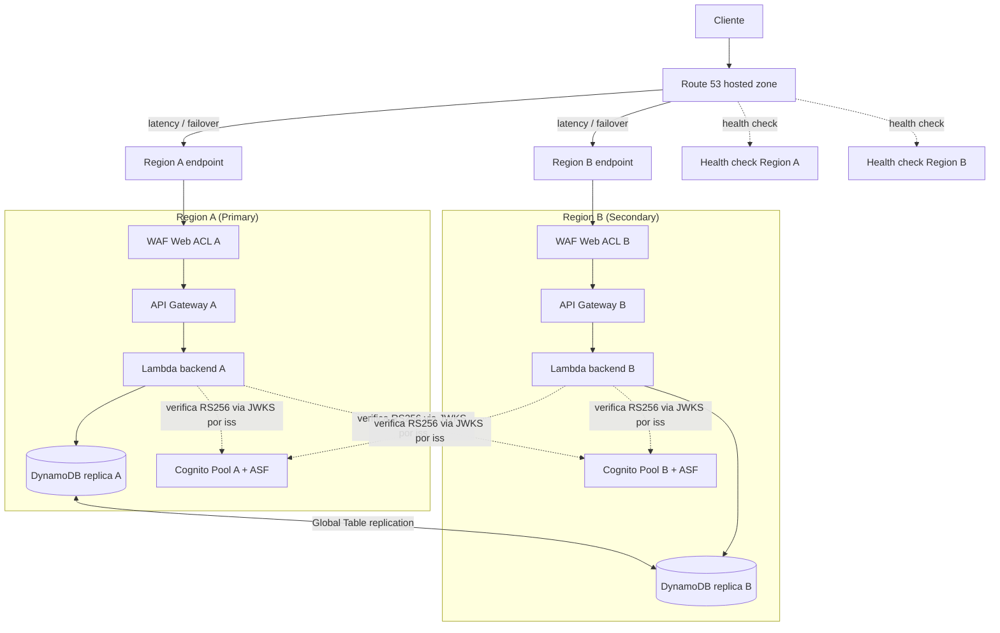

# Design Document: AWS Multi-Region Infrastructure

## Overview

Esta spec define la **infraestructura AWS multi-región** que soporta el backend de Account Management. El servicio de aplicación (Python, Clean Architecture) ya está implementado y no cambia: verifica access tokens con **RS256/JWKS** contra el pool identificado por el claim `iss`, y resuelve el tenant activo y los roles desde **DynamoDB** en cada request (token tenant-agnostic).

El diseño aquí es de **plataforma / infraestructura como código (IaC)**. Cubre cinco pilares:

1. **Route 53** — enrutamiento DNS (latency-based o failover) hacia endpoints regionales.
2. **Health checks + failover** — detección de región no sana y reencaminamiento automático.
3. **AWS WAF** — protección de borde y anti-abuso, con reglas rate-based.
4. **Cognito ASF** — endurecimiento de identidad (autenticación adaptativa, credenciales comprometidas).
5. **DynamoDB Global Tables** — replicación multi-región de los datos que el AuthGuard lee en caliente.

Más dos temas transversales: la **ubicación autoritativa del rate limiting** y la **consistencia de las allow-lists** de verificación de tokens con los pools desplegados.

**Nota de alcance:** la implementación queda **pendiente hasta disponer de una cuenta AWS**. Este documento existe para acordar el diseño y poder ejecutar sin ambigüedad cuando la cuenta esté lista.

## Architecture

### Vista multi-región



El backend en cualquier región puede verificar un token emitido por cualquier pool, porque resuelve el JWKS desde el `iss` del token. Por eso las flechas de verificación cruzan regiones: un login servido por la Región B produce un token que la Región A también sabe verificar, siempre que el `iss` esté en la allow-list.

### Flujo de una petición autenticada multi-región

```mermaid
sequenceDiagram
    participant C as Cliente
    participant R as Route 53
    participant W as WAF (región elegida)
    participant G as API Gateway
    participant L as Lambda backend
    participant J as JWKS del pool (por iss)
    participant D as DynamoDB (réplica regional)

    C->>R: Resuelve dominio del API
    R-->>C: IP del endpoint regional sano (latency/failover)
    C->>W: HTTPS + Bearer access token
    W->>W: Reglas administradas + rate-based (bloquea/permite)
    W->>G: Petición permitida
    G->>L: Invoca handler
    L->>L: Lee iss/kid sin verificar; valida iss en allow-list
    L->>J: Obtiene clave publica (cache por issuer, TTL)
    L->>L: Verifica firma RS256 + claims (token_use=access, client_id, exp)
    L->>D: find_by_id(sub) -> perfil + default_tenant_id
    L->>D: get_roles_for_tenant(sub, tenant) -> roles vigentes
    L-->>C: Respuesta (o 401/403/429 segun el caso)
```

## Components and Interfaces

### 1. Route 53 — enrutamiento DNS (Req 1)

- **Hosted zone** para el dominio del API, con **registros alias** hacia el endpoint regional de cada región (API Gateway regional / distribución de borde).
- **Política de enrutamiento configurable** por parámetro de despliegue:
  - **Latency-based**: dirige a la región de menor latencia para el cliente. Recomendado para operación normal multi-activa.
  - **Failover (activo-pasivo)**: una Primary Region recibe todo el tráfico; la Secondary entra solo cuando la primaria está no sana.
- **TLS/HTTPS únicamente**, con certificados **ACM por región** asociados a cada endpoint regional.
- **TTL de DNS corto** (<= 60 s) para que el failover propague rápido.

**Decisión:** la política por defecto (latency vs failover) queda como **parámetro abierto** (ver TODO / requirements). El diseño soporta ambas sin cambios de código de aplicación.

### 2. Health checks y failover (Req 2)

- **Endpoint de salud** del API por región (por ejemplo `GET /health`) que valide dependencias mínimas.
- **Health checks de Route 53** por región, con umbral de fallos configurable.
- WHEN una región falla de forma sostenida, Route 53 la **saca del enrutamiento**; cuando vuelve a estar sana, se **reincorpora automáticamente**.
- IF todas las regiones están no sanas, se devuelve una **respuesta de error controlada** (no se enruta a un endpoint caído).
- **RTO/RPO**: valores objetivo a fijar (parámetro abierto). RPO depende de la latencia de replicación de la Global Table (típicamente segundos); RTO depende del TTL de DNS + tiempo de detección del health check.

### 3. AWS WAF — borde y anti-abuso (Req 3, Req 6)

- **Web ACL por región** asociado a la capa de entrada (API Gateway regional o distribución de borde).
- **Reglas administradas de AWS**: conjunto común (Core rule set) + entradas maliciosas conocidas.
- **Reglas rate-based** por IP de origen, con ventana y umbral configurables → **primer nivel del rate limiting**.
- **Bloqueo en el borde** + **logging** de eventos a observabilidad centralizada.
- **Allow-list** para orígenes de confianza.

### 4. Cognito ASF — identidad (Req 4)

- **Advanced Security Features habilitado** en cada Region-local Pool.
- **Autenticación adaptativa** con acciones por nivel de riesgo: permitir / exigir MFA / bloquear.
- **Detección de credenciales comprometidas** con acción configurada (p. ej. bloquear login).
- **Configuración equivalente entre regiones** para comportamiento uniforme.
- **Exportar eventos de seguridad** a observabilidad.

### 5. DynamoDB Global Tables — datos (Req 5)

- La **tabla única** se configura como **Global Table** con réplica en cada región que tenga un pool.
- Se replican **todos los ítems que el AuthGuard/casos de uso leen en caliente**: perfil de usuario (con `default_tenant_id`), membresías, roles y tipos de cuenta.
- **Consistencia eventual** entre réplicas: se documenta el impacto en flujos sensibles (p. ej. registro en Región A seguido de login inmediato en Región B, donde la réplica podría no haber convergido todavía).
- **GSIs preservados** en todas las réplicas.
- **Resolución de conflictos**: last-writer-wins por defecto; se documentan implicaciones.

### 6. Rate limiting — ubicación autoritativa (Req 6)

| Nivel | Mecanismo | Alcance |
|-------|-----------|---------|
| 1 (borde) | WAF rate-based rules | Por IP de origen |
| 2 (API) | API Gateway usage plans / throttling | Por cliente / plan de uso |

- Los límites de negocio acordados (p. ej. **5 intentos de login/min por IP-email**, **10 registros/hora por IP**) se **documentan** indicando el nivel donde se aplican.
- La **lógica de aplicación en Python NO reimplementa** el rate limiting de borde. Cualquier límite de negocio no cubierto por WAF/API Gateway se documenta como **excepción explícita**.

### 7. Consistencia de allow-lists de verificación de tokens (Req 7)

- `COGNITO_ISSUERS` se **deriva del conjunto de pools desplegados** (uno por región); `COGNITO_CLIENT_IDS` de los app clients por región.
- WHEN se agrega/elimina una región, **ambas allow-lists se actualizan** para que la verificación siga siendo válida en todas las regiones activas.
- Se proveen al backend vía **configuración de entorno** (sin secreto simétrico; `JWT_SECRET` no se usa).

### 8. Observabilidad y despliegue IaC (Req 8)

- Toda la infra se define como **IaC** versionado, **parametrizado por región** para desplegar la misma definición N veces.
- **Métricas y alarmas**: salud de health checks, tasa de bloqueos de WAF, eventos de riesgo de Cognito, latencia de replicación de DynamoDB, tasa de 429.
- **Runbook de failover manual** como respaldo del automático.

## Data Models

Esta spec es de infraestructura; no introduce entidades de dominio nuevas. Los modelos relevantes son de configuración de plataforma:

- **RegionDeployment**: `{ region, api_endpoint, cognito_pool_id, cognito_client_id, ddb_replica: bool, waf_web_acl_id, health_check_id }` — una entrada por región desplegada.
- **RoutingPolicy**: `{ type: "latency" | "failover", primary_region?, secondary_regions?, dns_ttl_seconds }` — política de Route 53.
- **TokenVerificationConfig** (consumida por el backend vía entorno): `{ cognito_issuers: [issuer_url...], cognito_client_ids: [client_id...] }` — derivada del conjunto de `RegionDeployment`.
- **GlobalTableConfig**: `{ table_name, replica_regions: [region...], gsis: [name...], conflict_resolution: "last-writer-wins" }`.
- **RateLimitPolicy**: `{ level: "waf" | "api-gateway", key: "ip" | "client", window_seconds, max_requests }` — una por límite acordado.

Los datos de negocio (perfil de usuario con `default_tenant_id`, membresías, roles, tipos de cuenta) ya están modelados en la spec `account-management`; aquí solo se replican vía Global Table (Req 5).

## Correctness Properties

Propiedades que la infraestructura debe mantener (verificables mediante pruebas de despliegue en una cuenta AWS real, pendientes):

### Property 1: Token portability cross-region

*For any* access token emitido por cualquier Region-local Pool desplegado, el backend en cualquier región puede verificarlo, siempre que su `iss` esté en `COGNITO_ISSUERS`.

**Validates: Requirements 7.1, 7.3**

### Property 2: Allow-list consistency

*For any* región activa, su `iss` y `client_id` están presentes en las allow-lists; al agregar o quitar una región, las allow-lists reflejan exactamente el conjunto de regiones activas.

**Validates: Requirements 7.1, 7.2, 7.3**

### Property 3: Failover safety

*For any* estado de los health checks, el tráfico nunca se enruta a una región cuyo health check está fallando; si todas fallan, se devuelve un error controlado en lugar de enrutar a un endpoint caído.

**Validates: Requirements 2.2, 2.3, 2.5**

### Property 4: Replica convergence

*For any* ítem escrito en una réplica, este termina visible en todas las demás réplicas (consistencia eventual), preservando los GSIs.

**Validates: Requirements 5.1, 5.3, 5.4**

### Property 5: Rate limit enforcement

*For any* umbral configurado, superarlo produce 429 y un evento registrado, sin que la lógica de aplicación reimplemente el límite de borde.

**Validates: Requirements 6.4, 6.5**

### Property 6: HTTPS-only

*For any* endpoint del sistema, no se acepta tráfico no cifrado.

**Validates: Requirements 1.4**
## Error Handling

- **Región no sana** → Route 53 deja de enrutar; si todas caen, error controlado (Req 2.5).
- **Petición abusiva** → WAF bloquea en borde y registra (Req 3.4); exceso de tasa → **429** (Req 6.4).
- **Token de issuer desconocido / firma inválida / expirado** → el backend responde **401** (comportamiento ya implementado en el AuthGuard).
- **Usuario sin default tenant o sin membresía en el tenant resuelto** → **403** (ya implementado).
- **Replicación no convergida** → el flujo sensible (registro→login inmediato cross-región) se documenta; mitigación operativa (afinidad temporal a la región de registro) es opcional.

## Testing Strategy

Al ser IaC (sin lógica de negocio nueva en Python), la validación es de plataforma:

- **Validación de plantillas IaC** (lint/plan) en CI antes de aplicar.
- **Pruebas de despliegue** en una cuenta AWS real (pendiente): verificar health checks, failover simulando una región no sana, bloqueo de WAF con tráfico sintético, y verificación cross-región de un token emitido por otra región.
- **Prueba de replicación**: escribir en una réplica y leer en otra tras converger.
- **Prueba de rate limiting**: superar el umbral y confirmar 429 + evento en logs.
- El backend en Python **no requiere nuevos tests**; su suite (798 tests) ya cubre RS256/JWKS y la resolución de tenant.

## Dependencies

- **Amazon Route 53** — DNS, health checks, failover/latency routing.
- **AWS WAF** — Web ACL, reglas administradas y rate-based.
- **Amazon Cognito (ASF)** — pools por región con Advanced Security Features.
- **Amazon DynamoDB Global Tables** — replicación multi-región de la tabla única.
- **AWS Certificate Manager (ACM)** — certificados TLS por región.
- **Amazon API Gateway** — endpoint regional + usage plans/throttling.
- **AWS Lambda** — runtime del backend (ya existente).
- **Observabilidad** (CloudWatch u equivalente) — métricas, alarmas y logs centralizados.
- **Herramienta IaC** del proyecto (a definir) — definición versionada y parametrizada por región.

## Open Parameters (a fijar antes de implementar)

- Regiones concretas a desplegar.
- Política de enrutamiento por defecto: latency-based vs failover.
- Valores objetivo de **RTO/RPO**.
- Herramienta IaC concreta.

Estos parámetros están registrados como pendiente en `TODO.md`.


