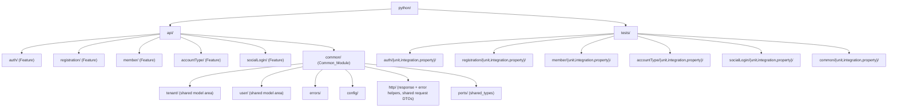

# Design Document

## Overview

This design describes a **structural migration** of the Sport_be backend from a layered / hexagonal (Clean Architecture) tree rooted at `src/` — split into `domain`, `application`, `infrastructure`, and `interfaces` layers — into a **feature-module** tree rooted at `python/`, matching the `apser-backend-ia-template` reference project. All application code moves into self-contained feature modules under `python/api/<feature>/`, cross-cutting code moves into `python/api/common/`, tests move under `python/tests/<feature>/`, and every configuration file that references `src` is repointed to `python`.

The migration is a **pure refactoring**. The only edits permitted inside a moved file are (a) import statements and (b) the file's own name (snake_case → camelCase, with role suffixes where the reference defines them). No function signatures, control flow, data transformations, return values, business logic, API contracts, or Lambda entry-point behavior change. Success is defined by: every project-internal import resolves, every CDK Handler_Path resolves to a callable `handler(event, context)`, static type checking produces no new unresolved-import errors, and the full existing test suite passes with no new migration-attributable failures.

Two Sport_be-specific facts shape the design and differ from the reference:

1. **Deployment via CDK dotted handler paths.** `infra/stacks/app_stack.py` names six Lambda entry points as dotted strings relative to the source root (e.g. `interfaces.http.handlers.auth_handler.handler`). `infra/lambda_assets/lambda_bundling.py` copies the `src/` tree into the Lambda asset. Both must be repointed to the new `python/` layout and module names.
2. **`src/` as the configured import root.** `pyproject.toml` configures `src` in five places: hatch wheel `packages`, `mypy.mypy_path`, `ruff.src`, `ruff.lint.isort.known-first-party`, and pytest `pythonpath`/`testpaths`. All must move to `python`.

A key departure from the reference: the reference exposes `tenant` and `user` as their own top-level feature directories. Sport_be's requirements (Req 1.2) limit the named Features to **exactly five** — `auth`, `registration`, `member`, `accountType`, `socialLogin`. Sport_be's `tenant`, `user`, `user_role`, and `tenant_membership` code is consumed by two or more of those five features (confirmed by import analysis: `member`, `registration`, `auth`, and `socialLogin` all depend on user/tenant entities, mappers, and repositories). Per Req 2.4 and 2.5, cross-feature code belongs in the Common_Module, so tenant/user code is placed under `python/api/common/` (Req 2.6 requires each such file to be an explicit Module_Mapping entry).

### Scope Summary (from source inventory)

- **118 `.py` files** under `src/` (including `__init__.py` files).
- **6 Lambda handler modules** referenced by CDK: `auth_handler`, `registration_handler`, `account_type_handler`, `member_handler`, `oauth_handler`, `post_confirmation_handler`.
- **Test suite** organized into `tests/unit/**`, `tests/integration/**`, `tests/property/**`, plus a legacy `tests/domain/**` group and a few loose files at `tests/` root (`conftest.py`, `test_email.py`, `test_value_objects.py`).

## Architecture

### Target `python/` tree (high level)



### Layered-to-flat collapse model

The reference feature module is **flat**: one directory per feature holding role-named files. The mapping strategy collapses the four current layers into that flat shape as follows.

| Current layer / role | Reference role file | Collapse rule |
|---|---|---|
| `interfaces/http/controllers/<f>_controller.py` | `<feature>Controller.py` | HTTP controller → the feature's `Controller` role file. |
| `interfaces/http/handlers/<f>_handler.py` | `<feature>Handler.py` | Lambda entry point → the feature's `Handler` role file (Sport_be-specific role; the reference has no Lambda handlers, so a `Handler` suffix is introduced consistently for the six entry points). |
| `application/services/<f>*.py` and business orchestration | `<feature>Service.py` | Application service / stateless helper → `Service` role file. |
| `application/use_cases/**` | `<feature><Verb>UseCase.py` (camelCase stem, no reference role) | Use cases have no reference role suffix; keep them as camelCase-stem files inside the feature (Req 3.4 — record "no role mapping"). |
| `application/dtos/**`, `interfaces/http/dtos/**` | `<feature>VM.py` for the primary view model; other DTOs keep camelCase stems | The feature's principal request/response shape maps to the `VM` role; remaining DTOs keep their converted stem (no role). |
| `domain/entities/<x>.py` | `<x>.py` (camelCase stem) | Domain entity → flat model file named after the entity (the reference uses `<feature>.py` / model file names, no suffix). |
| `domain/value_objects/<x>.py` | `<x>.py` (camelCase stem) | Value object → flat model file (no role). |
| `domain/errors/**` | Common `errors/` (camelCase stems) | Error types are cross-feature → Common. |
| `application/ports/**` | Common `ports/` or feature, depending on fan-out | A port used by ≥2 features → Common; a port used by exactly one feature → that feature. |
| `infrastructure/persistence/<x>_repository.py` | `<x>Repository.py` | Repository implementation → feature (single-feature) or Common (cross-feature: user/tenant). |
| `infrastructure/mappers/<x>_mapper.py` | `<x>Mapper.py` | Mapper → feature or Common by fan-out. |
| `infrastructure/auth/**`, `infrastructure/config/**` | Common | Cross-cutting infra (Cognito service, JWKS, DynamoDB client, environment) → Common. |
| `interfaces/http/middleware/**` | Common `http/` | Middleware (auth guard, role guard, validation) is shared across handlers → Common. |
| `interfaces/shared/**` | Common `http/` | Response builder + error handler → Common. |
| `interfaces/http/composition_root*.py` | feature or Common | The main container wires all features → Common; the social composition root is socialLogin-specific → socialLogin. |
| every `__init__.py` | `__init__.py` (unchanged name) | Kept verbatim; recreated in every new package (Req 3.8, Req 1.6). |

**Fan-out decision rule (Req 2.4, 2.5):** a source module is assigned to `common/` if and only if it is imported by two or more distinct Features; otherwise it is assigned to the single Feature that uses it. Fan-out is computed from static import analysis of the `src/` tree.

### CDK / deployment architecture after migration

- Handler_Paths change from `interfaces.http.handlers.<x>_handler.handler` to `api.<feature>.<feature>Handler.handler` (dotted path under the new `python/` root, using the renamed module).
- `lambda_bundling.py` copies `python/` instead of `src/` into the asset (`_SRC_PATH`, bundle `cp` command, and the CDK asset `exclude` globs all repoint to `python/**`).
- The exported callable name stays `handler`, signature stays `handler(event, context)`, the Lambda-function count stays six, and the API-Gateway route wiring is untouched.

## Components and Interfaces

The migration itself is a one-time process (not shipped runtime code). Its logical components are:

### 1. Inventory Scanner
- **Input:** `src/` root path.
- **Output:** the set of all `.py` file paths under `src/` (the source inventory; expected count 118).
- **Interface:** `scan_sources(root) -> set[Path]`.

### 2. Fan-out Analyzer
- **Input:** source inventory + parsed import graph.
- **Output:** for each source module, the set of Features that import it (used to classify Common vs single-Feature).
- **Interface:** `feature_fanout(module) -> set[Feature]`.

### 3. Name Converter
- **Input:** a snake_case file stem (and optional role).
- **Output:** a camelCase stem, with role suffix appended when the file maps to a reference role (`Controller`, `Service`, `VM`) or the Sport_be-introduced `Handler` role.
- **Rule (Req 3.1, 3.2):** remove each underscore; capitalize the first letter of each following word; leave the first word lowercase; preserve `.py`; never rename `__init__.py` (Req 3.8).
- **Interface:** `to_camel(stem) -> str`, `apply_role(camel_stem, role) -> str`.

### 4. Mapping Builder
- **Input:** source inventory, fan-out, name converter.
- **Output:** the **Module_Mapping** — a total function from every source path to exactly one destination path (Req 2.1, 2.2), plus a recorded original-name/new-name pair for every renamed file (Req 3.5) and a "no role" flag where applicable (Req 3.4).
- **Validation (before any file move):**
  - reject if any source file is unmapped (Req 2.8);
  - reject if two sources map to one destination (Req 2.9, 3.6);
  - reject if a destination directory would collide with an existing path (Req 1.8).

### 5. File Mover
- Moves each file byte-for-byte (Req 2.7, 8.2) to its destination, creating `__init__.py` in every new package directory (Req 1.6). Operates only after the Mapping Builder validates.

### 6. Import Rewriter
- **Input:** the Module_Mapping (old module path → new module path).
- **Behavior (Req 4.1–4.4):** rewrite every project-internal `import` / `from ... import ...` (absolute and relative) in both moved sources and test files to the new dotted path; leave stdlib/third-party imports unchanged; if a referenced internal module cannot be mapped to a unique new location, leave it unchanged and emit a diagnostic (file, line, module) and mark the migration incomplete.

### 7. Config Updater
- Edits `pyproject.toml` (5 settings) and `infra/stacks/app_stack.py` + `infra/lambda_assets/lambda_bundling.py` (handler paths, code-asset source). Fails with an identifying error if any stale `src` reference remains (Req 6.6, 7.6).

### 8. Verifier
- Runs import checks, `mypy`, and `pytest`; compares against pre-migration baselines; drives the correction loop (Req 8.3–8.5).

### Interface contract preserved for Lambda handlers

Every migrated handler module continues to export:

```python
def handler(event: dict, context: object) -> dict:
    ...
```

The dotted Handler_Path in CDK resolves to this callable; the accepted HTTP methods, route matching, and response shape are unchanged (Req 5.3, 5.5, 8.6).

## Data Models

### Feature (enumeration)

```
Feature ∈ { auth, registration, member, accountType, socialLogin }
```

`accountType` and `socialLogin` are the camelCase forms of `account_type` and `social_login` (Req 3.1).

### FileRole (enumeration)

```
FileRole ∈ { Controller, Service, VM, Handler, None }
```

`Controller`, `Service`, `VM` are reference roles; `Handler` is the Sport_be Lambda-entry-point role; `None` means "no role suffix — camelCase stem only" (Req 3.4).

### MappingEntry

```
MappingEntry {
  source_path:      str      # e.g. "src/interfaces/http/controllers/auth_controller.py"
  destination_path: str      # e.g. "python/api/auth/authController.py"
  original_name:    str      # "auth_controller.py"
  target_name:      str      # "authController.py"
  role:             FileRole # Controller
  target_feature:   Feature | "common"
}
```

- Invariant: `source_path` is unique across all entries (Req 2.2).
- Invariant: `destination_path` is unique across all entries (Req 2.2, 2.9).
- Invariant: the set of `source_path` values equals the source inventory (Req 2.1, 2.8).

### Module_Mapping (concrete table)

Grouped by destination feature / common. Every `.py` under `src/` appears exactly once. `__init__.py` files are moved (name unchanged) into each destination package and are omitted from the per-file rows below for brevity; they are covered by the `__init__.py` rule (one per created package).

#### Feature: `auth` → `python/api/auth/`

| Source (`src/…`) | Destination (`python/api/auth/…`) | Role |
|---|---|---|
| `interfaces/http/controllers/auth_controller.py` | `authController.py` | Controller |
| `interfaces/http/handlers/auth_handler.py` | `authHandler.py` | Handler |
| `application/use_cases/auth/login_use_case.py` | `loginUseCase.py` | None |
| `application/dtos/auth/login_input_dto.py` | `loginInputDto.py` | None |
| `application/dtos/auth/login_output_dto.py` | `loginOutputDto.py` | None |
| `application/dtos/auth/refresh_input_dto.py` | `refreshInputDto.py` | None |
| `application/dtos/auth/register_input_dto.py` | `registerInputDto.py` | None |
| `application/dtos/auth/register_output_dto.py` | `registerOutputDto.py` | None |
| `application/dtos/auth/forgot_password_input_dto.py` | `forgotPasswordInputDto.py` | None |
| `application/dtos/auth/confirm_forgot_password_input_dto.py` | `confirmForgotPasswordInputDto.py` | None |
| `application/dtos/auth/respond_to_challenge_input_dto.py` | `respondToChallengeInputDto.py` | None |
| `application/dtos/auth/_email.py` | `_email.py` | None |
| `interfaces/http/dtos/login_request.py` | `loginRequest.py` | None |
| `domain/entities/challenge_result.py` | `challengeResult.py` | None |
| `domain/entities/token_pair.py` | `tokenPair.py` | None |

Note: `login_input_dto.py` is the principal auth request shape; if a single `authVM.py` is preferred to match the reference, the Mapping Builder may assign the `VM` role to `login_input_dto.py` → `authVM.py`. The default above keeps each DTO as a distinct camelCase-stem file to avoid destination collisions and preserve one-to-one mapping; the choice is recorded per entry.

#### Feature: `registration` → `python/api/registration/`

| Source (`src/…`) | Destination (`python/api/registration/…`) | Role |
|---|---|---|
| `interfaces/http/controllers/registration_controller.py` | `registrationController.py` | Controller |
| `interfaces/http/handlers/registration_handler.py` | `registrationHandler.py` | Handler |
| `interfaces/http/handlers/post_confirmation_handler.py` | `postConfirmationHandler.py` | Handler |
| `application/use_cases/registration/register_use_case.py` | `registerUseCase.py` | None |
| `application/use_cases/registration/invite_user_use_case.py` | `inviteUserUseCase.py` | None |
| `interfaces/http/dtos/register_request.py` | `registerRequest.py` | None |

Note: `post_confirmation_handler` is the Cognito Post-Confirmation trigger; it is registration-domain behavior (creates records on confirm) and is used by no other feature, so it is placed in `registration`. Its CDK Handler_Path becomes `api.registration.postConfirmationHandler.handler`.

#### Feature: `member` → `python/api/member/`

| Source (`src/…`) | Destination (`python/api/member/…`) | Role |
|---|---|---|
| `interfaces/http/controllers/member_controller.py` | `memberController.py` | Controller |
| `interfaces/http/handlers/member_handler.py` | `memberHandler.py` | Handler |
| `application/use_cases/member/list_members_use_case.py` | `listMembersUseCase.py` | None |
| `application/use_cases/member/update_member_use_case.py` | `updateMemberUseCase.py` | None |
| `application/use_cases/member/deactivate_member_use_case.py` | `deactivateMemberUseCase.py` | None |
| `application/dtos/member/create_member_input_dto.py` | `createMemberInputDto.py` | None |
| `application/dtos/member/update_member_input_dto.py` | `updateMemberInputDto.py` | None |
| `application/dtos/member/member_output_dto.py` | `memberOutputDto.py` | None |
| `application/dtos/member/paginated_members_dto.py` | `paginatedMembersDto.py` | None |
| `interfaces/http/dtos/create_member_request.py` | `createMemberRequest.py` | None |
| `domain/entities/member.py` | `member.py` | None |
| `domain/value_objects/member_id.py` | `memberId.py` | None |
| `domain/value_objects/full_name.py` | `fullName.py` | None |
| `application/ports/i_member_repository.py` | `iMemberRepository.py` | None |
| `infrastructure/persistence/dynamodb_member_repository.py` | `dynamodbMemberRepository.py` | None |
| `infrastructure/mappers/member_mapper.py` | `memberMapper.py` | None |

#### Feature: `accountType` → `python/api/accountType/`

| Source (`src/…`) | Destination (`python/api/accountType/…`) | Role |
|---|---|---|
| `interfaces/http/controllers/account_type_controller.py` | `accountTypeController.py` | Controller |
| `interfaces/http/handlers/account_type_handler.py` | `accountTypeHandler.py` | Handler |
| `application/use_cases/account_type/create_account_type_use_case.py` | `createAccountTypeUseCase.py` | None |
| `application/use_cases/account_type/update_account_type_use_case.py` | `updateAccountTypeUseCase.py` | None |
| `application/use_cases/account_type/delete_account_type_use_case.py` | `deleteAccountTypeUseCase.py` | None |
| `application/use_cases/account_type/list_account_types_use_case.py` | `listAccountTypesUseCase.py` | None |
| `application/dtos/account_type/create_account_type_input_dto.py` | `createAccountTypeInputDto.py` | None |
| `application/dtos/account_type/update_account_type_input_dto.py` | `updateAccountTypeInputDto.py` | None |
| `application/dtos/account_type/account_type_output_dto.py` | `accountTypeOutputDto.py` | None |
| `application/dtos/account_type/paginated_account_types_dto.py` | `paginatedAccountTypesDto.py` | None |
| `interfaces/http/dtos/create_account_type_request.py` | `createAccountTypeRequest.py` | None |
| `domain/entities/account_type.py` | `accountType.py` | None |
| `domain/value_objects/account_type_id.py` | `accountTypeId.py` | None |
| `application/ports/i_account_type_repository.py` | `iAccountTypeRepository.py` | None |
| `infrastructure/persistence/dynamodb_account_type_repository.py` | `dynamodbAccountTypeRepository.py` | None |
| `infrastructure/mappers/account_type_mapper.py` | `accountTypeMapper.py` | None |

#### Feature: `socialLogin` → `python/api/socialLogin/`

| Source (`src/…`) | Destination (`python/api/socialLogin/…`) | Role |
|---|---|---|
| `interfaces/http/controllers/oauth_controller.py` | `oauthController.py` | Controller |
| `interfaces/http/handlers/oauth_handler.py` | `oauthHandler.py` | Handler |
| `interfaces/http/social_login_composition_root.py` | `socialLoginCompositionRoot.py` | None |
| `application/use_cases/social_authorize_use_case.py` | `socialAuthorizeUseCase.py` | None |
| `application/use_cases/social_callback_use_case.py` | `socialCallbackUseCase.py` | None |
| `application/use_cases/tenant_association_use_case.py` | `tenantAssociationUseCase.py` | None |
| `application/dtos/social_login_dtos.py` | `socialLoginDtos.py` | None |
| `application/services/state_token.py` | `stateToken.py` | None |

Note: `state_token` is used only by the two social use cases → single-feature → `socialLogin`.

#### Common_Module → `python/api/common/`

Shared model areas keep small sub-packages so tenant/user code stays grouped (mirrors the reference `common/models`, `common/enums` sub-package style).

| Source (`src/…`) | Destination (`python/api/common/…`) | Reason |
|---|---|---|
| `domain/entities/tenant.py` | `tenant/tenant.py` | tenant used by member, registration, socialLogin (Req 2.6) |
| `domain/entities/tenant_membership.py` | `tenant/tenantMembership.py` | cross-feature (Req 2.6) |
| `domain/value_objects/tenant_id.py` | `tenant/tenantId.py` | cross-feature (Req 2.6) |
| `application/ports/i_tenant_repository.py` | `tenant/iTenantRepository.py` | cross-feature |
| `infrastructure/persistence/dynamodb_tenant_repository.py` | `tenant/dynamodbTenantRepository.py` | cross-feature |
| `infrastructure/mappers/tenant_mapper.py` | `tenant/tenantMapper.py` | cross-feature |
| `domain/entities/user.py` | `user/user.py` | user used by auth, registration, member, socialLogin (Req 2.6) |
| `domain/entities/user_role.py` | `user/userRole.py` | cross-feature (Req 2.6) |
| `application/ports/i_user_repository.py` | `user/iUserRepository.py` | cross-feature |
| `infrastructure/persistence/dynamodb_user_repository.py` | `user/dynamodbUserRepository.py` | cross-feature |
| `infrastructure/mappers/user_mapper.py` | `user/userMapper.py` | cross-feature |
| `domain/value_objects/email.py` | `valueObjects/email.py` | used by auth + registration + user |
| `domain/value_objects/password.py` | `valueObjects/password.py` | used by auth + registration |
| `domain/value_objects/role_name.py` | `valueObjects/roleName.py` | used by member + account_type + user |
| `domain/errors/domain_error.py` | `errors/domainError.py` | shared base error |
| `domain/errors/validation_error.py` | `errors/validationError.py` | cross-feature |
| `domain/errors/not_found_error.py` | `errors/notFoundError.py` | cross-feature |
| `domain/errors/conflict_error.py` | `errors/conflictError.py` | cross-feature |
| `domain/errors/forbidden_error.py` | `errors/forbiddenError.py` | cross-feature |
| `domain/errors/invalid_credentials_error.py` | `errors/invalidCredentialsError.py` | cross-feature |
| `domain/errors/rate_limit_error.py` | `errors/rateLimitError.py` | cross-feature |
| `domain/errors/tenant_not_found_error.py` | `errors/tenantNotFoundError.py` | cross-feature |
| `application/ports/shared_types.py` | `ports/sharedTypes.py` | shared pagination/filter types (Req 2.4) |
| `application/ports/i_cognito_service.py` | `ports/iCognitoService.py` | used by auth + registration + socialLogin |
| `application/dtos/shared/pagination_params.py` | `dtos/paginationParams.py` | shared pagination DTO (Req 2.4) |
| `infrastructure/auth/cognito_auth_service.py` | `auth/cognitoAuthService.py` | shared cognito client |
| `infrastructure/auth/jwks_provider.py` | `auth/jwksProvider.py` | shared JWKS provider (Req 2.4) |
| `infrastructure/config/dynamodb_client.py` | `config/dynamodbClient.py` | shared DynamoDB client (Req 2.4) |
| `infrastructure/config/environment.py` | `config/environment.py` | shared config |
| `interfaces/http/dtos/api_response.py` | `http/apiResponse.py` | shared HTTP response DTO (Req 2.4) |
| `interfaces/shared/response_builder.py` | `http/responseBuilder.py` | shared HTTP response helper (Req 2.4) |
| `interfaces/shared/error_handler.py` | `http/errorHandler.py` | shared HTTP error helper (Req 2.4) |
| `interfaces/http/middleware/auth_guard_middleware.py` | `http/authGuardMiddleware.py` | shared middleware |
| `interfaces/http/middleware/role_guard_middleware.py` | `http/roleGuardMiddleware.py` | shared middleware |
| `interfaces/http/middleware/validation_middleware.py` | `http/validationMiddleware.py` | shared middleware |
| `interfaces/http/composition_root.py` | `compositionRoot.py` | wires all main-API features → Common |

Top-level `src/__init__.py` maps to `python/api/__init__.py` (package initializer for the new root; the `python/` directory itself is a namespace root configured via `pythonpath`).

**Total accounting:** every non-`__init__.py` source file above is assigned exactly once. `__init__.py` files are recreated in each new package directory (Req 1.6). The Mapping Builder asserts `count(source rows) == count(.py under src/)` before moving anything (Req 2.1).

### Configuration data model

| Config location | Before | After |
|---|---|---|
| `pyproject.toml` `[tool.hatch.build.targets.wheel] packages` | `["src"]` | `["python"]` |
| `pyproject.toml` `[tool.pytest.ini_options] pythonpath` | `["src"]` | `["python"]` |
| `pyproject.toml` `[tool.pytest.ini_options] testpaths` | `["tests"]` | `["python/tests"]` |
| `pyproject.toml` `[tool.mypy] mypy_path` | `"src"` | `"python"` |
| `pyproject.toml` `[tool.ruff] src` | `["src", "tests"]` | `["python", "python/tests"]` |
| `pyproject.toml` `[tool.ruff.lint.isort] known-first-party` | `["domain","application","infrastructure","interfaces"]` | `["api"]` |
| `infra/stacks/app_stack.py` handler paths | `interfaces.http.handlers.<x>_handler.handler` | `api.<feature>.<x>Handler.handler` |
| `infra/lambda_assets/lambda_bundling.py` `_SRC_PATH`, bundle `cp`, asset `exclude` | `src` / `src/**` | `python` / `python/**` |

Handler_Path mapping (Req 5.1):

| CDK construct | Before | After |
|---|---|---|
| `AuthFn` | `interfaces.http.handlers.auth_handler.handler` | `api.auth.authHandler.handler` |
| `RegistrationFn` | `interfaces.http.handlers.registration_handler.handler` | `api.registration.registrationHandler.handler` |
| `AccountTypeFn` | `interfaces.http.handlers.account_type_handler.handler` | `api.accountType.accountTypeHandler.handler` |
| `MemberFn` | `interfaces.http.handlers.member_handler.handler` | `api.member.memberHandler.handler` |
| `PostConfirmationFn` | `interfaces.http.handlers.post_confirmation_handler.handler` | `api.registration.postConfirmationHandler.handler` |
| `OAuthHandlerFn` | `interfaces.http.handlers.oauth_handler.handler` | `api.socialLogin.oauthHandler.handler` |

Since Handler_Paths are dotted under the `python/` root and `python/api/__init__.py` makes `api` a package, the `known-first-party` root becomes `api`.

### Test reorganization data model

Every current test file maps to `python/tests/<feature>/<group>/…` where `<group> ∈ {unit, integration, property}` and `<feature>` is one of the five features or `common`. The group is inferred from the current path segment (`tests/unit/**` → `unit`, `tests/integration/**` → `integration`, `tests/property/**` → `property`); the legacy `tests/domain/**` group and the loose root files are classified by subject:

| Current test path | Feature | Group | Destination |
|---|---|---|---|
| `tests/unit/application/use_cases/auth/**`, `tests/unit/interfaces/http/handlers/test_auth_handler.py`, `tests/unit/interfaces/http/controllers/test_auth_controller.py` | auth | unit | `python/tests/auth/unit/…` |
| `tests/integration/test_auth_integration.py` | auth | integration | `python/tests/auth/integration/…` |
| `tests/property/interfaces/http/controllers/test_password_recovery_controller_properties.py`, `tests/property/interfaces/http/handlers/test_password_recovery_handler_properties.py` | auth | property | `python/tests/auth/property/…` |
| `tests/unit/application/use_cases/registration/**`, `tests/integration/test_registration_integration.py`, `tests/unit/interfaces/http/controllers/test_registration_controller.py`, `tests/unit/interfaces/http/test_post_confirmation_handler.py` | registration | unit/integration | `python/tests/registration/{unit,integration}/…` |
| `tests/property/application/use_cases/registration/**` | registration | property | `python/tests/registration/property/…` |
| `tests/unit/application/use_cases/member/**`, `tests/unit/interfaces/http/controllers/test_member_controller.py`, `tests/unit/infrastructure/persistence/test_dynamodb_member_repository.py`, `tests/domain/entities/test_member.py` | member | unit | `python/tests/member/unit/…` |
| `tests/property/application/use_cases/member/**` | member | property | `python/tests/member/property/…` |
| `tests/unit/application/use_cases/account_type/**`, `tests/unit/interfaces/http/controllers/test_account_type_controller.py`, `tests/unit/infrastructure/persistence/test_dynamodb_account_type_repository.py`, `tests/domain/entities/test_account_type.py` | accountType | unit | `python/tests/accountType/unit/…` |
| `tests/property/application/use_cases/account_type/**` | accountType | property | `python/tests/accountType/property/…` |
| `tests/unit/application/use_cases/social_login/**`, `tests/unit/application/use_cases/test_social_authorize_use_case_property_url.py`, `tests/unit/interfaces/http/controllers/test_oauth_controller.py` | socialLogin | unit | `python/tests/socialLogin/unit/…` |
| `tests/unit/application/services/**`, `tests/property/application/services/**`, `tests/property/application/use_cases/social/**`, `tests/property/interfaces/http/middleware/test_pending_tenant_access_control_properties.py` | socialLogin | unit/property | `python/tests/socialLogin/{unit,property}/…` |
| `tests/integration/test_tenant_isolation_and_crud_integration.py`, `tests/unit/infrastructure/persistence/test_dynamodb_tenant_repository.py`, `tests/unit/infrastructure/persistence/test_dynamodb_user_repository.py`, `tests/unit/infrastructure/mappers/test_user_mapper.py`, `tests/domain/entities/test_tenant_membership.py`, `tests/domain/entities/test_user.py`, `tests/domain/entities/test_user_role.py`, `tests/domain/value_objects/**`, `tests/unit/domain/**`, `tests/unit/infrastructure/auth/**`, `tests/unit/interfaces/http/middleware/**` (except pending-tenant), `tests/unit/interfaces/shared/**`, `tests/property/infrastructure/auth/**`, `tests/property/interfaces/http/middleware/test_middleware_properties.py`, `tests/property/test_pagination_properties.py`, `tests/test_email.py`, `tests/test_value_objects.py` | common | unit/integration/property | `python/tests/common/{unit,integration,property}/…` |
| `tests/conftest.py` | (root) | — | `python/tests/conftest.py` |

Group preservation (Req 6.4) is enforced: a test that was in `unit` stays in a `unit/` subpath, `integration` stays in `integration/`, `property` stays in `property/`. The legacy `tests/domain/**` files (not under any group folder) are treated as `unit` for their subject feature.

## Correctness Properties

*A property is a characteristic or behavior that should hold true across all valid executions of a system — essentially, a formal statement about what the system should do. Properties serve as the bridge between human-readable specifications and machine-verifiable correctness guarantees.*

The migration is well suited to property-based testing: the name converter and the mapping builder are pure functions over structured inputs, and the mapping must satisfy strong universal invariants (totality, injectivity, no collisions). The properties below are derived from the prework analysis of the acceptance criteria.

### Property 1: camelCase conversion is deterministic and idempotent on already-camel stems

*For any* snake_case stem `s`, `to_camel(s)` contains no underscores, preserves the first word lowercase, and capitalizes every post-underscore word; and *for any* stem `c` that is already camelCase with no underscores, `to_camel(c) == c`.

**Validates: Requirements 3.1, 3.2**

### Property 2: `__init__.py` is never renamed

*For any* file whose name is exactly `__init__.py`, the Name Converter returns `__init__.py` unchanged.

**Validates: Requirements 3.8**

### Property 3: Mapping is total over the source inventory

*For any* `.py` file under `src/`, the Module_Mapping contains exactly one entry whose `source_path` is that file.

**Validates: Requirements 2.1, 2.8**

### Property 4: Mapping is injective on destinations (no collisions)

*For any* two distinct source files in the Module_Mapping, their destination paths differ; equivalently the number of distinct destinations equals the number of source entries.

**Validates: Requirements 2.2, 2.9, 3.6, 1.8**

### Property 5: Source paths are unique (no source mapped twice)

*For any* Module_Mapping, no `source_path` value appears in more than one entry.

**Validates: Requirements 2.2**

### Property 6: Cross-feature files land in Common, single-feature files land in their feature

*For any* source module `m`, if `m` is imported by two or more distinct Features then its destination is under `python/api/common/`; if `m` is imported by exactly one Feature then its destination is under that Feature's `python/api/<feature>/` directory.

**Validates: Requirements 2.3, 2.4, 2.5**

### Property 7: tenant and user source files are explicitly mapped

*For any* source file under the `tenant` or `user` model areas (`tenant.py`, `tenant_membership.py`, `tenant_id.py`, `i_tenant_repository.py`, `dynamodb_tenant_repository.py`, `tenant_mapper.py`, `user.py`, `user_role.py`, `i_user_repository.py`, `dynamodb_user_repository.py`, `user_mapper.py`), there is exactly one Module_Mapping entry whose destination is a Feature_Module or the Common_Module.

**Validates: Requirements 2.6**

### Property 8: File contents change only on import lines

*For any* migrated file, a line-by-line diff against its pre-migration version shows differences only on lines that are Import_Statements (project-internal import rewrites); all other lines are byte-for-byte identical.

**Validates: Requirements 2.7, 8.1, 8.2**

### Property 9: Every project-internal import resolves post-migration

*For any* migrated application module or test module, importing it raises neither `ModuleNotFoundError` nor `ImportError`.

**Validates: Requirements 4.1, 4.3, 4.6, 6.6**

### Property 10: Import rewrite targets are unique or diagnosed

*For any* project-internal import in a migrated file, either it resolves to a unique new module path (and is rewritten to it) or it is left unchanged and recorded as a diagnostic with file, line, and module name.

**Validates: Requirements 4.4**

### Property 11: Every Handler_Path resolves to a `handler(event, context)` callable

*For any* of the six CDK Handler_Paths after migration, the dotted path resolves to a callable attribute named `handler` whose first two positional parameters are named `event` and `context` in that order.

**Validates: Requirements 5.1, 5.3, 5.5, 5.6**

### Property 12: Test group is preserved across reorganization

*For any* migrated test file that belonged to group `g ∈ {unit, integration, property}` before migration, its destination path contains the same group segment `g`.

**Validates: Requirements 6.4**

### Property 13: Test-file count and one-to-one placement are preserved

*For any* reorganized Test_Suite, the count of test files equals the pre-migration count, each maps to exactly one destination, and none remains at its original location.

**Validates: Requirements 6.2**

### Property 14: No stale `src` reference remains in configuration

*For any* Configuration_File after migration (`pyproject.toml`, `infra/stacks/app_stack.py`, `infra/lambda_assets/lambda_bundling.py`), scanning it yields zero import-root/path references to `src`.

**Validates: Requirements 5.2, 7.1, 7.2, 7.3, 7.4, 7.5, 7.6**

## Error Handling

The migration is transactional at the planning boundary: **no file is moved until the full Module_Mapping validates.** All error paths below match the halt/reject/restore semantics in the acceptance criteria.

| Condition | Detection | Response | Requirement |
|---|---|---|---|
| Target directory collides with an existing path | Pre-create path check | Halt directory creation; emit error naming the conflicting path; no partial creation | 1.8 |
| A source `.py` file has no mapping entry | Totality check vs inventory | Reject the mapping; list each unmapped file; move nothing | 2.8 |
| Two sources map to one destination | Injectivity check | Reject the mapping; identify the conflicting sources + destination; move nothing | 2.9 |
| Two source names convert to the same target within one feature | Per-feature name-collision check | Halt conversion for that feature; leave those sources unchanged; report the conflicting names | 3.6 |
| Internal import cannot be mapped to a unique location | Import Rewriter resolution | Leave the import unchanged; record diagnostic (file, line, module); mark migration incomplete | 4.4 |
| A Handler_Path does not resolve to a callable | Post-migration resolution check | Halt; report the unresolved Handler_Path; leave pre-migration handler references unchanged | 5.6 |
| A test file cannot be mapped to a feature test dir | Test mapping check | Halt reorganization; restore test files to original locations; report the unmappable file | 6.3 |
| A config update leaves a stale `src` reference | Post-update scan | Emit error naming the file + setting; no partial update accepted | 6.6, 7.6 |
| Test suite reports migration-caused failures | Verifier run vs baseline | Correct and re-run until migration-attributable failures reach zero | 8.5 |

**Rollback approach:** because file moves are staged behind mapping validation and executed via a recorded old→new manifest, a failure at any post-move step (import resolution, handler resolution, test collection) can be reversed by replaying the manifest in reverse. Configuration edits are applied last and are individually revertible from the recorded before-values in the config data model table. The test-reorganization step (Req 6.3) explicitly restores original test locations on failure.

## Testing Strategy

### Baselines (captured before migration begins)

- Pre-migration passing test count and total test count (`pytest` collection + run).
- Pre-migration `mypy` unresolved-import error count (Req 8.4 baseline).
- Pre-migration Lambda-function count and route→handler assignments in the CDK stack (Req 5.4, 8.6).

### Property-based tests

Property tests target the pure functions and the mapping invariants. Use **Hypothesis** (already a dev dependency in `pyproject.toml`), minimum **100 iterations** per property, each tagged with the design property.

Tag format: `# Feature: folder-structure-migration, Property {number}: {property_text}`

| Property | Generator strategy |
|---|---|
| P1 (camel conversion) | Generate random snake_case stems (words of `[a-z]`, joined by `_`), plus already-camel stems; assert no underscores, first word lowercase, idempotence on camel input. |
| P2 (`__init__` preserved) | Include `__init__.py` in the name-generator; assert identity. |
| P3 / P4 / P5 (totality, injectivity, uniqueness) | Run the Mapping Builder over the real 118-file inventory and over randomized synthetic inventories; assert `count(sources)==count(entries)`, `count(distinct destinations)==count(entries)`, and unique sources. |
| P6 (fan-out placement) | Generate synthetic import graphs with random fan-out; assert ≥2-feature modules → common, 1-feature modules → that feature. |
| P7 (tenant/user mapped) | Assert each tenant/user file has exactly one Feature/Common destination. |
| P12 (group preserved) | Generate random test paths tagged with a group; assert destination retains the group segment. |

### Example-based unit tests

- **P2 concrete cases:** `account_type` → `accountType`, `social_login` → `socialLogin`, `i_user_repository` → `iUserRepository`, `__init__.py` → `__init__.py`.
- **Handler_Path resolution (P11):** for each of the six handlers, import the new module and assert `handler` exists, is callable, and its first two params are `(event, context)`.
- **Config scan (P14):** parse `pyproject.toml` and assert each of the five settings equals its post-migration value and no value contains `src`; grep `app_stack.py` and `lambda_bundling.py` for `src` and assert zero import-root/path matches.

### Integration / verification tests (not PBT)

These verify wiring and are run once (or a few times), not across 100 inputs:

- **Import resolution sweep (P9):** enumerate every `.py` under `python/` and every test module, import each, assert no `ImportError`/`ModuleNotFoundError` (Req 4.6).
- **mypy run (Req 8.4):** assert new unresolved-import errors ≤ baseline.
- **CDK synth / stack assertions (Req 5.4, 8.6):** assert the Lambda-function count and route→handler assignments are unchanged; assert `cdk synth` still resolves handler strings against the bundled `python/` asset.
- **Full pytest run (Req 8.3, 8.7):** assert passing count ≥ baseline, zero new migration-attributable failures, and the full run completes and reports within 600 seconds.

### Migration & verification procedure

1. Capture baselines (test counts, mypy import-error count, CDK function/route counts).
2. Build and validate the Module_Mapping (halt on any Req 1.8 / 2.8 / 2.9 / 3.6 violation).
3. Create the `python/` tree with `__init__.py` in every package.
4. Move files per the manifest (byte-for-byte).
5. Rewrite project-internal imports in sources and tests; emit diagnostics for any unresolved reference (Req 4.4).
6. Update `pyproject.toml`, `app_stack.py`, `lambda_bundling.py`; scan for stale `src` (Req 7.6).
7. Run the import sweep, `mypy`, CDK assertions, and the full test suite; compare to baselines.
8. If migration-attributable failures exist, correct and re-run until zero (Req 8.5); if a non-recoverable halt condition fires, replay the manifest in reverse to roll back.
9. Validate the produced target-layout document against the actual `python/` tree (Req 1.7).
