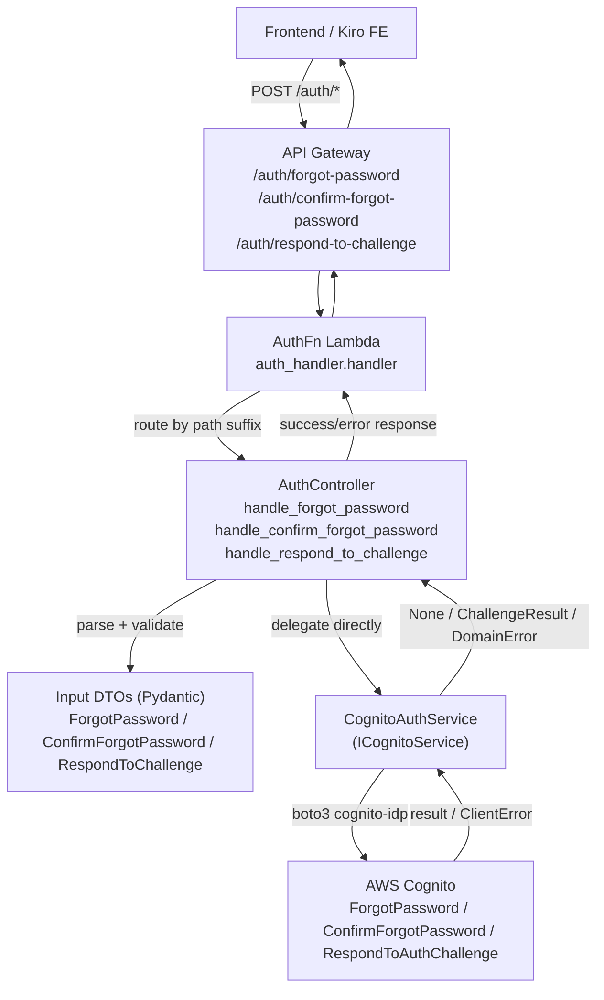

# Design Document: Password Recovery & Challenge

## Overview

Este feature implementa tres endpoints POST que el frontend (Kiro FE) ya invoca pero que aún no existen en el backend, cerrando los callejones sin salida del flujo de recuperación de contraseña y de los desafíos (challenge) devueltos por Cognito durante el login:

- `POST /auth/forgot-password` — inicia el reset (Cognito `ForgotPassword`).
- `POST /auth/confirm-forgot-password` — completa el reset con `Confirmation_Code` + nueva contraseña (Cognito `ConfirmForgotPassword`).
- `POST /auth/respond-to-challenge` — responde a un desafío de autenticación (Cognito `RespondToAuthChallenge`).

### Cómo encaja en el feature de auth existente

El diseño se apoya **exactamente** en las convenciones ya presentes en el backend (Clean/Hexagonal sobre AWS Lambda + API Gateway) y **no** introduce piezas nuevas de infraestructura de cómputo:

- **Sin nueva Lambda.** Las tres rutas son sub-rutas POST bajo el recurso `/auth` existente, servidas por la Lambda `AuthFn` ya desplegada (misma que atiende `/auth/login`, `/auth/refresh`, `/auth/logout`).
- **Sin nuevos casos de uso.** Igual que `refresh` y `logout`, los tres endpoints se delegan **directamente** desde `AuthController` al `Cognito_Auth_Service`. No se crean use cases: el `LoginUseCase` es el único que necesita orquestación (lookup en DynamoDB). Recuperación y challenge son operaciones puras de Cognito.
- **Reutilización de helpers.** El controlador reutiliza `_parse_body`, `_success_response` y `_error_response` de `AuthController`.
- **Puerto y adaptador extendidos.** Se añaden tres métodos abstractos a `ICognitoService` y sus implementaciones concretas en `CognitoAuthService`, siguiendo el patrón de `try/except ClientError → e.response["Error"]["Code"] → error de dominio`, y `logger.error(...) + raise` para lo inesperado.
- **Sin cambio de wiring relevante.** El `composition_root` ya construye `AuthController` con `cognito_service`. No se requiere una nueva dependencia (ver "Composition Root").

### Decisiones de diseño clave

- **Anti-enumeración en el adaptador (no en el controlador).** `forgot_password` **no** propaga `UserNotFoundException`: el adaptador la traga (`return None`) para que el controlador no pueda distinguir el caso "email registrado" del "no registrado" y devuelva una respuesta byte-idéntica (Req 1.3). Se elige el adaptador como capa por ser el punto donde se conoce el código de error de Cognito y por mantener el controlador libre de lógica anti-enumeración condicional.
- **Rate-limit como error de dominio dedicado.** Se añade `RateLimitError(DomainError)` en `src/domain/errors/`. El adaptador lo lanza ante `LimitExceededException`/`TooManyRequestsException` y el controlador lo mapea a **429**. Se prefiere un tipo explícito antes que reusar `ValidationError` para no colisionar con el mapeo genérico `ValidationError→400`.
- **`ChallengeResult` como tipo de resultado bimodal.** `respond_to_challenge` devuelve un `ChallengeResult` (dataclass frozen en `domain.entities`) que porta **o** un `TokenPair` (autenticado) **o** un siguiente desafío (`challenge_name` + `session`), nunca ambos. Un helper `is_authenticated()` distingue los dos casos, garantizando la propiedad XOR (Req 3.2/3.3).
- **`SECRET_HASH` condicional.** El App Client actual **no** tiene secreto configurado, por lo que las llamadas concretas **omiten** `SECRET_HASH` (igual que los métodos existentes). El diseño documenta el punto de extensión (cláusulas WHERE de Req 1.8/2.12/3.10): si en el futuro se configura un secreto, se calcula el HMAC con la misma convención y se inyecta en la llamada / en `Challenge_Responses`.

### Deployment / CDK (fase posterior)

Los cambios de infraestructura se implementan en una fase de tareas separada, sobre `infra/stacks/app_stack.py`. Notas para esa fase:

- **Tres nuevos sub-recursos de API Gateway** bajo el recurso `auth` existente: `forgot-password`, `confirm-forgot-password`, `respond-to-challenge`. Cada uno con un método `POST` apuntando a la **misma** `LambdaIntegration` de `AuthFn` (no se crea integración nueva).
- **Rutas públicas** (sin authorizer), consistente con `/auth/login` (Req 1.9, 2.13, 3.11).
- **IAM:** verificar que el rol de `AuthFn` pueda invocar `cognito-idp:ForgotPassword`, `cognito-idp:ConfirmForgotPassword` y `cognito-idp:RespondToAuthChallenge`. Si el rol se construye con `user_pool.grant(auth_fn, ...actions...)`, la lista de acciones debe extenderse con estas tres. `ForgotPassword`/`ConfirmForgotPassword`/`RespondToAuthChallenge` son operaciones no-admin ligadas al App Client; aun así se recomienda concederlas explícitamente para evitar denegaciones si el rol es restrictivo. **No** se requiere IAM adicional más allá de estas tres acciones.

---

## Architecture



El flujo es idéntico al de `refresh`/`logout`: el handler enruta por sufijo de path, el controlador valida vía DTO y delega directamente al servicio de Cognito. No hay capa de use case intermedia.

---

## Components and Interfaces

### 1. Puerto `ICognitoService` (nuevos métodos abstractos)

En `src/application/ports/i_cognito_service.py`:

```python
async def forgot_password(self, email: str) -> None:
    """Inicia el reset de contraseña (Cognito ForgotPassword).

    NO lanza error si el email no está registrado (anti-enumeración):
    UserNotFoundException se trata como éxito silencioso.

    Raises:
        RateLimitError: LimitExceeded / TooManyRequests.
    """

async def confirm_forgot_password(
    self, email: str, confirmation_code: str, new_password: str
) -> None:
    """Completa el reset (Cognito ConfirmForgotPassword).

    Raises:
        ValidationError: InvalidPassword / CodeMismatch / ExpiredCode.
        RateLimitError: LimitExceeded / TooManyRequests.
    """

async def respond_to_challenge(
    self, challenge_name: str, session: str, challenge_responses: dict[str, str]
) -> ChallengeResult:
    """Responde a un desafío (Cognito RespondToAuthChallenge).

    Returns:
        ChallengeResult: portador de un TokenPair (autenticado) O de un
        siguiente desafío (challenge_name + session), nunca ambos.

    Raises:
        InvalidCredentialsError: NotAuthorized / CodeMismatch (sesión inválida/expirada).
        ValidationError: InvalidPassword en NEW_PASSWORD_REQUIRED.
    """
```

`ChallengeResult` se importa desde `domain.entities.challenge_result` (ver Data Models).

### 2. `ChallengeResult` (nuevo tipo de dominio)

`src/domain/entities/challenge_result.py`, dataclass frozen (consistente con la inmutabilidad de `TokenPair`):

```python
from __future__ import annotations
from dataclasses import dataclass
from domain.entities.token_pair import TokenPair


@dataclass(frozen=True, slots=True)
class ChallengeResult:
    """Resultado bimodal de respond_to_challenge.

    Invariante: exactamente uno de los dos casos está poblado.
    - Autenticado:   token_pair set, next_challenge_name/next_session None.
    - Siguiente reto: next_challenge_name + next_session set, token_pair None.
    """
    token_pair: TokenPair | None = None
    next_challenge_name: str | None = None
    next_session: str | None = None

    def is_authenticated(self) -> bool:
        return self.token_pair is not None

    @classmethod
    def authenticated(cls, token_pair: TokenPair) -> "ChallengeResult":
        return cls(token_pair=token_pair)

    @classmethod
    def next_challenge(cls, challenge_name: str, session: str) -> "ChallengeResult":
        return cls(next_challenge_name=challenge_name, next_session=session)
```

### 3. Adaptador `CognitoAuthService` (nuevos métodos concretos)

En `src/infrastructure/auth/cognito_auth_service.py`. Todos siguen el patrón existente: `try/except ClientError`, mapeo por `e.response["Error"]["Code"]`, y `logger.error(...) + raise` para códigos no contemplados. Ninguna llamada incluye `SECRET_HASH` hoy (el App Client no tiene secreto); se documenta el punto condicional.

**`forgot_password`** → `self._client.forgot_password(ClientId=self._client_id, Username=email)`

| Cognito exception | Manejo en el adaptador |
|---|---|
| `UserNotFoundException` | **Se traga**: `return None` (anti-enumeración, Req 1.3) |
| `LimitExceededException`, `TooManyRequestsException` | `raise RateLimitError(...)` |
| otros | `logger.error("Unexpected Cognito error during forgot_password: %s", code)` + `raise` |

**`confirm_forgot_password`** → `self._client.confirm_forgot_password(ClientId=self._client_id, Username=email, ConfirmationCode=confirmation_code, Password=new_password)`

| Cognito exception | Manejo |
|---|---|
| `InvalidPasswordException` | `raise ValidationError(<reason de Cognito>)` (Req 2.7) |
| `CodeMismatchException` | `raise ValidationError("Invalid confirmation code")` (Req 2.8) |
| `ExpiredCodeException` | `raise ValidationError("Confirmation code has expired")` (Req 2.9) |
| `LimitExceededException`, `TooManyRequestsException` | `raise RateLimitError(...)` |
| otros | `logger.error(...)` + `raise` |

**`respond_to_challenge`** → `self._client.respond_to_auth_challenge(ClientId=self._client_id, ChallengeName=challenge_name, Session=session, ChallengeResponses=challenge_responses)`

- Si la respuesta contiene `AuthenticationResult` → construir `TokenPair` y devolver `ChallengeResult.authenticated(token_pair)`.
- Si la respuesta contiene `ChallengeName` + `Session` (sin `AuthenticationResult`) → devolver `ChallengeResult.next_challenge(resp["ChallengeName"], resp["Session"])`.

| Cognito exception | Manejo |
|---|---|
| `NotAuthorizedException`, `CodeMismatchException` | `raise InvalidCredentialsError()` (→ 401, Req 3.7) |
| `InvalidPasswordException` | `raise ValidationError(<reason>)` (→ 400, Req 3.8) |
| otros | `logger.error(...)` + `raise` |

> **Nota `SECRET_HASH` (Req 1.8/2.12/3.10):** hoy `self._client` se invoca sin `SECRET_HASH` porque el App Client carece de secreto. Punto de extensión: `if self._client_secret: params["SecretHash"] = _secret_hash(email, self._client_id, self._client_secret)` para `forgot_password`/`confirm_forgot_password`, y para `respond_to_challenge` inyectando `challenge_responses["SECRET_HASH"] = ...`, usando la misma derivación HMAC-SHA256 (`base64(HMAC(secret, username + client_id))`) que adoptarían los métodos existentes.

### 4. Controlador `AuthController` (nuevos métodos)

En `src/interfaces/http/controllers/auth_controller.py`. Reutilizan `_parse_body`, `_success_response`, `_error_response`. Delegan **directamente** a `self._cognito_service` (patrón `refresh`/`logout`).

```python
async def handle_forgot_password(self, event) -> dict: ...
async def handle_confirm_forgot_password(self, event) -> dict: ...
async def handle_respond_to_challenge(self, event) -> dict: ...
```

**`handle_forgot_password`** (anti-enumeración):
1. `body = _parse_body(event)`; si `None` → 400.
2. Validar `ForgotPasswordInputDTO(email=...)`; si falla → 400 sin llamar a Cognito.
3. `try: await self._cognito_service.forgot_password(email)` — el adaptador ya tragó `UserNotFound`.
   - `except RateLimitError` → 429.
   - `except Exception` → `logger.exception(...)` + 500.
4. **Siempre** devolver el mismo `_success_response(200, {"message": "If an account exists for this email, a reset code has been sent."})`.

**`handle_confirm_forgot_password`**:
1. `_parse_body` → 400 si `None`.
2. Validar `ConfirmForgotPasswordInputDTO`; si falta/vacío/inválido → 400 sin llamar a Cognito.
3. `try: await self._cognito_service.confirm_forgot_password(...)`.
   - `except ValidationError as e` → `_error_response(400, e.message)`.
   - `except RateLimitError` → 429.
   - `except Exception` → 500.
4. `_success_response(200, {"message": "Password has been reset. Please log in."})` — **sin tokens** (Req 2.3).

**`handle_respond_to_challenge`**:
1. `_parse_body` → 400 si `None` o si el top-level no es objeto (garantizado por `_parse_body`, que sólo acepta dicts).
2. Validar `RespondToChallengeInputDTO`; challenge_name en el set soportado, session no vacío, `challenge_responses` objeto no vacío; si falla → 400 sin llamar a Cognito.
3. `try: result = await self._cognito_service.respond_to_challenge(...)`.
   - `except InvalidCredentialsError` → 401.
   - `except ValidationError as e` → 400 (`e.message`).
   - `except Exception` → 500.
4. Si `result.is_authenticated()` → `_success_response(200, {access_token, id_token, refresh_token, expires_in})` **sin** `challenge_name`.
   Si no → `_success_response(200, {"challenge_name": result.next_challenge_name, "session": result.next_session})` **sin** tokens.

Mapeo transversal de `DomainError` (Req 4.4): `ValidationError→400`, `InvalidCredentialsError→401`, `RateLimitError→429`, otro `DomainError→500`.

### 5. Handler `auth_handler` (nuevas ramas de routing)

En `src/interfaces/http/handlers/auth_handler.py`. El handler ya devuelve 405 para métodos no-POST; se refuerza para incluir el header `Allow: POST` (Req 4.5) y se añaden las tres ramas por sufijo:

```python
if http_method != "POST":
    return _method_not_allowed()  # 405 + {"Allow": "POST", "Content-Type": ...}

resource = event.get("resource") or event.get("path") or ""
if resource.endswith("/login"):
    return _run_async(container.auth_controller.handle_login(event))
elif resource.endswith("/refresh"):
    return _run_async(container.auth_controller.handle_refresh(event))
elif resource.endswith("/logout"):
    return _run_async(container.auth_controller.handle_logout(event))
elif resource.endswith("/forgot-password"):
    return _run_async(container.auth_controller.handle_forgot_password(event))
elif resource.endswith("/confirm-forgot-password"):
    return _run_async(container.auth_controller.handle_confirm_forgot_password(event))
elif resource.endswith("/respond-to-challenge"):
    return _run_async(container.auth_controller.handle_respond_to_challenge(event))
else:
    return _error_response(404, "Route not found")
```

Nuevo helper `_method_not_allowed()`:

```python
def _method_not_allowed() -> dict[str, Any]:
    return {
        "statusCode": 405,
        "headers": {"Content-Type": "application/json", "Allow": "POST"},
        "body": json.dumps({"error": "Method not allowed"}),
    }
```

### 6. DTOs de entrada (nuevos)

En `src/application/dtos/auth/`, siguiendo la convención Pydantic `BaseModel` de `LoginInputDTO`. Se usan validadores para reflejar exactamente las reglas de los criterios de aceptación (la construcción del DTO fallando produce 400 en el controlador, como `LoginInputDTO`).

`forgot_password_input_dto.py`:
```python
from pydantic import BaseModel, field_validator

class ForgotPasswordInputDTO(BaseModel):
    email: str

    @field_validator("email")
    @classmethod
    def _valid_email(cls, v: str) -> str:
        v = (v or "").strip()
        if not (3 <= len(v) <= 254) or v.count("@") != 1:
            raise ValueError("invalid email")
        local, _, domain = v.partition("@")
        if not local or not domain:
            raise ValueError("invalid email")
        return v
```

`confirm_forgot_password_input_dto.py`:
```python
class ConfirmForgotPasswordInputDTO(BaseModel):
    email: str                # misma validación de email que arriba
    confirmation_code: str    # 1..2048, no vacío/whitespace
    new_password: str         # 1..256, no vacío/whitespace
```

`respond_to_challenge_input_dto.py`:
```python
SUPPORTED_CHALLENGES = {
    "NEW_PASSWORD_REQUIRED", "SMS_MFA", "SOFTWARE_TOKEN_MFA", "CUSTOM_CHALLENGE",
}

class RespondToChallengeInputDTO(BaseModel):
    challenge_name: str                 # debe estar en SUPPORTED_CHALLENGES
    session: str                        # 1..2048, no vacío
    challenge_responses: dict[str, str] # objeto no vacío (>= 1 par)
```

**Respuestas:** siguiendo `AuthController`, los éxitos se devuelven como `dict` planos vía `_success_response` (el codebase no usa output DTOs en refresh/logout). No se añaden output DTOs; se documentan las formas en Data Models.

### 7. Errores de dominio

- Reutiliza `ValidationError` (400), `InvalidCredentialsError` (401), `DomainError` (500).
- **Nuevo:** `RateLimitError(DomainError)` en `src/domain/errors/rate_limit_error.py`:
  ```python
  class RateLimitError(DomainError):
      def __init__(self, message: str = "Too many requests, please try again later") -> None:
          super().__init__(message)
  ```
  Mapeado a **429** por el controlador. Se elige un tipo dedicado en lugar de reusar `ValidationError` para no interferir con el mapeo `ValidationError→400`.

### 8. Composition Root

`src/interfaces/http/composition_root.py` ya construye `AuthController(login_use_case=..., cognito_service=cognito_service)`. Como los tres nuevos métodos usan `self._cognito_service` (ya inyectado), **no se requiere ningún cambio de wiring**. El `Container` ya expone `auth_controller`.

---

## Data Models

### Input DTOs

| DTO | Campos | Reglas de validación |
|---|---|---|
| `ForgotPasswordInputDTO` | `email: str` | un solo `@`, local y domain no vacíos, longitud total 3–254 |
| `ConfirmForgotPasswordInputDTO` | `email: str`, `confirmation_code: str`, `new_password: str` | email como arriba; code no vacío/whitespace (1–2048); new_password no vacío/whitespace (1–256) |
| `RespondToChallengeInputDTO` | `challenge_name: str`, `session: str`, `challenge_responses: dict[str,str]` | challenge_name ∈ set soportado; session no vacío (≤2048); responses objeto con ≥1 par |

### `ChallengeResult`

| Campo | Tipo | Caso autenticado | Caso siguiente-reto |
|---|---|---|---|
| `token_pair` | `TokenPair \| None` | set | `None` |
| `next_challenge_name` | `str \| None` | `None` | set |
| `next_session` | `str \| None` | `None` | set |

Invariante: `is_authenticated() == (token_pair is not None)` y exactamente uno de los dos modos poblado.

### Formas de respuesta (success)

**`POST /auth/forgot-password`** — 200 (idéntica en todos los casos):
```json
{ "message": "If an account exists for this email, a reset code has been sent." }
```

**`POST /auth/confirm-forgot-password`** — 200 (sin tokens):
```json
{ "message": "Password has been reset. Please log in." }
```

**`POST /auth/respond-to-challenge`** — 200, dos resultados distinguibles:

Caso A (autenticado — igual shape que login, sin `challenge_name`):
```json
{ "access_token": "...", "id_token": "...", "refresh_token": "...", "expires_in": 3600 }
```

Caso B (siguiente desafío — sin tokens):
```json
{ "challenge_name": "SMS_MFA", "session": "<opaque>" }
```

El FE distingue A vs B por presencia de `access_token` versus `challenge_name`.

Todos los éxitos incluyen `statusCode`, `headers` con `Content-Type: application/json` y `body` JSON serializable (Req 4.2).

---

## Correctness Properties

*A property is a characteristic or behavior that should hold true across all valid executions of a system — essentially, a formal statement about what the system should do. Properties serve as the bridge between human-readable specifications and machine-verifiable correctness guarantees.*

Estas propiedades se derivan del prework de criterios de aceptación (redundancias eliminadas: los criterios de "éxito genérico" se subsumen en la propiedad anti-enumeración; los criterios de rechazo de cuerpo malformado y de campos inválidos se consolidan en una única propiedad de validación por endpoint; los dos resultados de respond-to-challenge se unifican en la propiedad XOR).

### Property 1: Anti-enumeración de forgot-password

*For any* email sintácticamente válido, la respuesta HTTP de `handle_forgot_password` (par `statusCode` + `body` serializado) SHALL ser byte-idéntica tanto cuando el servicio Cognito completa con éxito como cuando el email no está registrado (rama `UserNotFoundException` tragada por el adaptador), y en ambos casos SHALL ser `200`.

**Validates: Requirements 1.2, 1.3**

---

### Property 2: Validación de entrada sin efecto colateral (y llamada única en entrada válida)

*For any* endpoint de los tres y *for any* cuerpo de petición inválido — cuerpo ausente, JSON malformado, top-level no-objeto, o cualquier campo requerido ausente/vacío/whitespace, email sin formato válido, `challenge_name` fuera del set soportado, o `challenge_responses` no-objeto/vacío — el controlador SHALL responder `400` con body `{"error": <str no vacío>}` y SHALL NOT invocar el `Cognito_Auth_Service`; y recíprocamente, *for any* entrada totalmente válida el controlador SHALL invocar el método correspondiente del servicio exactamente una vez con los valores parseados.

**Validates: Requirements 1.1, 1.4, 1.5, 2.1, 2.4, 2.5, 2.6, 3.1, 3.4, 3.5, 3.6**

---

### Property 3: Distinguibilidad XOR de respond-to-challenge

*For any* `ChallengeResult` de éxito devuelto por el servicio, el body de respuesta de `handle_respond_to_challenge` SHALL contener **exactamente uno** de los dos conjuntos —{`access_token`,`id_token`,`refresh_token`,`expires_in`} (cuando `is_authenticated()`), o {`challenge_name`,`session`} (cuando hay siguiente reto)— nunca ambos y nunca ninguno, siendo el status siempre `200` y el caso autenticado sin campo `challenge_name`.

**Validates: Requirements 3.2, 3.3**

---

### Property 4: Forma del error y no-fuga de material sensible

*For any* petición a cualquiera de los tres endpoints que produzca una respuesta de error (status ≥ 400), el body SHALL ser exactamente `{"error": <str>}` con `1 ≤ len(<str>) ≤ 500`, y `<str>` SHALL NOT contener como subcadena ninguno de los valores sensibles suministrados en la petición (password, `confirmation_code`, `session`, tokens, ni ningún `SECRET_HASH`).

**Validates: Requirements 4.1, 4.6**

---

### Property 5: confirm-forgot-password exitoso no contiene tokens

*For any* triple válido (email, confirmation_code, new_password) para el que el servicio completa con éxito, el body de respuesta `200` de `handle_confirm_forgot_password` SHALL NOT contener las claves `access_token`, `id_token` ni `refresh_token`.

**Validates: Requirements 2.2, 2.3**

---

### Property 6: Mapeo de DomainError a estado HTTP

*For any* subtipo de `DomainError` lanzado por el `Cognito_Auth_Service` al atender cualquiera de los tres endpoints, el controlador SHALL mapear `ValidationError`→`400`, `InvalidCredentialsError`→`401`, `RateLimitError`→`429`, y cualquier otro subtipo de `DomainError`→`500`.

**Validates: Requirements 1.6, 1.7, 2.7, 2.8, 2.9, 2.10, 2.11, 3.7, 3.8, 3.9, 4.4**

---

### Property 7: Método no-POST produce 405 con Allow: POST

*For any* método HTTP distinto de `POST` sobre `/auth/forgot-password`, `/auth/confirm-forgot-password` o `/auth/respond-to-challenge`, el `Auth_Handler` SHALL responder `405`, con el header `Allow: POST`, y body `{"error": <str no vacío>}`.

**Validates: Requirements 4.5**

---

## Error Handling

Tabla de mapeo Cognito → error de dominio → HTTP status por endpoint.

### `POST /auth/forgot-password`

| Escenario | Cognito exception | Error de dominio | HTTP |
|---|---|---|---|
| Cuerpo ausente / JSON inválido | — (pre-Cognito) | — | 400 |
| Email inválido | — (pre-Cognito, DTO) | — | 400 |
| Email no registrado | `UserNotFoundException` | **tragado** → éxito | **200** (idéntico) |
| Rate limit | `LimitExceeded`/`TooManyRequests` | `RateLimitError` | 429 |
| Inesperado (≠ UserNotFound) | otros | re-raise → `Exception` | 500 |
| Éxito | — | — | 200 (body genérico) |

### `POST /auth/confirm-forgot-password`

| Escenario | Cognito exception | Error de dominio | HTTP |
|---|---|---|---|
| Cuerpo/JSON inválido, campo faltante, email inválido | — (pre-Cognito) | — | 400 |
| Password viola política | `InvalidPasswordException` | `ValidationError(reason)` | 400 |
| Código no coincide | `CodeMismatchException` | `ValidationError` | 400 |
| Código expirado | `ExpiredCodeException` | `ValidationError` | 400 |
| Rate limit | `LimitExceeded`/`TooManyRequests` | `RateLimitError` | 429 |
| Inesperado | otros | re-raise | 500 |
| Éxito | — | — | 200 (sin tokens) |

### `POST /auth/respond-to-challenge`

| Escenario | Cognito exception | Error de dominio | HTTP |
|---|---|---|---|
| Cuerpo/JSON inválido, no-objeto, campos inválidos, challenge_name no soportado | — (pre-Cognito) | — | 400 |
| Sesión inválida/expirada | `NotAuthorizedException`/`CodeMismatchException` | `InvalidCredentialsError` | 401 |
| Password viola política (NEW_PASSWORD_REQUIRED) | `InvalidPasswordException` | `ValidationError(reason)` | 400 |
| Inesperado | otros | re-raise | 500 |
| Éxito con tokens | — | — | 200 (Token_Set) |
| Éxito con siguiente reto | — | — | 200 (challenge_name+session) |

### Transversal (Req 4)

- **Anti-enumeración (Req 1.3):** manejada en el adaptador (`forgot_password` traga `UserNotFoundException`); el controlador nunca ve el caso y responde siempre 200.
- **405 / Allow: POST (Req 4.5):** cualquier método ≠ POST → 405 con header `Allow: POST`.
- **Forma de error (Req 4.1, 4.6):** todos los errores usan `{"error": <message>}` con `<message>` no vacío (1–500) y sin material sensible ni stack traces. Los helpers `_error_response`/`_method_not_allowed` garantizan la forma.
- **DomainError mapping (Req 4.4):** `ValidationError→400`, `InvalidCredentialsError→401`, `RateLimitError→429`, otro `DomainError→500`; `Exception` no-dominio → 500 con `logger.exception(...)`.

---

## Security

- **No logging de secretos (Req 4.3, 4.1):** el adaptador y el controlador NUNCA registran `new_password`, `confirmation_code`, `session`, tokens ni `SECRET_HASH`. Se sigue el patrón existente de `initiate_auth` (que loggea sólo `error_code`, nunca la password). En excepciones inesperadas se usa `logger.exception(...)` con mensaje genérico, sin volcar el body de la petición.
- **Anti-enumeración (Req 1.3):** respuesta byte-idéntica para email registrado y no registrado en forgot-password. Ver Property 1.
- **`SECRET_HASH` condicional (Req 1.8/2.12/3.10):** hoy omitido (App Client sin secreto). Si se añade secreto, se deriva con la misma convención HMAC de los métodos existentes y NUNCA se loggea. `SECRET_HASH` se trata como material sensible en las mismas reglas de no-fuga (Property 4).
- **Mensajes de error genéricos:** el body de error no revela detalles internos ni stack traces (Req 4.6); las razones de política de contraseña de Cognito (Req 2.7, 3.8) se propagan pero no incluyen la contraseña.

---

## Testing Strategy

El proyecto usa **pytest**, **moto** para tests del adaptador Cognito, **unittest.mock** para tests de controlador y **Hypothesis** para tests de propiedad. El feature es apto para PBT: la lógica del controlador es entrada/salida determinista con invariantes universales (anti-enumeración, validación, XOR, forma de error), aislable con mocks.

### Enfoque dual

- **Unit tests (moto + mock):** ejemplos concretos, mapeos de excepción y edge cases.
- **Property-based tests (Hypothesis):** invariantes universales sobre grandes espacios de entrada.

### Unit tests

- **Adaptador (`tests/unit/infrastructure/auth/test_cognito_auth_service.py`, moto):**
  - `forgot_password`: éxito; `UserNotFoundException` no lanza (retorna `None`); `LimitExceeded`→`RateLimitError`; error inesperado re-lanza.
  - `confirm_forgot_password`: éxito; `InvalidPassword`/`CodeMismatch`/`ExpiredCode`→`ValidationError`; `LimitExceeded`→`RateLimitError`.
  - `respond_to_challenge`: respuesta con `AuthenticationResult`→`ChallengeResult.authenticated`; respuesta con `ChallengeName`+`Session`→`ChallengeResult.next_challenge`; `NotAuthorized`→`InvalidCredentialsError`; `InvalidPassword`→`ValidationError`.
- **Controlador (`tests/unit/interfaces/http/controllers/test_auth_controller.py`, mock):**
  - Mapeos de estado por endpoint (400/401/429/500), forma de éxito, ausencia de tokens en confirm, dos resultados de respond-to-challenge, no logging de secretos (con `caplog`).
- **Handler (`tests/unit/interfaces/http/handlers/test_auth_handler.py`):**
  - Routing de las tres nuevas ramas; 405 + `Allow: POST` para no-POST; 404 para ruta desconocida.

### Property-based tests (Hypothesis)

- Mínimo **100 iteraciones** por propiedad; cada test etiquetado con:
  `# Feature: password-recovery-challenge, Property {n}: {property_text}`
- Se usa la librería Hypothesis existente (no reimplementar PBT). Los servicios Cognito se mockean para probar la lógica del controlador de forma barata (sin llamadas AWS).

| Propiedad | Test (Hypothesis) | Requisitos cubiertos |
|---|---|---|
| P1 Anti-enumeración | genera emails válidos; corre controlador con mock éxito vs mock `UserNotFound`-tragado; assert responses byte-idénticas y 200 | 1.2, 1.3 |
| P2 Validación sin efecto | genera cuerpos malformados / campos inválidos por endpoint; assert 400 y `service` no llamado; y entradas válidas → llamada única | 1.1, 1.4, 1.5, 2.1, 2.4, 2.5, 2.6, 3.1, 3.4, 3.5, 3.6 |
| P3 XOR respond-to-challenge | genera `ChallengeResult` autenticado o siguiente-reto; assert exactamente un conjunto de campos presente | 3.2, 3.3 |
| P4 Forma error + no-fuga | inyecta secretos como inputs en escenarios de error; assert body `{"error": s}`, 1≤len≤500, sin subcadenas sensibles | 4.1, 4.6 |
| P5 confirm sin tokens | triples válidos con mock éxito; assert body sin claves de token | 2.2, 2.3 |
| P6 Mapeo DomainError | parametriza subtipo de error lanzado por mock; assert status mapeado | 1.6, 1.7, 2.7–2.11, 3.7–3.9, 4.4 |
| P7 405 Allow: POST | genera métodos ≠ POST sobre las tres rutas; assert 405 + `Allow: POST` | 4.5 |

Los tests de propiedad viven bajo `tests/property/...` siguiendo la convención existente.

---

## Requirements Traceability

| Requisito / Criterio | Elemento de diseño | Propiedad | Test |
|---|---|---|---|
| 1.1 Invoca ForgotPassword con email válido | `handle_forgot_password` → `forgot_password` | P2 | property + unit |
| 1.2 200 + body genérico | `_success_response` genérico | P1 | property |
| 1.3 UserNotFound → 200 idéntico (anti-enum) | Adaptador traga `UserNotFoundException` | P1 | property + unit(moto) |
| 1.4 Cuerpo/JSON inválido → 400, sin Cognito | `_parse_body` + guard | P2 | property |
| 1.5 email inválido → 400, sin Cognito | `ForgotPasswordInputDTO` validator | P2 | property |
| 1.6 rate limit → 429 | `RateLimitError` → 429 | P6 | unit |
| 1.7 inesperado → 500 | `except Exception` → 500 | P6 | unit |
| 1.8 SECRET_HASH condicional | nota de diseño en adaptador | — | (futuro) |
| 1.9 ruta pública /auth | CDK sub-recurso público | — | CDK/handler |
| 2.1 Invoca ConfirmForgotPassword | `handle_confirm_forgot_password` | P2 | property + unit |
| 2.2 200 + body genérico | `_success_response` | P5 | property |
| 2.3 sin tokens | body sin claves de token | P5 | property |
| 2.4 Cuerpo/JSON inválido → 400 | `_parse_body` | P2 | property |
| 2.5 campo faltante → 400 | `ConfirmForgotPasswordInputDTO` | P2 | property |
| 2.6 email inválido → 400, sin Cognito | DTO validator | P2 | property |
| 2.7 InvalidPassword → 400 reason | `ValidationError(reason)` | P6 | unit |
| 2.8 CodeMismatch → 400 | `ValidationError` | P6 | unit |
| 2.9 ExpiredCode → 400 | `ValidationError` | P6 | unit |
| 2.10 rate limit → 429 | `RateLimitError` | P6 | unit |
| 2.11 inesperado → 500 | `except Exception` | P6 | unit |
| 2.12 SECRET_HASH condicional | nota de diseño | — | (futuro) |
| 2.13 ruta pública | CDK | — | CDK/handler |
| 3.1 Invoca RespondToAuthChallenge | `handle_respond_to_challenge` | P2 | property + unit |
| 3.2 tokens → 200 Token_Set sin challenge_name | `ChallengeResult.authenticated` | P3 | property |
| 3.3 siguiente reto → 200 challenge_name+session | `ChallengeResult.next_challenge` | P3 | property |
| 3.4 no-objeto/JSON inválido → 400 | `_parse_body` (sólo dict) | P2 | property |
| 3.5 campos inválidos → 400 | `RespondToChallengeInputDTO` | P2 | property |
| 3.6 challenge_name no soportado → 400 | `SUPPORTED_CHALLENGES` | P2 | property |
| 3.7 sesión inválida/expirada → 401 | `InvalidCredentialsError` | P6 | unit |
| 3.8 InvalidPassword → 400 reason | `ValidationError(reason)` | P6 | unit |
| 3.9 inesperado → 500 | `except Exception` | P6 | unit |
| 3.10 SECRET_HASH condicional | nota de diseño | — | (futuro) |
| 3.11 ruta pública | CDK | — | CDK/handler |
| 4.1 forma error {"error": str} sin secretos | `_error_response` | P4 | property |
| 4.2 forma éxito statusCode/headers/body | `_success_response` | P1/P3/P5 | property |
| 4.3 logs sin secretos | patrón de logging del adaptador/controlador | P4 (refuerzo) | unit(caplog) |
| 4.4 mapeo DomainError | mapeo en controlador | P6 | unit |
| 4.5 no-POST → 405 + Allow: POST | `_method_not_allowed` | P7 | property/unit |
| 4.6 no-DomainError → 500 genérico sin secretos | `except Exception` + `_error_response` | P4 | property/unit |
