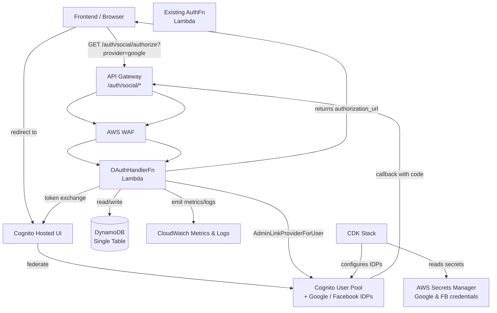

# Design Document: Social Login

## Overview

This design adds federated social authentication (Google and Facebook) to the existing Account Management backend. The system already provides an email+password flow backed by AWS Cognito, a Post Confirmation Lambda trigger that provisions DynamoDB records, and a hexagonal architecture with clearly separated ports and adapters.

The social login feature extends the system in three layers:

1. **Infrastructure (CDK)** — configure Cognito Identity Providers, Hosted UI domain, OAuth App Client settings, and Secrets Manager references for social credentials.
2. **Application + Domain** — a new `SocialLoginUseCase`, a `TenantAssociationUseCase`, new port methods on `ICognitoService` and the repositories, and extended domain entities/value objects.
3. **Interface (HTTP)** — a new `OAuthHandlerFn` Lambda exposing `GET /auth/social/authorize`, `GET /auth/social/callback`, and `POST /auth/social/select-tenant`.

Key design decisions:
- **Provisioning is synchronous** — DynamoDB records are created inside the callback handler, not via a Cognito trigger, so tokens are only returned after the user's records exist (Requirement 9.4).
- **State parameter uses HMAC-SHA256 + timestamp** — stored in an ephemeral in-memory dict during the authorize call and validated in the callback, with a 10-minute TTL (Requirements 2.4, 8.1, 8.2).
- **Email-based deduplication** — existing users are found by querying DynamoDB by email (Requirement 6.6), then linked via `AdminLinkProviderForUser` rather than creating a new Cognito user.
- **`pending_tenant` status** — when no tenant can be auto-assigned, the User is created with `status="pending_tenant"` and `default_tenant_id=None`; the select-tenant endpoint completes the flow (Requirement 5).
- **New `registration_type="social"` value** — the Member entity and its validation will accept this third option alongside existing `"self"` and `"invited"`.

---

## Architecture



The new `OAuthHandlerFn` is a separate Lambda alongside the existing `auth`, `registration`, `account_type`, and `member` functions. It shares the same backend code bundle and the same DynamoDB table. It does **not** reuse the existing `auth_handler.py` entry point — it gets its own handler module so CDK can grant it specific IAM permissions (Cognito token exchange, `AdminLinkProviderForUser`, Secrets Manager read).

### State Management for CSRF Protection

The `state` parameter is a signed token: `base64url(timestamp_iso) + "." + hmac_sha256_hex(secret, timestamp_iso)`. The handler validates the HMAC and checks that the timestamp is within 10 minutes. No external store (ElastiCache, DynamoDB) is needed; the HMAC secret lives in a Lambda environment variable sourced from Secrets Manager at deploy time.

---

## Components and Interfaces

### New CDK Resources (`infra/stacks/app_stack.py`)

| Resource | Description |
|---|---|
| `UserPoolIdentityProviderGoogle` | Google IDP with credentials from Secrets Manager |
| `UserPoolIdentityProviderFacebook` | Facebook IDP with credentials from Secrets Manager |
| `UserPoolDomain` | Cognito Hosted UI domain: `sport-<env>` |
| `AppClient` (extended) | Adds `COGNITO`, `Google`, `Facebook` to supported IDPs; enables Authorization Code Grant; registers callback/logout URLs |
| `OAuthHandlerFn` | New Lambda for social login endpoints |
| `OAuthHandlerLogGroup` | CloudWatch Log Group for the new Lambda |
| Secret references | `from_secret_name_v2` for `social/google` and `social/facebook` in Secrets Manager |

The existing `AppClient` created by `_build_cognito()` will be replaced or extended (via `user_pool.add_client` with additional parameters). Because CDK does not allow patching an existing `UserPoolClient` construct after creation, `_build_cognito()` will be updated to accept the social config and produce a single client with all required settings.

Two new custom attributes must be added to the User Pool:
- `custom:social_sub` — stores the provider's subject identifier (`sub` for Google, `id` for Facebook).
- `custom:provider` — stores which provider was used (`"google"` or `"facebook"`).

### New Application Port Methods

**`ICognitoService`** — new abstract methods:

```python
@abstractmethod
async def exchange_code_for_tokens(
    self,
    code: str,
    redirect_uri: str,
    hosted_ui_domain: str,
) -> TokenPair: ...

@abstractmethod
async def admin_link_provider_for_user(
    self,
    destination_cognito_sub: str,
    provider_name: str,  # "Google" or "Facebook"
    provider_user_id: str,  # sub or id from the social provider
) -> None: ...

@abstractmethod
async def admin_update_user_attributes(
    self,
    cognito_sub: str,
    attributes: dict[str, str],
) -> None: ...
```

**`IUserRepository`** — new methods:

```python
def find_by_cognito_sub(self, cognito_sub: str) -> User | None: ...

def register_social_user(
    self,
    user: User,
    membership: TenantMembership | None,
    member: Member | None,
    role: UserRole | None,
) -> None: ...
# Atomic write with attribute_not_exists(PK) on User;
# membership/member/role included only when tenant is known.

def associate_tenant(
    self,
    user_id: str,
    membership: TenantMembership,
    member: Member,
    role: UserRole,
    new_status: str,
    new_default_tenant_id: str,
) -> None: ...
# Atomic write of TenantMembership + Member + Role + User update.
```

**`ITenantRepository`** — existing port; `find_by_id` is already defined and sufficient.

### New Application Use Cases

#### `SocialAuthorizeUseCase`

Input: `provider: str`
Output: `authorization_url: str`

Logic:
1. Validate `provider` is `"google"` or `"facebook"`.
2. Build the state token (HMAC-SHA256 over ISO timestamp with `SOCIAL_STATE_SECRET`).
3. Construct the Cognito Hosted UI authorization URL with `response_type=code`, `client_id`, `redirect_uri`, `scope=openid email profile`, `identity_provider=Google|Facebook`, `state`.
4. Return the URL.

#### `SocialCallbackUseCase`

Input: `code: str`, `state: str`
Output: `SocialLoginOutputDTO`

Logic:
1. Validate `state` (HMAC + 10-minute TTL). Raise `ValidationError("invalid_state")` on failure.
2. Exchange `code` for tokens via `cognito_service.exchange_code_for_tokens(...)`.
3. Decode `id_token` (JWT, no verification needed — Cognito already validated it) to extract `sub`, `email`, `name`, `custom:provider`.
4. Look up `User` by `cognito_sub` in DynamoDB → if found, return tokens (existing social user, fast path).
5. Look up `User` by `email` in DynamoDB:
   - **Found (Native_User)**: invoke `_link_provider(...)`, return existing user's tokens.
   - **Not found (new Social_User)**: invoke `_provision_new_user(...)`, return tokens.
6. Build `SocialLoginOutputDTO` including `requires_tenant_selection: bool`.

#### `TenantAssociationUseCase`

Input: `user_id: str`, `tenant_id: str`, `access_token: str` (for auth)
Output: `TenantAssociationOutputDTO`

Logic:
1. Verify the calling user's `user_id` matches the token subject (done at controller level via `AuthGuardMiddleware`).
2. Find `User` by `user_id`; verify `status == "pending_tenant"`.
3. Find `Tenant` by `tenant_id`; verify it exists and is active.
4. Check no active `TenantMembership` already exists for (`user_id`, `tenant_id`).
5. Create `TenantMembership`, `Member` (with `registration_type="social"`), and `UserRole("viewer")`.
6. Call `user_repository.associate_tenant(...)` — atomic write.
7. Return updated user data.

### New DTOs

**`SocialAuthorizeOutputDTO`**: `authorization_url: str`

**`SocialLoginOutputDTO`**:
```python
@dataclass(frozen=True)
class SocialLoginOutputDTO:
    access_token: str
    id_token: str
    refresh_token: str
    expires_in: int
    user_id: str
    requires_tenant_selection: bool = False
```

**`SelectTenantInputDTO`**: `tenant_id: str`

**`TenantAssociationOutputDTO`**: `user_id: str`, `email: str`, `default_tenant_id: str`, `status: str`

### New HTTP Layer

**`OAuthController`** — handles three routes:

| Route | Method | Use case |
|---|---|---|
| `/auth/social/authorize` | GET | `SocialAuthorizeUseCase` |
| `/auth/social/callback` | GET | `SocialCallbackUseCase` |
| `/auth/social/select-tenant` | POST | `TenantAssociationUseCase` (auth required) |

**`oauth_handler.py`** — new Lambda entry point, mirrors `auth_handler.py` pattern but routes to `OAuthController`.

**`social_login_composition_root.py`** — separate composition root for the OAuth Lambda (avoids importing Cognito user pool env vars that cause CDK circular deps, mirrors the `post_confirmation_handler` pattern).

---

## Data Models

### DynamoDB — Existing Key Schema

All new items fit within the existing single-table design:

| Entity | PK | SK |
|---|---|---|
| User (new social) | `USER#{email}` | `PROFILE` |
| TenantMembership | `TENANT#{tenant_id}#USER#{user_id}` | `MEMBERSHIP` |
| Member | `TENANT#{tenant_id}#MEMBER#{member_id}` | `PROFILE` |
| UserRole | `TENANT#{tenant_id}#USER#{user_id}` | `ROLE#{role_name}` |

No new GSI is required. The existing `find_by_email` (PK=`USER#{email}`) covers deduplication. The new `find_by_cognito_sub` requires a scan with filter expression on `cognito_sub` attribute (same pattern as the existing `find_by_id`; acceptable for low-frequency OAuth flows — if throughput becomes a concern a GSI on `cognito_sub` can be added later).

### User Entity Changes

The `User` domain entity needs two additions:

1. **`registration_type` field** — `Literal["native", "social"]`. New field with default `"native"` for backward compatibility during reconstitution.
2. **`status` literal** — extend `UserStatus` to include `"pending_tenant"`.

```python
UserStatus = Literal["active", "inactive", "suspended", "pending_confirmation", "pending_tenant"]
```

The `User.create()` factory will accept `registration_type: str = "native"`.

### Member Entity Changes

The `_VALID_REGISTRATION_TYPES` frozenset in `member.py` must include `"social"`:

```python
_VALID_REGISTRATION_TYPES = frozenset({"self", "invited", "social"})
```

### Cognito Attribute Schema Extensions

Two new custom attributes on the User Pool:

| Attribute | Mutable | Description |
|---|---|---|
| `custom:social_sub` | `True` | Provider subject identifier (`sub` for Google, `id` for Facebook) |
| `custom:provider` | `True` | Last social provider used: `"google"` or `"facebook"` |

### State Token Format

```
state = base64url(timestamp_utc_iso8601) + "." + hex(hmac_sha256(SOCIAL_STATE_SECRET, timestamp_utc_iso8601))
```

Validation:
1. Split on `.` → `[encoded_ts, signature]`.
2. Decode `encoded_ts` → `timestamp_str`.
3. Recompute expected HMAC; compare with constant-time comparison (`hmac.compare_digest`).
4. Parse `timestamp_str` as ISO 8601 datetime; verify `now - timestamp < 10 minutes`.

### Token Exchange Flow

The Cognito Hosted UI token endpoint:
```
POST https://{domain}.auth.{region}.amazoncognito.com/oauth2/token
Content-Type: application/x-www-form-urlencoded

grant_type=authorization_code
&code={code}
&client_id={client_id}
&redirect_uri={callback_url}
```

The response contains the standard JWT token set. The `id_token` payload (decoded without signature verification, since Cognito already validated it) provides `sub`, `email`, `name`, and the custom attributes.

### New Environment Variables for `OAuthHandlerFn`

| Variable | Source | Description |
|---|---|---|
| `TABLE_NAME` | CDK | DynamoDB table name |
| `REGION` | CDK | AWS region |
| `COGNITO_USER_POOL_ID` | CDK | User Pool ID |
| `COGNITO_CLIENT_ID` | CDK | App Client ID |
| `COGNITO_HOSTED_UI_DOMAIN` | CDK | e.g. `sport-dev.auth.us-east-1.amazoncognito.com` |
| `COGNITO_CALLBACK_URL` | CDK | Full callback URL registered in the App Client |
| `SOCIAL_STATE_SECRET` | Secrets Manager (via Lambda env) | HMAC signing key for state tokens |
| `POWERTOOLS_SERVICE_NAME` | CDK | For structured logging |
| `LOG_LEVEL` | CDK | `DEBUG` or `INFO` |

---

## Correctness Properties

*A property is a characteristic or behavior that should hold true across all valid executions of a system — essentially, a formal statement about what the system should do. Properties serve as the bridge between human-readable specifications and machine-verifiable correctness guarantees.*

### Property 1: State token HMAC integrity round-trip

*For any* UTC timestamp within the valid window, generating a state token from that timestamp and then validating the token SHALL succeed; and for any generated state token, mutating any character in the HMAC signature portion SHALL cause validation to fail.

**Validates: Requirements 2.4, 3.2, 8.1**

---

### Property 2: State token TTL enforcement

*For any* state token generated at time T, validating it at time T + delta SHALL succeed if delta < 10 minutes and SHALL fail if delta ≥ 10 minutes.

**Validates: Requirements 8.2**

---

### Property 3: Provider parameter validation

*For any* string that is not `"google"` or `"facebook"` (including empty string, `None`-equivalent, whitespace-only, and arbitrary random strings), the `SocialAuthorizeUseCase` SHALL raise a `ValidationError` and SHALL NOT construct an authorization URL.

**Validates: Requirements 2.1, 2.3, 8.5**

---

### Property 4: Authorization URL contains all required OAuth parameters

*For any* valid provider in `{"google", "facebook"}`, the authorization URL returned by `SocialAuthorizeUseCase` SHALL contain the query parameters `response_type`, `client_id`, `redirect_uri`, `scope`, `identity_provider`, and `state`.

**Validates: Requirements 2.2**

---

### Property 5: Social user provisioning idempotence and field correctness

*For any* new Social_User (cognito_sub, email, full_name triple), calling the provisioning logic N times (N ≥ 1) SHALL result in exactly one `User` record in DynamoDB with `registration_type="social"`, `status` set to either `"active"` or `"pending_tenant"`, and `cognito_sub` matching the input — with all subsequent duplicate calls silently continuing without error.

**Validates: Requirements 4.1, 4.2, 4.3, 4.6, 4.7, 9.1, 9.2**

---

### Property 6: Email sanitization preserves canonical form

*For any* valid email string (with arbitrary leading/trailing whitespace and mixed case), sanitizing it through `Email.create()` before persistence SHALL produce the same normalized, lowercase, trimmed value as `Email.create(email.strip().lower())`.

**Validates: Requirements 8.4**

---

### Property 7: Pending-tenant flag matches user status

*For any* `User` entity, the callback response SHALL include `"requires_tenant_selection": true` if and only if `user.status == "pending_tenant"`, and SHALL include `"requires_tenant_selection": false` (or omit it) for all other statuses.

**Validates: Requirements 5.1, 7.4**

---

### Property 8: Token response format consistency

*For any* completed OAuth callback outcome (new user, linked user, or existing user), the JSON response body SHALL contain all five fields: `access_token`, `id_token`, `refresh_token`, `expires_in`, and `user_id`, with the first four matching the schema of the existing `POST /auth/login` response.

**Validates: Requirements 7.1, 7.3**

---

### Property 9: Tenant association atomicity

*For any* Social_User in `"pending_tenant"` state and any valid active tenant, a successful call to `TenantAssociationUseCase.execute()` SHALL result in all three records — `TenantMembership`, `Member`, and `UserRole` — being written together and `User.status` transitioning to `"active"`, with no partial write ever observable.

**Validates: Requirements 5.3**

---

### Property 10: Pending-tenant access control

*For any* pending-tenant user (`status == "pending_tenant"`) and *for any* request path that is not `/auth/social/select-tenant` and not `/auth/logout`, the `AuthGuardMiddleware` SHALL return HTTP 403 with error code `"tenant_required"`.

**Validates: Requirements 5.7**

---

## Error Handling

| Scenario | Layer | HTTP Status | Error Code |
|---|---|---|---|
| Missing or invalid `provider` parameter | `OAuthController` | 400 | `"invalid_provider"` |
| Invalid or tampered `state` | `SocialCallbackUseCase` | 400 | `"invalid_state"` |
| Expired `state` (> 10 min) | `SocialCallbackUseCase` | 400 | `"invalid_state"` |
| Token exchange failure (Cognito) | `CognitoAuthService` | 400 | `"token_exchange_failed"` |
| Email absent or invalid from provider | `SocialCallbackUseCase` | 422 | `"invalid_provider_email"` |
| `AdminLinkProviderForUser` failure | `CognitoAuthService` | 409 | `"provider_link_failed"` |
| DynamoDB provisioning failure (non-conditional) | `SocialCallbackUseCase` | 500 | `"provisioning_failed"` |
| Tenant not found or inactive | `TenantAssociationUseCase` | 404 | `"tenant_not_found"` |
| User already a member of the given tenant | `TenantAssociationUseCase` | 409 | `"already_member"` |
| Request over HTTP (not HTTPS) | `OAuthController` | 301 | — redirect to HTTPS |
| Rate limit exceeded (WAF) | AWS WAF | 429 | — |
| Calling protected endpoint with `status="pending_tenant"` | `AuthGuardMiddleware` | 403 | `"tenant_required"` |

**Error response shape** (consistent with the rest of the API):
```json
{
  "error": "<error_code>",
  "message": "<human-readable description>"
}
```

**CloudWatch logging on errors**:
- `state` validation failures → `WARNING` with masked source IP (last octet zeroed).
- DynamoDB provisioning failures → `ERROR` with `cognito_sub` (first 8 chars), `email` (domain only), and failure type.
- All errors emit a structured JSON log event.

**CloudWatch metrics on provisioning**:
- `SocialLoginProvisioningSuccess` with dimension `Provider`.
- `SocialLoginProvisioningFailure` with dimensions `Provider` and `FailureReason`.
- `SocialLoginAttempt` with dimensions `Provider` and `Outcome` (`"new_user"` | `"linked_user"` | `"existing_user"`).

---

## Testing Strategy

### Unit Tests (example-based)

| Scenario | Component |
|---|---|
| `SocialAuthorizeUseCase` returns valid URL for `"google"` | `SocialAuthorizeUseCase` |
| `SocialAuthorizeUseCase` raises `ValidationError` for unknown provider | `SocialAuthorizeUseCase` |
| `SocialCallbackUseCase` rejects expired `state` | `SocialCallbackUseCase` |
| `SocialCallbackUseCase` rejects tampered `state` | `SocialCallbackUseCase` |
| `SocialCallbackUseCase` routes to provisioning for new user | `SocialCallbackUseCase` |
| `SocialCallbackUseCase` routes to linking for existing native user | `SocialCallbackUseCase` |
| `TenantAssociationUseCase` returns 404 for missing tenant | `TenantAssociationUseCase` |
| `TenantAssociationUseCase` returns 409 for already-member | `TenantAssociationUseCase` |
| `OAuthController` returns 400 on missing `provider` query param | `OAuthController` |
| `OAuthController` returns 400 on missing `code` query param | `OAuthController` |
| `User.create()` with `status="pending_tenant"` | `User` domain entity |
| `Member.create()` with `registration_type="social"` | `Member` domain entity |
| State token generation + validation within TTL | `state_token` module |
| State token validation rejects expired token | `state_token` module |
| Email from provider validated with `Email.create()` | Domain value object |

### Property-Based Tests

Using **[Hypothesis](https://hypothesis.readthedocs.io/)** (the standard PBT library for Python). Each test runs a minimum of 100 examples.

**Property 1 — State token HMAC integrity round-trip**
`Feature: social-login, Property 1: State token HMAC integrity round-trip`
- Generate arbitrary UTC timestamps within the valid window using `hypothesis.strategies.datetimes`.
- Assert `validate_state(generate_state(ts), now=ts)` returns `True`.
- Mutate any single character in the signature half; assert validation fails.

**Property 2 — State token TTL enforcement**
`Feature: social-login, Property 2: State token TTL enforcement`
- Generate a state token at time T; generate a timedelta from `timedelta(seconds=0)` to `timedelta(days=1)`.
- Assert validation at `T + delta` succeeds iff `delta.total_seconds() < 600`.

**Property 3 — Provider parameter validation**
`Feature: social-login, Property 3: Provider parameter validation`
- Use `hypothesis.strategies.text()` to generate arbitrary provider strings.
- Filter out `"google"` and `"facebook"`.
- Assert `SocialAuthorizeUseCase.execute(provider=s)` raises `ValidationError` for all remaining inputs.

**Property 4 — Authorization URL contains all required OAuth parameters**
`Feature: social-login, Property 4: Authorization URL contains all required OAuth parameters`
- Draw provider from `st.sampled_from(["google", "facebook"])`.
- Parse the returned URL; assert all six required query parameters are present and non-empty.

**Property 5 — Social user provisioning idempotence and field correctness**
`Feature: social-login, Property 5: Social user provisioning idempotence and field correctness`
- Generate arbitrary (cognito_sub, email, full_name) triples using `hypothesis.strategies`.
- Call provisioning logic N times (N drawn from 1–5) against a mocked `DynamoDBUserRepository`.
- Assert the `User` record is written exactly once, has `registration_type="social"`, and `cognito_sub` matches input.
- Assert all subsequent duplicate calls are silently skipped (ConditionalCheckFailed handled).

**Property 6 — Email sanitization preserves canonical form**
`Feature: social-login, Property 6: Email sanitization preserves canonical form`
- Generate valid email strings using Hypothesis with random casing and surrounding whitespace.
- Assert `Email.create(raw).value == raw.strip().lower()` for all accepted inputs.

**Property 7 — Pending-tenant flag matches user status**
`Feature: social-login, Property 7: Pending-tenant flag matches user status`
- Generate arbitrary `User` entities with status drawn from `UserStatus` values.
- Assert `build_callback_response(user, token_pair)["requires_tenant_selection"]` is `True` iff `user.status == "pending_tenant"`.

**Property 8 — Token response format consistency**
`Feature: social-login, Property 8: Token response format consistency`
- Generate arbitrary `SocialLoginOutputDTO` instances with random token strings and `user_id`.
- Serialize via the response builder.
- Assert the JSON contains keys `access_token`, `id_token`, `refresh_token`, `expires_in`, and `user_id`, all with non-null values.

**Property 9 — Tenant association atomicity**
`Feature: social-login, Property 9: Tenant association atomicity`
- Generate arbitrary (user_id, tenant_id) pairs; build a `User` with `status="pending_tenant"` and a valid active `Tenant`.
- Run `TenantAssociationUseCase.execute()` against mocked repositories.
- Assert all three records (TenantMembership, Member, UserRole) are written in a single `transact_write_items` call and that `User.status` transitions to `"active"`.

**Property 10 — Pending-tenant access control**
`Feature: social-login, Property 10: Pending-tenant access control`
- Generate arbitrary path strings that are not `/auth/social/select-tenant` and not `/auth/logout`.
- Build a JWT for a user whose `User.status == "pending_tenant"`.
- Assert `AuthGuardMiddleware` returns HTTP 403 with `error == "tenant_required"` for every such path.

### Integration Tests

- Cognito Hosted UI token endpoint reachability (manual / staging only).
- `AdminLinkProviderForUser` against a real (or moto-mocked) Cognito pool.
- Full callback flow end-to-end against a staging environment.

### CDK Snapshot Tests

- `cdk synth` output for the updated stack includes `UserPoolIdentityProviderGoogle`, `UserPoolIdentityProviderFacebook`, the `OAuthHandlerFn` Lambda, and the WAF association for `/auth/social/*`.
- Assert no credentials appear in the synthesized template (only Secrets Manager dynamic references).
